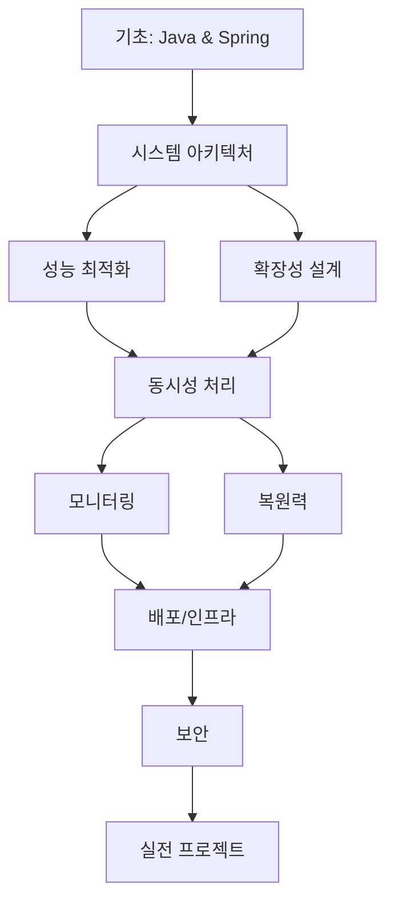

# Java 백엔드 대규모 트래픽 처리 커리큘럼

## 📚 학습 목표
대규모 트래픽을 처리할 수 있는 Java 백엔드 개발자가 되기 위한 체계적인 학습 커리큘럼

## 🗂️ 커리큘럼 구성

### 1. [[01-System-Architecture|시스템 아키텍처 패턴]]
- 마이크로서비스 아키텍처
- 이벤트 기반 아키텍처
- 분산 시스템 설계

### 2. [[02-Performance-Optimization|성능 최적화]]
- JVM 튜닝
- 데이터베이스 최적화
- 캐싱 전략

### 3. [[03-Scalability|확장성 설계]]
- 수평적 확장
- 로드 밸런싱
- 세션 관리

### 4. [[04-Concurrency|동시성 처리]]
- Java 동시성 프로그래밍
- 분산 환경의 동시성
- Reactive Programming

### 5. [[05-Monitoring|모니터링과 관찰성]]
- APM과 메트릭
- 분산 추적
- 로그 관리

### 6. [[06-Resilience|복원력과 안정성]]
- 장애 처리 패턴
- 레이트 리미팅
- 서킷 브레이커

### 7. [[07-Deployment|배포와 인프라]]
- 컨테이너화
- CI/CD 파이프라인
- 쿠버네티스

### 8. [[08-Security|보안]]
- 인증/인가
- 데이터 보호
- API 보안

## 🎯 학습 로드맵

## 📋 체크리스트

- [ ] Java 기초 및 Spring Framework 숙달
- [ ] 마이크로서비스 아키텍처 이해
- [ ] JVM 튜닝 및 성능 최적화
- [ ] 분산 시스템 설계 원칙
- [ ] 컨테이너 및 오케스트레이션
- [ ] 모니터링 도구 활용
- [ ] 보안 best practices

## 🔗 관련 리소스
- [[Resources|추천 도서 및 강의]]
- [[Projects|실습 프로젝트]]
- [[Tools|필수 도구 목록]]
