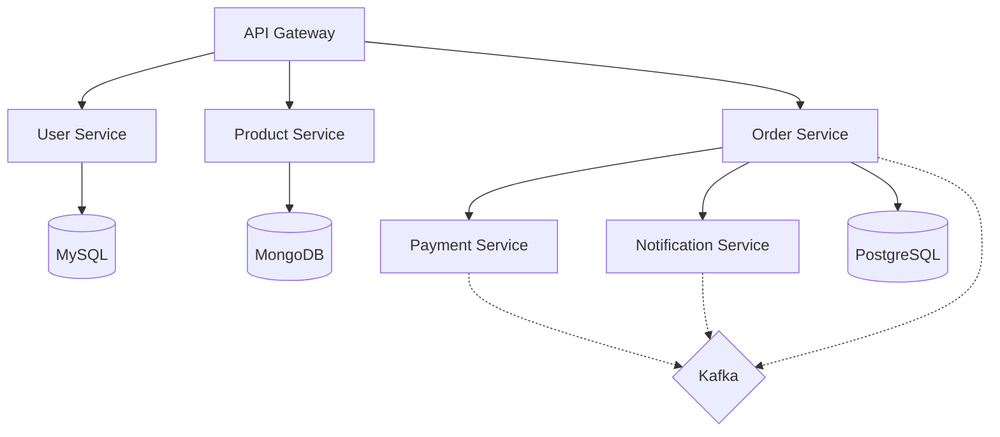

# 실습 프로젝트

## 🚀 프로젝트 아이디어

### 1. 실시간 채팅 시스템
**난이도**: ⭐⭐⭐

**학습 목표**:
- WebSocket을 이용한 실시간 통신
- Redis Pub/Sub을 이용한 메시지 브로드캐스팅
- 수평적 확장을 위한 세션 관리

**주요 기능**:
- 실시간 메시지 전송
- 채팅방 생성/참여
- 온라인 사용자 목록
- 메시지 히스토리

**기술 스택**:
```yaml
Backend:
  - Spring Boot WebSocket
  - Redis (Pub/Sub, Session)
  - MongoDB (메시지 저장)
  - JWT 인증

Infrastructure:
  - Docker Compose
  - Nginx (WebSocket 프록시)
  - Prometheus + Grafana
```

---

### 2. 이커머스 플랫폼
**난이도**: ⭐⭐⭐⭐

**학습 목표**:
- 마이크로서비스 아키텍처 설계
- 분산 트랜잭션 처리 (Saga Pattern)
- 높은 동시성 처리 (재고 관리)

**주요 서비스**:
- User Service (인증/인가)
- Product Service (상품 관리)
- Order Service (주문 처리)
- Payment Service (결제 처리)
- Notification Service (알림)

**아키텍처**:


---

### 3. 실시간 분석 대시보드
**난이도**: ⭐⭐⭐⭐⭐

**학습 목표**:
- 스트림 처리 (Kafka Streams)
- 시계열 데이터 저장 및 조회
- 실시간 데이터 시각화

**주요 기능**:
- 실시간 로그 수집 및 분석
- 메트릭 집계 및 알림
- 커스텀 대시보드
- 이상 탐지

**데이터 파이프라인**:
```
Application Logs → Fluentd → Kafka → Kafka Streams → InfluxDB → Grafana
                                  ↓
                            Elasticsearch → Kibana
```

---

## 💻 단계별 구현 가이드

### Phase 1: 기본 구조
```java
// 1. 프로젝트 구조
ecommerce-platform/
├── api-gateway/
├── user-service/
├── product-service/
├── order-service/
├── payment-service/
├── common/
├── docker-compose.yml
└── k8s/

// 2. 공통 라이브러리
@SpringBootApplication
@EnableEurekaClient
@EnableCircuitBreaker
public class BaseApplication {
    // 공통 설정
}
```

### Phase 2: 핵심 기능
- RESTful API 구현
- 데이터베이스 연동
- 기본 CRUD 작업
- 단위 테스트

### Phase 3: 고급 기능
- 메시지 큐 통합
- 캐싱 레이어
- 분산 트랜잭션
- 성능 최적화

### Phase 4: 운영 준비
- 모니터링 설정
- 로그 집계
- CI/CD 파이프라인
- 부하 테스트

---

## 🧪 부하 테스트 시나리오

### JMeter 테스트 계획
```xml
<TestPlan>
  <ThreadGroup>
    <numThreads>1000</numThreads>
    <rampUp>60</rampUp>
    <duration>300</duration>
    
    <HTTPSampler>
      <domain>${__P(host,localhost)}</domain>
      <port>8080</port>
      <path>/api/products</path>
      <method>GET</method>
    </HTTPSampler>
    
    <ResponseAssertion>
      <testStrings>200</testStrings>
    </ResponseAssertion>
  </ThreadGroup>
</TestPlan>
```

### Gatling 시나리오
```scala
class LoadTestSimulation extends Simulation {
  val httpProtocol = http
    .baseUrl("http://localhost:8080")
    .acceptHeader("application/json")
    
  val scn = scenario("E-commerce Load Test")
    .exec(http("Get Products")
      .get("/api/products")
      .check(status.is(200)))
    .pause(1, 3)
    .exec(http("Create Order")
      .post("/api/orders")
      .body(StringBody("""{"productId": "${productId}"}"""))
      .check(status.is(201)))
      
  setUp(
    scn.inject(
      rampUsersPerSec(10) to 100 during (5 minutes),
      constantUsersPerSec(100) during (10 minutes)
    )
  ).protocols(httpProtocol)
}
```

---

## 📊 성능 목표

### SLA 기준
- **가용성**: 99.9% (연간 다운타임 < 8.76시간)
- **응답 시간**: P95 < 200ms, P99 < 500ms
- **처리량**: 10,000 TPS 이상
- **동시 사용자**: 100,000명

### 측정 방법
```java
@Component
public class PerformanceMonitor {
    private final MeterRegistry meterRegistry;
    
    @Scheduled(fixedRate = 60000)
    public void reportMetrics() {
        // TPS 계산
        double tps = meterRegistry.counter("http.requests")
            .count() / 60.0;
        
        // 응답 시간 백분위
        double p95 = meterRegistry.timer("http.requests")
            .percentile(0.95);
        
        log.info("TPS: {}, P95 Latency: {}ms", tps, p95);
    }
}
```

---

## 🛠️ 트러블슈팅 체크리스트

### 성능 이슈
- [ ] 슬로우 쿼리 확인
- [ ] N+1 문제 체크
- [ ] 캐시 히트율 확인
- [ ] GC 로그 분석

### 장애 대응
- [ ] 에러 로그 수집
- [ ] 힙 덤프 분석
- [ ] 스레드 덤프 확인
- [ ] 네트워크 지연 측정

### 확장성
- [ ] 병목 지점 식별
- [ ] 수평적 확장 테스트
- [ ] 로드 밸런싱 검증
- [ ] 데이터베이스 샤딩
