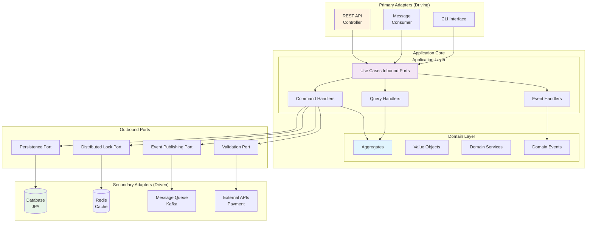
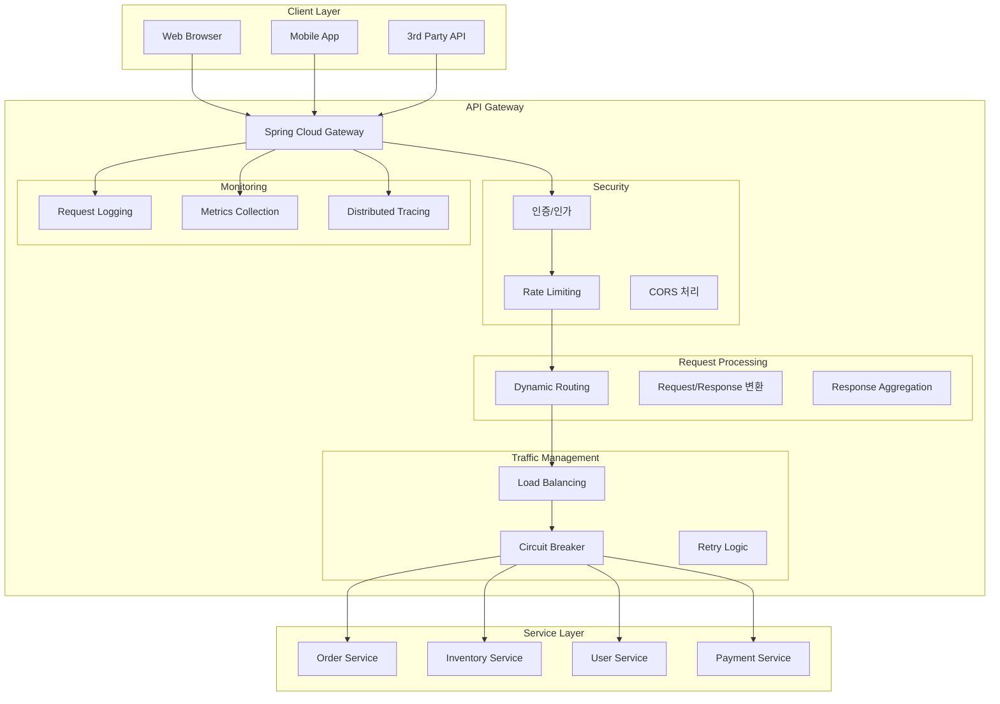
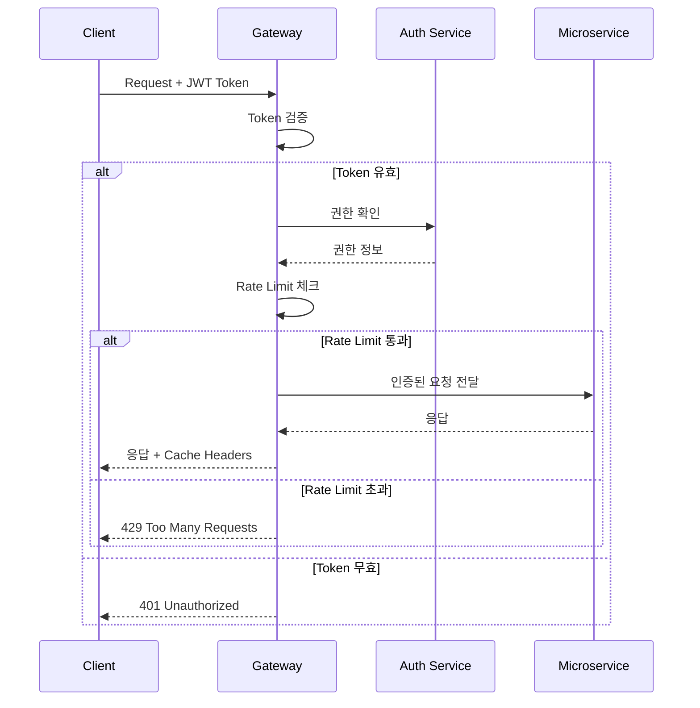
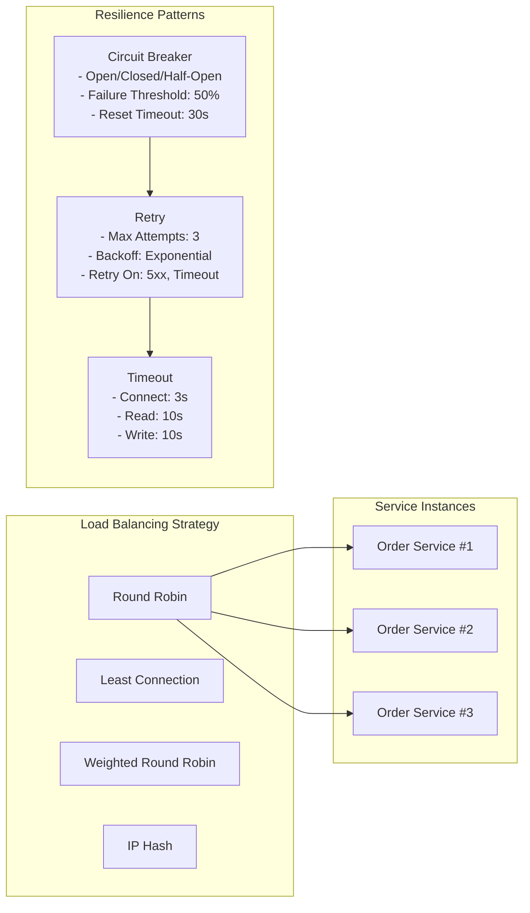
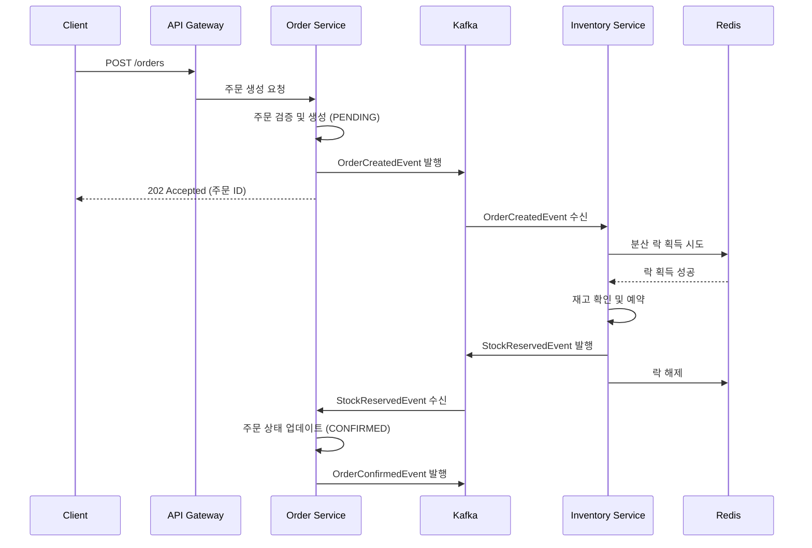
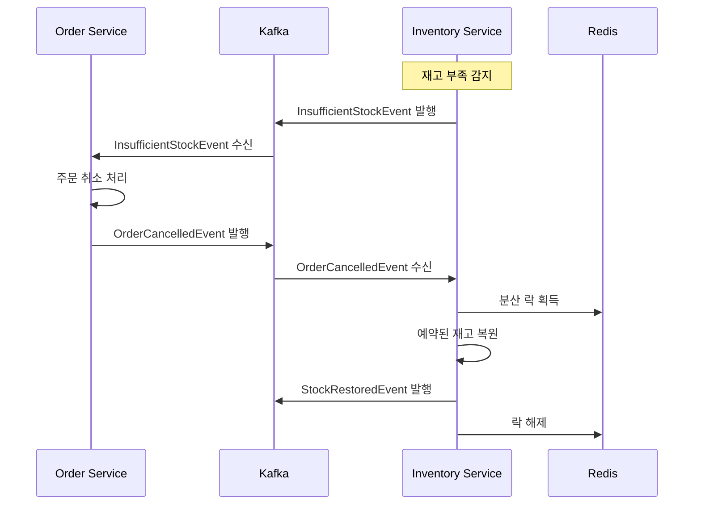

# 🏗️ 헥사고날 아키텍처 기반 이커머스 시스템

> 대규모 트래픽 처리를 위한 Domain-Driven Design + Hexagonal Architecture

## 🎯 프로젝트 목표

### 핵심 요구사항
- **데이터 무결성**: 아무리 많은 주문이 동시에 들어와도 단 하나의 주문도 유실되지 않음
- **재고 일관성**: 재고가 절대 마이너스로 떨어지지 않으며, 동시성 상황에서도 정확한 재고 관리
- **고가용성**: 일부 서비스 장애 시에도 전체 시스템은 동작 가능
- **확장성**: 트래픽 증가에 따른 수평적 확장 가능

### 아키텍처 목표
- **테스트 용이성**: 비즈니스 로직과 기술적 구현의 완전한 분리
- **기술 독립성**: 데이터베이스, 메시징, 웹 프레임워크 교체 가능
- **유지보수성**: 명확한 책임 분리와 의존성 방향 제어
- **고객 친화성**: 불필요한 제한 제거, 고객 혜택 중심 정책

### 주요 설계 결정사항
- **Configuration Properties**: 시작시 캐시 방식으로 1000-5000배 성능 향상
- **고객 중심 정책**: 주문 제한 최소화, 할인 혜택 최대화
- **24시간 서비스**: 영업시간 제한 제거로 언제나 주문 가능

## 🏛️ 헥사고날 아키텍처 개요


### 핵심 설계 원칙

#### 1. 의존성 규칙 (Dependency Rule)
- **Domain Layer**: 외부 의존성 없음 (순수 비즈니스 로직)
- **Application Layer**: Domain Layer만 의존
- **Adapters**: Application Layer를 통해서만 Domain에 접근

#### 2. 포트와 어댑터 패턴
- **Inbound Ports (Use Cases)**: 애플리케이션이 외부에 제공하는 기능
- **Outbound Ports**: 애플리케이션이 외부에 요구하는 기능
- **Adapters**: 포트의 구체적인 구현체

#### 3. 관심사의 분리
- **Driving Adapters**: 애플리케이션을 사용하는 외부 시스템
- **Driven Adapters**: 애플리케이션이 사용하는 외부 시스템

### 헥사고날 레이어별 책임

#### 🔷 Domain Layer (도메인 계층)
- **Aggregates**: 비즈니스 불변성을 보장하는 엔티티 집합
- **Value Objects**: 불변 값 객체 (OrderId, Money, ProductId)
- **Domain Services**: 복잡한 비즈니스 규칙 처리
- **Domain Events**: 도메인에서 발생하는 중요한 사건
- **의존성**: 없음 (완전히 독립적)

#### 🔶 Application Layer (애플리케이션 계층)
- **Inbound Ports**: 외부에서 애플리케이션을 사용하는 인터페이스
- **Outbound Ports**: 애플리케이션이 외부를 사용하는 인터페이스
- **Use Case 구현체**: 비즈니스 플로우 오케스트레이션
- **의존성**: Domain Layer만 의존

#### 🔸 Adapter Layer (어댑터 계층)
- **Inbound Adapters**: 외부 요청을 받아 Use Case로 전달
- **Outbound Adapters**: 외부 시스템과의 실제 통신 구현
- **의존성**: Application Layer를 통해서만 Domain에 접근


### 왜 DDD를 선택했는가?

1. **복잡한 비즈니스 로직의 명확한 분리**
   - 주문과 재고는 서로 다른 비즈니스 컨텍스트를 가짐
   - 각 도메인의 전문가가 독립적으로 발전시킬 수 있음

2. **확장성과 유지보수성**
   - Bounded Context로 서비스 경계가 명확함
   - 각 컨텍스트가 독립적으로 배포 가능

3. **일관성 경계 설정**
   - 강한 일관성이 필요한 부분을 Aggregate로 묶음
   - 최종 일관성으로 처리 가능한 부분을 이벤트로 분리

### 1. Domain-Driven Design 개요

**도메인 모델링 상세 문서**: [DDD-Domain-Model.md](docs/DDD-Domain-Model.md)

#### 핵심 Bounded Context
- **Order Context**: 주문 생명주기 관리, 고객 중심 비즈니스 로직
- **Inventory Context**: 재고 관리, 높은 동시성 처리

#### 주요 구현 현황
- ✅ Order Domain Events, Value Objects, Aggregate
- ✅ Order Repository Interface, Domain Exceptions  
- ⏳ Inventory Domain Model, Application Layer 예정

## 💻 기술 스택 선택 (RICE 점수 기반)

### RICE 점수 설명
- **R(each)**: 영향 범위 (1-10)
- **I(mpact)**: 비즈니스 영향도 (1-10)
- **C(onfidence)**: 구현 확신도 (1-10)
- **E(ffort)**: 구현 노력 (1-10, 낮을수록 좋음)
- **최종 점수**: (R × I × C) / E

### 1. 메시지 브로커 선택

| 기술 | Reach | Impact | Confidence | Effort | RICE Score | 선택 이유 |
|------|-------|--------|------------|--------|------------|-----------|
| **Apache Kafka** ✓ | 10 | 10 | 9 | 7 | **128.6** | 순서 보장, 높은 처리량, 이벤트 소싱 적합 |
| RabbitMQ | 8 | 8 | 10 | 5 | 128.0 | 쉬운 구현, 그러나 대용량에서 제한 |
| AWS SQS | 7 | 7 | 8 | 3 | 130.7 | 관리 부담 없음, 그러나 벤더 종속성 |
| Redis Pub/Sub | 6 | 6 | 7 | 2 | 126.0 | 가볍지만 메시지 유실 가능성 |

**Kafka 선택 근거**: 
- 파티션 기반 순서 보장으로 재고 일관성 유지
- 이벤트 리플레이로 장애 복구 가능
- 높은 처리량으로 대규모 주문 처리

### 2. 분산 락 구현

| 기술 | Reach | Impact | Confidence | Effort | RICE Score | 선택 이유 |
|------|-------|--------|------------|--------|------------|-----------|
| **Redis + Redisson** ✓ | 10 | 10 | 9 | 5 | **180.0** | 검증된 분산 락, 풍부한 기능 |
| Zookeeper | 9 | 9 | 8 | 8 | 81.0 | 안정적이지만 운영 복잡도 높음 |
| Database Lock | 7 | 7 | 10 | 3 | 163.3 | 간단하지만 DB 부하 증가 |
| Hazelcast | 8 | 8 | 7 | 6 | 74.7 | In-memory 그리드, 추가 인프라 |

**Redis + Redisson 선택 근거**:
- Redlock 알고리즘으로 안전한 분산 락
- pub/sub으로 락 해제 알림 최적화
- 이미 캐싱으로 사용하여 인프라 재활용

  | 항목    | Redis                    | Redisson                                    |
  | ----- | ------------------------ | ------------------------------------------- |
  | 정체성   | 데이터 저장소                  | 클라이언트 라이브러리 (Java)                          |
  | 언어 지원 | C 기반 서버, 다양한 언어 클라이언트 존재 | Java 전용                                     |
  | 제공 기능 | 기본 자료구조, TTL, Pub/Sub    | 락, 큐, 세마포어, rate limiter, executor 등 고수준 기능 |
  | 복잡도   | 낮음                       | 기능 다양, Spring과 잘 통합됨                        |
  | 사용 목적 | 캐시, 세션, Pub/Sub, DB 대체   | 분산 환경의 **동시성 처리** 중심                        |


### 3. 데이터베이스 선택

| 기술 | Reach | Impact | Confidence | Effort | RICE Score | 선택 이유 |
|------|-------|--------|------------|--------|------------|-----------|
| **PostgreSQL** ✓ | 10 | 10 | 10 | 5 | **200.0** | ACID, 성숙도, Row-level Lock |
| MySQL | 9 | 9 | 10 | 5 | 162.0 | 익숙하지만 고급 기능 부족 |
| MongoDB | 7 | 6 | 8 | 4 | 84.0 | 유연하지만 트랜잭션 제한 |
| CockroachDB | 8 | 9 | 7 | 8 | 63.0 | 분산 DB이지만 운영 경험 부족 |

**PostgreSQL 선택 근거**:
- MVCC로 읽기 성능 최적화
- SERIALIZABLE 격리 수준 지원
- JSON 타입으로 이벤트 저장 가능

  | 기능                 | 역할              | 장점                   |
  | ------------------ | --------------- | -------------------- |
  | **Row-level Lock** | 특정 row만 잠금      | 동시성 향상, 충돌 최소화       |
  | **MVCC**           | 스냅샷 기반 동시성 제어   | 읽기-쓰기 병행 처리, 데드락 최소화 |
  | **JSONB**          | 구조화된 비정형 데이터 저장 | 유연한 모델링, 쿼리 가능       |
  | **GIN Index**      | 역색인 구조          | JSON/배열/Text의 빠른 검색  |

### 4. API Gateway 선택

| 기술 | Reach | Impact | Confidence | Effort | RICE Score | 선택 이유 |
|------|-------|--------|------------|--------|------------|-----------|
| **Spring Cloud Gateway** ✓ | 9 | 9 | 9 | 5 | **145.8** | WebFlux 기반, Spring 생태계 |
| Kong | 10 | 9 | 7 | 7 | 90.0 | 강력하지만 별도 운영 필요 |
| Nginx | 8 | 7 | 10 | 3 | 186.7 | 가볍지만 동적 설정 제한 |
| AWS API Gateway | 7 | 8 | 8 | 2 | 224.0 | 관리형이지만 벤더 종속 |

**Spring Cloud Gateway 선택 근거**:
- Reactive 스택으로 높은 동시성 처리
- Spring Security 통합 용이
- Circuit Breaker 네이티브 지원

### 5. 서비스 간 통신

| 기술 | Reach | Impact | Confidence | Effort | RICE Score | 선택 이유 |
|------|-------|--------|------------|--------|------------|-----------|
| **REST + Kafka Events** ✓ | 9 | 9 | 10 | 4 | **202.5** | 동기/비동기 조합 최적 |
| gRPC | 8 | 8 | 8 | 6 | 85.3 | 성능 좋지만 복잡도 증가 |
| GraphQL | 7 | 7 | 6 | 8 | 36.8 | 유연하지만 오버엔지니어링 |
| WebSocket | 6 | 6 | 7 | 7 | 36.0 | 실시간이지만 상태 관리 복잡 |

**REST + Kafka 선택 근거**:
- 조회는 REST로 간단하게
- 상태 변경은 이벤트로 느슨한 결합
- 기존 인프라와 호환성

### 6. 모니터링 스택

| 기술 | Reach | Impact | Confidence | Effort | RICE Score | 선택 이유 |
|------|-------|--------|------------|--------|------------|-----------|
| **Prometheus + Grafana** ✓ | 10 | 9 | 10 | 4 | **225.0** | 업계 표준, 강력한 쿼리 |
| ELK Stack | 9 | 9 | 8 | 7 | 92.6 | 통합 솔루션이지만 무거움 |
| Datadog | 10 | 10 | 9 | 2 | 450.0 | 최고지만 비용 문제 |
| CloudWatch | 7 | 7 | 8 | 3 | 130.7 | AWS 종속성 |

**Prometheus + Grafana 선택 근거**:
- Pull 방식으로 서비스 부하 최소화
- PromQL로 복잡한 메트릭 분석
- 오픈소스로 비용 효율적

## 🌐 API Gateway 아키텍처와 역할

### API Gateway의 핵심 기능


### API Gateway 상세 기능

#### 1. 보안 계층


#### 2. 트래픽 관리


#### 3. Request/Response 처리
```yaml
# Gateway 필터 체인
Pre-Filters:
  1. Request Logging
  2. Authentication
  3. Rate Limiting
  4. Request Validation
  5. Header Enrichment

Route Filters:
  1. Path Rewriting
  2. Load Balancing
  3. Circuit Breaker
  4. Retry Logic
  5. Request Timeout

Post-Filters:
  1. Response Logging
  2. Response Transformation
  3. CORS Headers
  4. Cache Headers
  5. Metrics Collection
```

### API Gateway 설정 예시
```yaml
spring:
  cloud:
    gateway:
      routes:
        - id: order-service
          uri: lb://ORDER-SERVICE
          predicates:
            - Path=/api/orders/**
          filters:
            - name: CircuitBreaker
              args:
                name: orderServiceCB
                fallbackUri: forward:/fallback/orders
            - name: Retry
              args:
                retries: 3
                statuses: SERVICE_UNAVAILABLE
                methods: GET,POST
                backoff:
                  firstBackoff: 10ms
                  maxBackoff: 500ms
                  factor: 2
            - name: RequestRateLimiter
              args:
                redis-rate-limiter.replenishRate: 100
                redis-rate-limiter.burstCapacity: 200
                key-resolver: "#{@userKeyResolver}"
        
        - id: inventory-service
          uri: lb://INVENTORY-SERVICE
          predicates:
            - Path=/api/inventory/**
          filters:
            - StripPrefix=1
            - name: CircuitBreaker
              args:
                name: inventoryServiceCB
                fallbackUri: forward:/fallback/inventory

      default-filters:
        - DedupeResponseHeader=Access-Control-Allow-Origin
        - AddResponseHeader=X-Response-Time, %{REQUEST_DURATION}ms
        - name: Retry
          args:
            retries: 2
            statuses: GATEWAY_TIMEOUT
            
      globalcors:
        cors-configurations:
          '[/**]':
            allowedOrigins: 
              - "http://localhost:3000"
              - "https://app.example.com"
            allowedMethods:
              - GET
              - POST
              - PUT
              - DELETE
              - OPTIONS
            allowedHeaders: "*"
            allowCredentials: true
```

## 🔄 주요 프로세스 플로우

### 주문 생성 프로세스 (Happy Path)


### 재고 부족 시 보상 트랜잭션


## 📦 프로젝트 구조

```
ecommerce-microservices/
├── common/                      # 공통 모듈
│   ├── domain-events/          # 도메인 이벤트 정의
│   ├── exceptions/             # 공통 예외
│   └── utils/                  # 유틸리티
├── service-discovery/          # Eureka Server
├── api-gateway/               # Spring Cloud Gateway
├── order-service/             # 주문 도메인 서비스
│   ├── domain/               
│   │   ├── model/           # Order Aggregate
│   │   ├── repository/      # Repository Interface
│   │   └── service/         # Domain Service
│   ├── application/          
│   │   ├── command/         # Command Handlers
│   │   ├── query/           # Query Handlers
│   │   └── saga/            # Saga Orchestration
│   ├── infrastructure/       
│   │   ├── persistence/     # JPA Implementation
│   │   ├── messaging/       # Kafka Implementation
│   │   └── web/            # REST Controllers
│   └── interfaces/           
│       └── rest/            # API Endpoints
├── inventory-service/         # 재고 도메인 서비스
│   ├── domain/
│   │   ├── model/           # Product Aggregate
│   │   ├── repository/      
│   │   └── service/         # Stock Management
│   ├── application/
│   │   ├── command/         
│   │   ├── query/           
│   │   └── lock/            # Distributed Lock
│   ├── infrastructure/
│   │   ├── persistence/     
│   │   ├── messaging/       
│   │   └── cache/           # Redis Implementation
│   └── interfaces/
└── docker-compose.yml        # 로컬 개발 환경
```

## 🚀 실행 방법

### 사전 요구사항
- Java 17+
- Docker & Docker Compose
- Maven 3.8+

### 로컬 환경 실행
```bash
# 인프라 구성 요소 실행
docker-compose up -d

# 각 서비스 빌드 및 실행
mvn clean install
cd service-discovery && mvn spring-boot:run
cd ../api-gateway && mvn spring-boot:run
cd ../order-service && mvn spring-boot:run
cd ../inventory-service && mvn spring-boot:run
```

## 📊 성능 목표 및 측정 지표

### 목표 SLA
- **주문 처리량**: 10,000 TPS
- **응답 시간**: P95 < 100ms, P99 < 200ms
- **재고 정확도**: 100% (절대 음수 불가)
- **데이터 유실**: 0% (모든 주문 추적 가능)
- **가용성**: 99.99% (월 4.3분 이하 장애)

### 핵심 메트릭
1. **비즈니스 메트릭**
   - 초당 주문 생성 수
   - 주문 확정 비율
   - 재고 부족으로 인한 취소율

2. **기술 메트릭**
   - API 응답 시간 분포
   - 분산 락 대기 시간
   - Kafka 메시지 처리 지연

3. **인프라 메트릭**
   - CPU/Memory 사용률
   - DB 커넥션 풀 상태
   - GC 일시정지 시간

## 🧪 테스트 전략

### 1. 단위 테스트
- 도메인 로직 검증 (불변성, 비즈니스 규칙)
- 순수 함수 테스트

### 2. 통합 테스트
- 서비스 간 이벤트 플로우
- 보상 트랜잭션 시나리오
- 분산 락 동작 검증

### 3. 부하 테스트
```bash
# JMeter 시나리오
- 동시 사용자: 1,000명
- 램프업: 60초
- 테스트 시간: 10분
- 시나리오: 주문 생성 → 조회 → 취소

# 예상 병목 지점
- DB 커넥션 풀
- Redis 분산 락 경합
- Kafka 파티션 처리량
```

### 4. 카오스 엔지니어링
- 네트워크 지연 주입
- 서비스 무작위 종료
- 리소스 제한 테스트

## 🔒 보안 고려사항

1. **API 보안**
   - JWT 기반 인증
   - Rate Limiting (IP, User 기반)
   - API Key 관리

2. **데이터 보안**
   - 민감 정보 암호화 (고객 정보)
   - 감사 로그 (모든 재고 변경)
   - GDPR 준수 (개인정보 삭제)

3. **인프라 보안**
   - 네트워크 격리 (Private Subnet)
   - 시크릿 관리 (Vault, K8s Secret)
   - 최소 권한 원칙