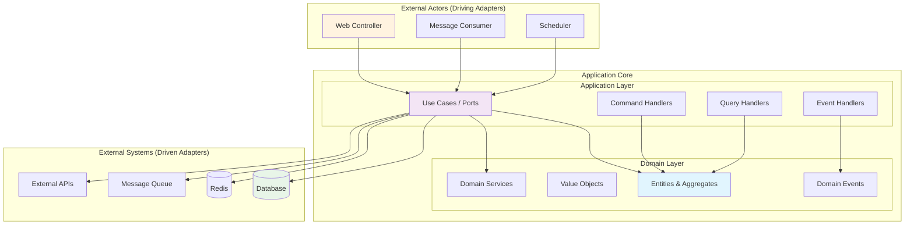
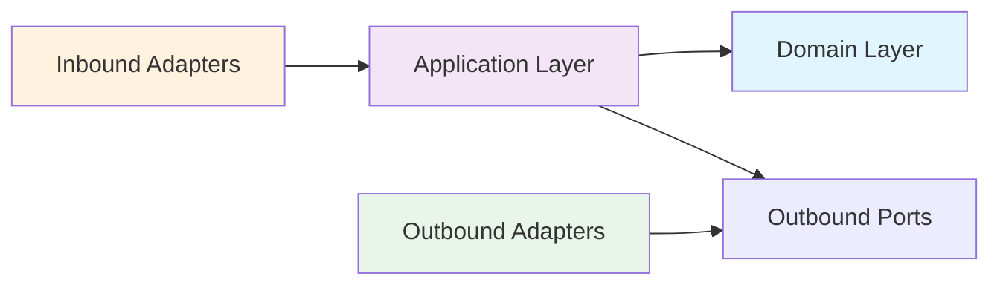
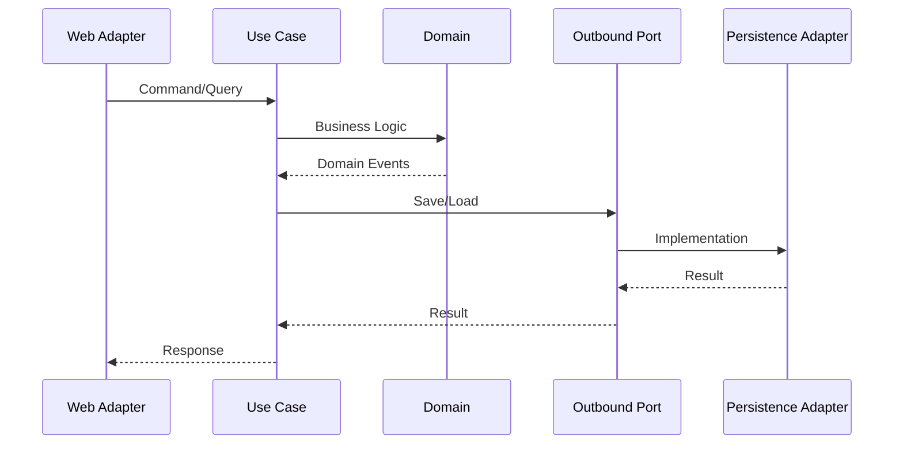

# 🏗️ 헥사고날 아키텍처 기반 WBS

## 📋 아키텍처 개요



---

## 🎯 1주차: 프로젝트 설정 및 인프라 구성 (20시간)

### 📁 1.1 개발 환경 설정 (8시간) ✅

#### 1.1.1 Gradle Multi-Module 헥사고날 구조 생성 (2시간)
- [X] **1.1.1.1** 루트 프로젝트 및 헥사고날 모듈 구조 (45분)
  ```
  ecommerce-microservices/
  ├── common/                    # 공통 도메인 이벤트
  ├── service-discovery/         # Eureka 서버
  ├── api-gateway/              # API Gateway
  ├── order-service/            # 주문 서비스
  │   ├── domain/              # 도메인 레이어
  │   ├── application/         # 애플리케이션 레이어  
  │   ├── adapter-in-web/      # 인바운드 웹 어댑터
  │   ├── adapter-in-messaging/# 인바운드 메시징 어댑터
  │   ├── adapter-out-persistence/# 아웃바운드 DB 어댑터
  │   └── adapter-out-messaging/# 아웃바운드 메시징 어댑터
  └── inventory-service/        # 재고 서비스 (동일 구조)
  ```
- [X] **1.1.1.2** 각 모듈별 Gradle 설정 (45분)
- [X] **1.1.1.3** 의존성 방향 규칙 설정 (30분)
  - 도메인 → 의존성 없음
  - 애플리케이션 → 도메인만 의존
  - 어댑터 → 애플리케이션 & 도메인 의존

#### 1.1.2 Docker 개발 환경 구성 (4시간) ✅
- [X] 모든 인프라 서비스 설정 완료

#### 1.1.3 IDE 및 개발 도구 설정 (2시간)
- [ ] **1.1.3.1** IntelliJ 헥사고날 프로젝트 설정 (1시간)
  - 모듈별 패키지 구조 인식
  - 의존성 방향 검증 플러그인
  - ArchUnit 설정
- [ ] **1.1.3.2** 아키텍처 규칙 검증 도구 설정 (1시간)
  - ArchUnit 테스트 작성
  - 의존성 규칙 검증
  - 패키지 구조 검증

---

## 🔧 2주차: 공통 모듈 및 도메인 레이어 (20시간)

### 📦 2.1 공통 도메인 이벤트 정의 (6시간)

#### 2.1.1 Order Domain Events (3시간)
- [X] **2.1.1.1** OrderCreatedEvent 구현 (45분)
  - 이벤트 필드 정의 (orderId, customerId, orderItems, timestamp)
  - JSON 직렬화/역직렬화 설정
  - 유효성 검증 로직
- [X] **2.1.1.2** OrderConfirmedEvent 구현 (45분)
- [X] **2.1.1.3** OrderCancelledEvent 구현 (45분)
- [X] **2.1.1.4** OrderCompletedEvent 구현 (45분)

#### 2.1.2 Inventory Domain Events (3시간)
- [X] **2.1.2.1** StockReservedEvent 구현 (45분)
- [X] **2.1.2.2** StockDeductedEvent 구현 (45분)
- [X] **2.1.2.3** StockRestoredEvent 구현 (45분)
- [X] **2.1.2.4** InsufficientStockEvent 구현 (45분)

### 🏗️ 2.2 Order Service - Domain Layer (8시간)

#### 2.2.1 Value Objects 구현 (2시간)
- [x] **2.2.1.1** OrderId 클래스 구현 (30분)
  - UUID 기반 ID 생성
  - 불변성 보장, equals/hashCode
- [x] **2.2.1.2** CustomerId 클래스 구현 (30분)
- [x] **2.2.1.3** OrderStatus 열거형 구현 (30분)
- [x] **2.2.1.4** Money 클래스 구현 (30분)
  - BigDecimal 기반 금액 계산
  - 통화 단위 처리

#### 2.2.2 Order Aggregate 구현 (4시간)
- [X] **2.2.2.1** OrderItem Entity 구현 (1시간)
  - 상품 정보 (ProductId, Quantity, Money)
  - 비즈니스 검증 로직
- [x] **2.2.2.2** Order Aggregate Root 구현 (2시간)
  - 주문 생성 팩토리 메서드
  - 상태 전이 메서드 (confirm, cancel, complete)
  - 도메인 이벤트 발행
  - 불변성 규칙 보장
- [x] **2.2.2.3** Order 비즈니스 규칙 구현 (1시간)
  - 주문 생성 조건 검증
  - 상태 전이 규칙
  - 총액 계산 로직

#### 2.2.3 Domain Services 구현 (2시간)
- [x] **2.2.3.1** OrderDomainService 구현 (1시간 30분)
  - 복잡한 비즈니스 규칙 처리
  - 여러 Aggregate 간 협력 로직
- [x] **2.2.3.2** Domain Repository Port 정의 (30분)
  - OrderRepository 인터페이스
  - 저장/조회 메서드 정의

### 🏗️ 2.3 Inventory Service - Domain Layer (6시간)

#### 2.3.1 Value Objects 구현 (1시간 30분)
- [x] **2.3.1.1** ProductId 클래스 구현 (30분)
- [x] **2.3.1.2** StockQuantity 클래스 구현 (30분)
- [x] **2.3.1.3** ReservationId 클래스 구현 (30분)

#### 2.3.2 Inventory Aggregate 구현 (3시간 30분)
- [x] **2.3.2.1** Stock Entity 구현 (1시간 30분)
  - 사용 가능 수량 관리
  - 예약 수량 관리
  - 동시성 제어를 위한 버전 필드
- [x] **2.3.2.2** Product Aggregate Root 구현 (2시간)
  - 재고 예약/차감/복원 메서드
  - 동시성 제어 로직
  - 도메인 이벤트 발행

#### 2.3.3 Domain Services 구현 (1시간)
- [x] **2.3.3.1** StockDomainService 구현 (1시간)
  - 재고 부족 검증 로직
  - 예약 만료 처리

---

## 🎯 3주차: Application Layer & Use Cases (20시간)

### 📋 3.1 Order Service - Application Layer (10시간)

#### 3.1.1 Inbound Ports (Use Cases) 정의 (2시간)
- [x] **3.1.1.1** CreateOrderUseCase 인터페이스 (30분)
- [x] **3.1.1.2** ConfirmOrderUseCase 인터페이스 (30분)
- [x] **3.1.1.3** CancelOrderUseCase 인터페이스 (30분)
- [x] **3.1.1.4** GetOrderUseCase 인터페이스 (30분)

#### 3.1.2 Command Handlers (Use Case 구현) (4시간)
- [x] **3.1.2.1** CreateOrderService 구현 (1시간 30분)
  - CreateOrderCommand 정의
  - 주문 생성 로직
  - 도메인 이벤트 발행
- [x] **3.1.2.2** ConfirmOrderService 구현 (1시간)
- [x] **3.1.2.3** CancelOrderService 구현 (1시간)
- [x] **3.1.2.4** GetOrderService 구현 (30분)

#### 3.1.3 Outbound Ports 정의 (2시간)
- [ ] **3.1.3.1** OrderPersistencePort 인터페이스 (30분)
  - 저장/조회 메서드
- [ ] **3.1.3.2** EventPublishingPort 인터페이스 (30분)
  - 이벤트 발행 메서드
- [ ] **3.1.3.3** StockValidationPort 인터페이스 (30분)
  - 재고 확인 메서드
- [ ] **3.1.3.4** PaymentProcessingPort 인터페이스 (30분)
  - 결제 처리 메서드

#### 3.1.4 Event Handlers 구현 (2시간)
- [ ] **3.1.4.1** StockReservedEventHandler (1시간)
  - 재고 예약 완료 처리
- [ ] **3.1.4.2** PaymentCompletedEventHandler (1시간)
  - 결제 완료 처리

### 📋 3.2 Inventory Service - Application Layer (10시간)

#### 3.2.1 Inbound Ports 정의 (2시간)
- [ ] **3.2.1.1** ReserveStockUseCase 인터페이스 (30분)
- [ ] **3.2.1.2** DeductStockUseCase 인터페이스 (30분)
- [ ] **3.2.1.3** RestoreStockUseCase 인터페이스 (30분)
- [ ] **3.2.1.4** GetStockUseCase 인터페이스 (30분)

#### 3.2.2 Command Handlers 구현 (4시간)
- [ ] **3.2.2.1** ReserveStockService 구현 (1시간 30분)
  - 분산 락 적용
  - 재고 예약 로직
- [ ] **3.2.2.2** DeductStockService 구현 (1시간)
- [ ] **3.2.2.3** RestoreStockService 구현 (1시간)
- [ ] **3.2.2.4** GetStockService 구현 (30분)

#### 3.2.3 Outbound Ports 정의 (2시간)
- [ ] **3.2.3.1** InventoryPersistencePort 인터페이스 (30분)
- [ ] **3.2.3.2** DistributedLockPort 인터페이스 (30분)
- [ ] **3.2.3.3** EventPublishingPort 인터페이스 (30분)
- [ ] **3.2.3.4** CachePort 인터페이스 (30분)

#### 3.2.4 Event Handlers 구현 (2시간)
- [ ] **3.2.4.1** OrderCreatedEventHandler (1시간)
  - 주문 생성시 재고 예약
- [ ] **3.2.4.2** OrderCancelledEventHandler (1시간)
  - 주문 취소시 재고 복원

---

## 🔌 4주차: Inbound Adapters (16시간)

### 🌐 4.1 Web Adapters 구현 (8시간)

#### 4.1.1 Order Service Web Adapter (4시간)
- [ ] **4.1.1.1** OrderController 구현 (2시간)
  - REST API 엔드포인트
  - DTO 변환 로직
  - 입력값 검증
- [ ] **4.1.1.2** Web Request/Response DTOs (1시간)
  - CreateOrderRequest/Response
  - GetOrderResponse
- [ ] **4.1.1.3** Global Exception Handler (1시간)
  - 도메인 예외 → HTTP 응답 변환

#### 4.1.2 Inventory Service Web Adapter (4시간)
- [ ] **4.1.2.1** InventoryController 구현 (2시간)
- [ ] **4.1.2.2** Web DTOs 구현 (1시간)
- [ ] **4.1.2.3** Exception Handling (1시간)

### 📨 4.2 Messaging Adapters 구현 (8시간)

#### 4.2.1 Order Service Messaging Adapter (4시간)
- [ ] **4.2.1.1** OrderEventListener 구현 (2시간)
  - Kafka Consumer 설정
  - 이벤트 역직렬화
- [ ] **4.2.1.2** Message DTOs 구현 (1시간)
- [ ] **4.2.1.3** Error Handling & DLQ (1시간)

#### 4.2.2 Inventory Service Messaging Adapter (4시간)
- [ ] **4.2.2.1** InventoryEventListener 구현 (2시간)
- [ ] **4.2.2.2** Message DTOs 구현 (1시간)
- [ ] **4.2.2.3** Error Handling (1시간)

---

## 🔌 5주차: Outbound Adapters (20시간)

### 💾 5.1 Persistence Adapters 구현 (10시간)

#### 5.1.1 Order Service Persistence Adapter (5시간)
- [ ] **5.1.1.1** OrderJpaEntity 매핑 (1시간 30분)
  - JPA 어노테이션 설정
  - 테이블 매핑
- [ ] **5.1.1.2** OrderRepository 구현 (2시간)
  - Spring Data JPA 인터페이스
  - 커스텀 쿼리 메서드
- [ ] **5.1.1.3** OrderPersistenceAdapter 구현 (1시간 30분)
  - Domain ↔ JPA Entity 변환
  - Port 인터페이스 구현

#### 5.1.2 Inventory Service Persistence Adapter (5시간)
- [ ] **5.1.2.1** ProductJpaEntity 매핑 (1시간 30분)
- [ ] **5.1.2.2** ProductRepository 구현 (2시간)
- [ ] **5.1.2.3** InventoryPersistenceAdapter 구현 (1시간 30분)

### 📨 5.2 Messaging Adapters 구현 (6시간)

#### 5.2.1 Event Publishing Adapters (3시간)
- [ ] **5.2.1.1** KafkaEventPublisher 구현 (2시간)
  - Kafka Producer 설정
  - 이벤트 직렬화
- [ ] **5.2.1.2** EventPublishingAdapter 구현 (1시간)
  - Port 인터페이스 구현

#### 5.2.2 External API Adapters (3시간)
- [ ] **5.2.2.1** PaymentAdapter 구현 (1시간 30분)
  - 외부 결제 API 연동
- [ ] **5.2.2.2** StockValidationAdapter 구현 (1시간 30분)
  - 재고 서비스 호출

### 🔧 5.3 Technical Adapters 구현 (4시간)

#### 5.3.1 Cache Adapter (2시간)
- [ ] **5.3.1.1** RedisAdapter 구현 (2시간)
  - Redis 연결 설정
  - CachePort 구현

#### 5.3.2 Distributed Lock Adapter (2시간)
- [ ] **5.3.2.1** RedisDistributedLockAdapter (2시간)
  - Redisson 기반 구현
  - DistributedLockPort 구현

---

## 🌐 6주차: API Gateway & Service Discovery (16시간)

### 🚪 6.1 API Gateway 구현 (12시간)
- [ ] **6.1.1** Spring Cloud Gateway 설정 (4시간)
- [ ] **6.1.2** 라우팅 규칙 설정 (3시간)
- [ ] **6.1.3** 인증/인가 필터 (3시간)
- [ ] **6.1.4** Rate Limiting & Circuit Breaker (2시간)

### 🔍 6.2 Service Discovery 구현 (4시간)
- [ ] **6.2.1** Eureka Server 설정 (2시간)
- [ ] **6.2.2** 서비스 등록/발견 설정 (2시간)

---

## 🧪 7주차: 테스트 및 아키텍처 검증 (20시간)

### 🏗️ 7.1 아키텍처 테스트 (6시간)

#### 7.1.1 ArchUnit 테스트 (3시간)
- [ ] **7.1.1.1** 의존성 방향 검증 테스트 (1시간)
  - 도메인 레이어 순수성 검증
  - 어댑터가 포트를 통해서만 접근하는지 검증
- [ ] **7.1.1.2** 패키지 구조 검증 테스트 (1시간)
- [ ] **7.1.1.3** 네이밍 규칙 검증 테스트 (1시간)

#### 7.1.2 헥사고날 아키텍처 컴플라이언스 (3시간)
- [ ] **7.1.2.1** 포트와 어댑터 구조 검증 (1시간 30분)
- [ ] **7.1.2.2** 도메인 로직 격리 검증 (1시간 30분)

### 🔬 7.2 단위 테스트 (8시간)

#### 7.2.1 Domain Layer 테스트 (4시간)
- [ ] **7.2.1.1** Aggregate 테스트 (2시간)
- [ ] **7.2.1.2** Domain Service 테스트 (2시간)

#### 7.2.2 Application Layer 테스트 (4시간)
- [ ] **7.2.2.1** Use Case 테스트 (2시간)
- [ ] **7.2.2.2** Event Handler 테스트 (2시간)

### 🔗 7.3 통합 테스트 (6시간)

#### 7.3.1 어댑터 통합 테스트 (3시간)
- [ ] **7.3.1.1** Persistence Adapter 테스트 (1시간 30분)
- [ ] **7.3.1.2** Messaging Adapter 테스트 (1시간 30분)

#### 7.3.2 End-to-End 테스트 (3시간)
- [ ] **7.3.2.1** 주문-재고 플로우 테스트 (2시간)
- [ ] **7.3.2.2** 성능 테스트 (1시간)

---

## 📚 8주차: 문서화 및 배포 (12시간)

### 📖 8.1 아키텍처 문서화 (6시간)

#### 8.1.1 헥사고날 아키텍처 가이드 (3시간)
- [ ] **8.1.1.1** 아키텍처 결정 기록 (ADR) (1시간 30분)
- [ ] **8.1.1.2** 포트와 어댑터 매핑 문서 (1시간 30분)

#### 8.1.2 개발자 가이드 (3시간)
- [ ] **8.1.2.1** 새로운 기능 추가 가이드 (1시간 30분)
- [ ] **8.1.2.2** 테스트 전략 문서 (1시간 30분)

### 🚀 8.2 배포 및 운영 (6시간)
- [ ] **8.2.1** Kubernetes 배포 (3시간)
- [ ] **8.2.2** 모니터링 설정 (2시간)
- [ ] **8.2.3** CI/CD 파이프라인 (1시간)

---

## 🎯 헥사고날 아키텍처 핵심 원칙

### ✅ 의존성 규칙


### 📦 모듈 구조
```
order-service/
├── domain/                 # 순수 비즈니스 로직
│   ├── model/             # Aggregates, Entities, VOs
│   ├── service/           # Domain Services
│   └── event/             # Domain Events
├── application/           # Use Cases & Ports
│   ├── port/
│   │   ├── in/           # Inbound Ports (Use Cases)
│   │   └── out/          # Outbound Ports
│   └── service/          # Use Case 구현체
├── adapter/
│   ├── in/
│   │   ├── web/          # REST Controllers
│   │   └── messaging/    # Event Listeners
│   └── out/
│       ├── persistence/  # JPA Repositories
│       ├── messaging/    # Event Publishers
│       └── external/     # External API Clients
└── config/               # Spring Configuration
```

### 🔄 데이터 플로우


이 헥사고날 아키텍처 기반 WBS는 **테스트 가능성**, **유지보수성**, **확장성**을 극대화하도록 설계되었습니다!