# 🐳 Docker & Docker Compose 완전 초보자 가이드

> 신입 개발자를 위한 Docker 기초부터 실전까지

## 📚 목차
1. [Docker란 무엇인가?](#docker란-무엇인가)
2. [Docker 기본 개념](#docker-기본-개념)
3. [Docker Compose 이해하기](#docker-compose-이해하기)
4. [우리 프로젝트의 Docker 구성](#우리-프로젝트의-docker-구성)
5. [네트워크 구성 이해하기](#네트워크-구성-이해하기)
6. [실습: 서비스 시작하기](#실습-서비스-시작하기)
7. [트러블슈팅](#트러블슈팅)

---

## 🤔 Docker란 무엇인가?

### 전통적인 개발 환경의 문제점

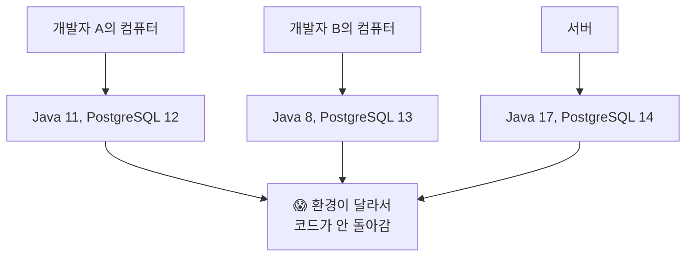

### Docker가 해결하는 방법

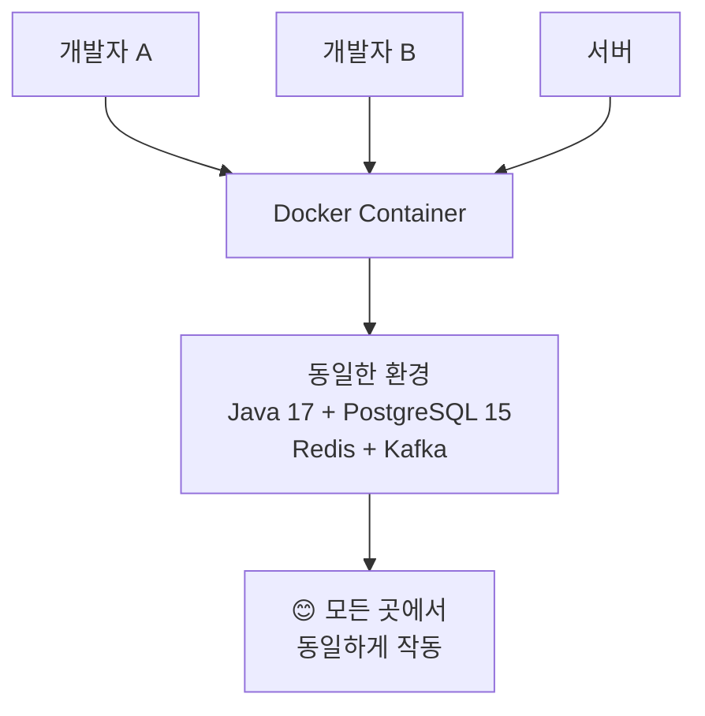

### 🏠 Docker를 집에 비유하면?

- **Docker Image**: 집의 설계도 📋
- **Docker Container**: 실제로 지어진 집 🏠
- **Dockerfile**: 집을 어떻게 지을지 적은 매뉴얼 📝
- **Docker Compose**: 여러 집(서비스)을 한 번에 짓는 도시 계획 🏙️

---

## 🧱 Docker 기본 개념

### 1. Image vs Container

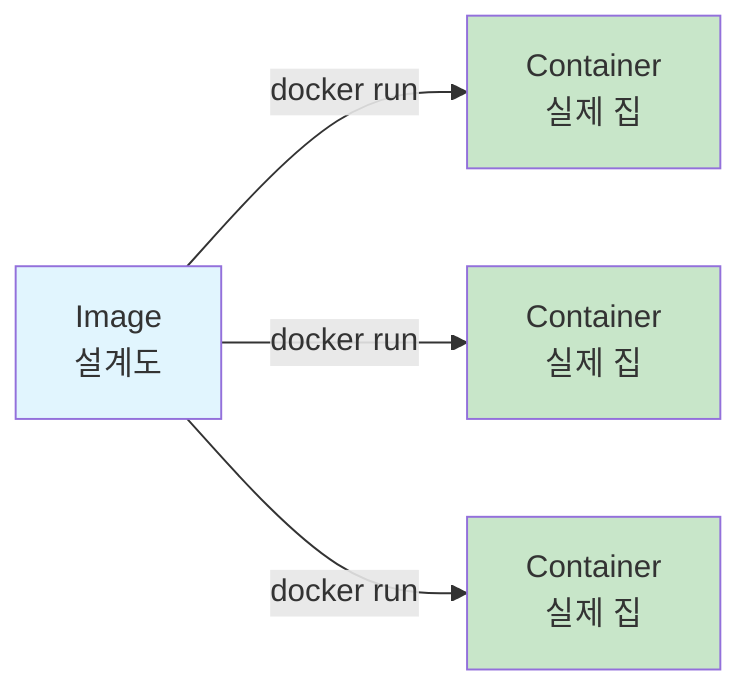

### 2. 주요 Docker 명령어

| 명령어 | 설명 | 예시 |
|--------|------|------|
| `docker run` | 컨테이너 실행 | `docker run -p 5432:5432 postgres` |
| `docker ps` | 실행 중인 컨테이너 보기 | `docker ps` |
| `docker stop` | 컨테이너 중지 | `docker stop container_name` |
| `docker logs` | 컨테이너 로그 보기 | `docker logs container_name` |

---

## 🎼 Docker Compose 이해하기

### Docker Compose가 필요한 이유

**Docker 명령어로 하나씩 실행한다면?**

```bash
# 😫 이렇게 하나씩 실행해야 함
docker run -d --name postgres -p 5432:5432 -e POSTGRES_PASSWORD=password postgres
docker run -d --name redis -p 6379:6379 redis
docker run -d --name kafka -p 9092:9092 --link zookeeper kafka
# ... 10개 이상의 서비스를 하나씩...
```

**Docker Compose를 사용하면?**

```bash
# 😊 한 번에 모든 서비스 실행
docker compose up -d
```

### Docker Compose 파일 구조

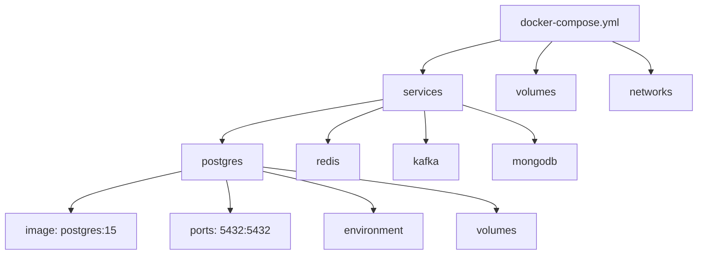

---

## 🏗️ 우리 프로젝트의 Docker 구성

### 전체 서비스 아키텍처

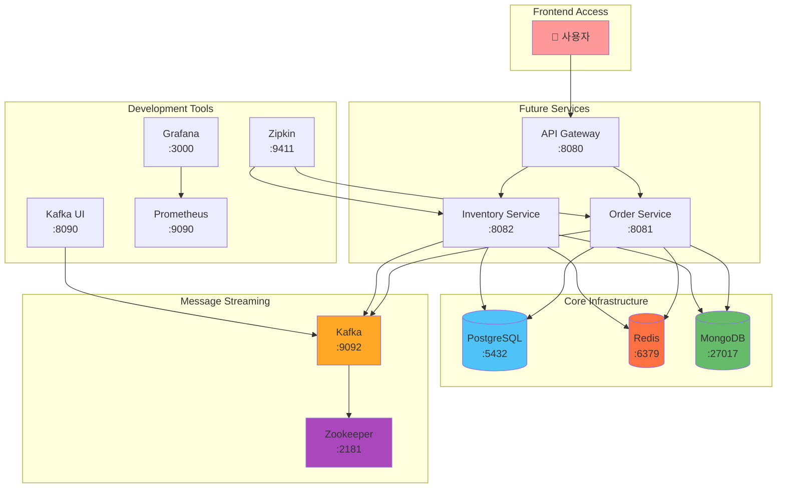

### 서비스별 역할 설명

| 서비스 | 포트 | 역할 | 왜 필요한가? |
|--------|------|------|-------------|
| **PostgreSQL** | 5432 | 메인 데이터베이스 | 주문, 재고 데이터 저장 |
| **Redis** | 6379 | 캐시 & 분산락 | 빠른 데이터 조회, 동시성 제어 |
| **MongoDB** | 27017 | 이벤트 저장소 | 이벤트 소싱 패턴 구현 |
| **Kafka** | 9092 | 메시지 큐 | 서비스 간 비동기 통신 |
| **Zookeeper** | 2181 | Kafka 코디네이터 | Kafka 클러스터 관리 |
| **Kafka UI** | 8090 | Kafka 관리 도구 | 개발 시 메시지 확인 |
| **Prometheus** | 9090 | 메트릭 수집 | 시스템 모니터링 |
| **Grafana** | 3000 | 대시보드 | 메트릭 시각화 |
| **Zipkin** | 9411 | 분산 추적 | 서비스 간 호출 추적 |

---

## 🌐 네트워크 구성 이해하기

### Docker 네트워크 개념

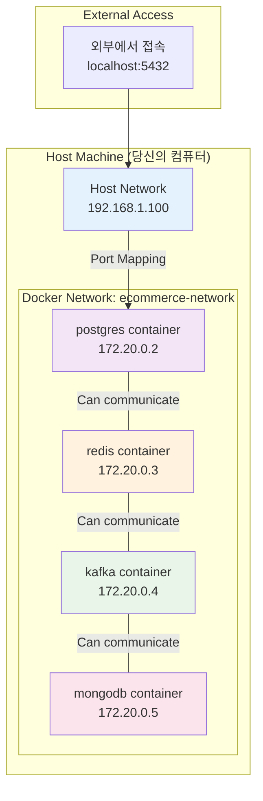

### 포트 매핑 설명

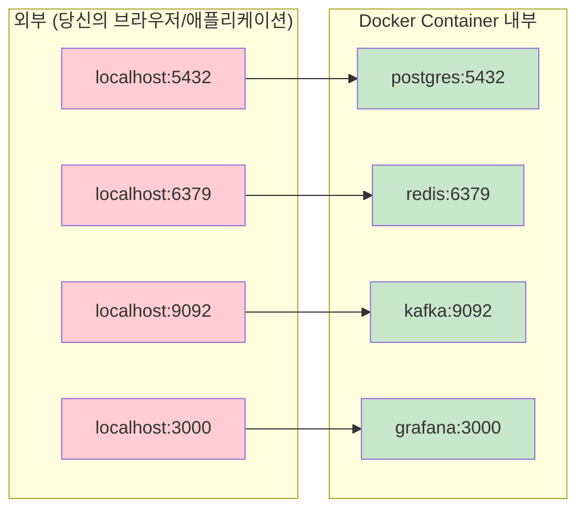

### 컨테이너 간 통신

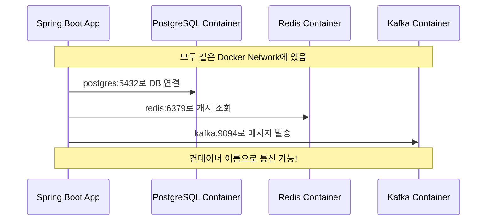

---

## 🚀 실습: 서비스 시작하기

### 1단계: 환경 준비

```bash
# 1. 프로젝트 디렉토리로 이동
cd /path/to/ecommerce-microservices

# 2. 환경 변수 파일 생성
cp .env.example .env

# 3. Docker가 실행 중인지 확인
docker --version
docker compose --version
```

### 2단계: 서비스 시작하기

#### 방법 1: 자동 스크립트 사용 (권장)

```bash
# 순차적으로 안전하게 시작
./docker/start-infrastructure.sh
```

#### 방법 2: 수동으로 시작

```bash
# 1. 기본 데이터베이스부터 시작
docker compose up -d postgres redis

# 2. 상태 확인 (healthy 될 때까지 대기)
docker compose ps

# 3. 메시징 시스템 시작
docker compose up -d zookeeper kafka

# 4. 나머지 서비스 시작
docker compose up -d mongodb kafka-ui prometheus grafana zipkin
```

### 3단계: 서비스 상태 확인

```bash
# 실행 중인 컨테이너 확인
docker compose ps

# 특정 서비스 로그 확인
docker compose logs postgres
docker compose logs kafka

# 모든 서비스 로그 실시간 확인
docker compose logs -f
```

### 4단계: 서비스 접속 테스트

| 서비스 | URL | 계정 정보 |
|--------|-----|-----------|
| Kafka UI | http://localhost:8090 | - |
| Grafana | http://localhost:3000 | admin / admin123! |
| Prometheus | http://localhost:9090 | - |
| Zipkin | http://localhost:9411 | - |

### 서비스 시작 플로우

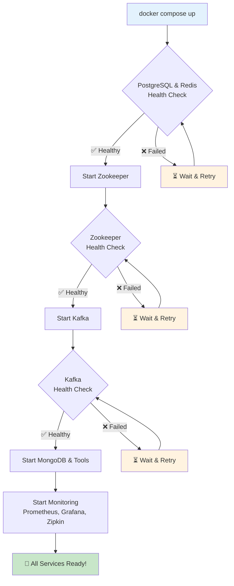

---

## 🔧 트러블슈팅

### 자주 발생하는 문제들

#### 1. 포트 충돌

**문제**: `port is already allocated`

```bash
# 해결방법: 포트 사용 중인 프로세스 확인
lsof -i :5432  # PostgreSQL 포트 확인
lsof -i :6379  # Redis 포트 확인

# 또는 해당 프로세스 종료
sudo kill -9 <PID>
```

#### 2. 컨테이너가 시작되지 않음

**문제**: 컨테이너가 계속 재시작됨

```bash
# 해결방법: 로그 확인
docker compose logs <service-name>

# 예시
docker compose logs postgres
docker compose logs kafka
```

#### 3. 네트워크 연결 문제

**문제**: 컨테이너 간 통신 안됨

```bash
# 해결방법: 네트워크 확인
docker network ls
docker network inspect ecommerce-microservices_ecommerce-network
```

#### 4. 볼륨 권한 문제

**문제**: Permission denied

```bash
# 해결방법: 볼륨 권한 수정 (Linux/Mac)
sudo chown -R $USER:$USER ./data
```

### 유용한 디버깅 명령어

```bash
# 컨테이너 내부 접속
docker compose exec postgres bash
docker compose exec redis redis-cli

# 리소스 사용량 확인
docker stats

# 네트워크 상태 확인
docker compose exec postgres ping redis
docker compose exec kafka ping zookeeper

# 전체 재시작
docker compose down
docker compose up -d
```

### 성능 튜닝 팁

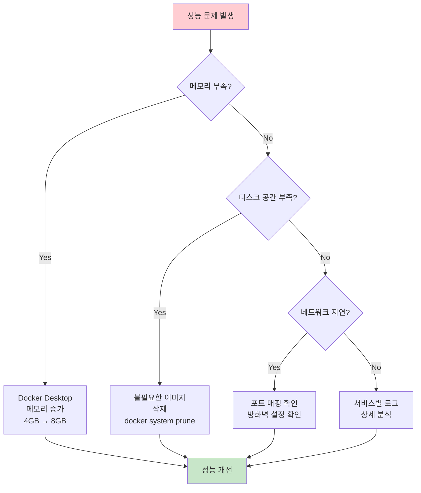

---

## 📝 요약

### 배운 핵심 개념

1. **Docker**: 동일한 환경을 어디서나 실행할 수 있게 해주는 컨테이너 기술
2. **Docker Compose**: 여러 서비스를 한 번에 관리하는 도구
3. **네트워크**: 컨테이너끼리 이름으로 통신 가능
4. **포트 매핑**: 외부에서 컨테이너 접근을 위한 포트 연결
5. **헬스체크**: 서비스가 정상 동작하는지 확인하는 메커니즘

### 다음 단계

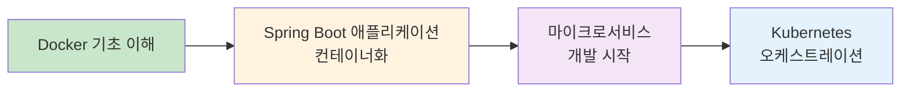

### 추가 학습 자료

- [Docker 공식 문서](https://docs.docker.com/)
- [Docker Compose 공식 가이드](https://docs.docker.com/compose/)
- [Spring Boot Docker 가이드](https://spring.io/guides/gs/spring-boot-docker/)

---

**💡 기억하세요**: Docker는 처음에는 복잡해 보이지만, 한 번 익숙해지면 개발 환경 설정이 훨씬 쉬워집니다!