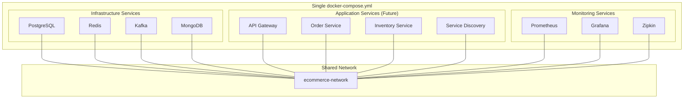
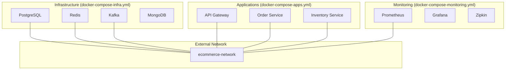
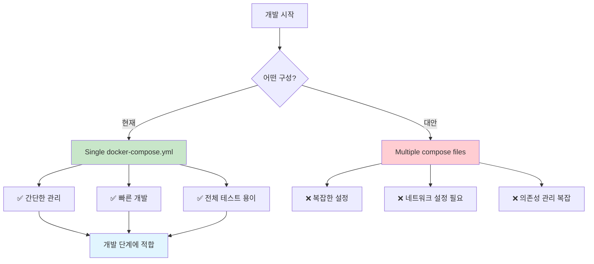
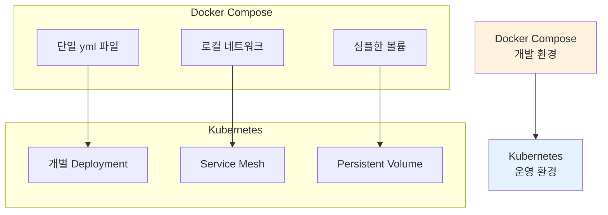

# 🐳 Docker Compose 구성 전략

## 📋 현재 구성 방식

### 단일 docker-compose.yml 구성
현재 우리 프로젝트는 **모든 서비스를 하나의 docker-compose.yml**에서 관리합니다.



## 🤔 왜 단일 Compose 파일을 선택했나?

### ✅ 장점

1. **간단한 관리**
   ```bash
   # 모든 서비스를 한 번에 시작/중지
   docker compose up -d
   docker compose down
   ```

2. **네트워크 통신 보장**
   - 모든 서비스가 같은 네트워크(`ecommerce-network`)에 속함
   - 서비스 이름으로 직접 통신 가능

3. **의존성 관리 용이**
   ```yaml
   kafka:
     depends_on:
       zookeeper:
         condition: service_healthy
   ```

4. **개발 단계에 적합**
   - 빠른 피드백 루프
   - 전체 스택 테스트 용이

### ⚠️ 단점

1. **파일 크기가 커짐**
2. **서비스별 독립적 관리 어려움**
3. **팀별 책임 분리 어려움**

## 🔄 대안: 멀티 Compose 구성

### 파일 분리 전략



### 구현 방법

#### 1. 인프라 서비스 (docker-compose-infra.yml)
```yaml
version: '3.8'
services:
  postgres:
    # ... 설정 생략
    networks:
      - ecommerce-network

networks:
  ecommerce-network:
    driver: bridge
    name: ecommerce-network  # 고정 이름 설정
```

#### 2. 애플리케이션 서비스 (docker-compose-apps.yml)
```yaml
version: '3.8'
services:
  api-gateway:
    # ... 설정 생략
    networks:
      - ecommerce-network

networks:
  ecommerce-network:
    external: true  # 외부 네트워크 사용
    name: ecommerce-network
```

#### 3. 시작 순서
```bash
# 1. 인프라 먼저 시작
docker compose -f docker-compose-infra.yml up -d

# 2. 애플리케이션 시작  
docker compose -f docker-compose-apps.yml up -d

# 3. 모니터링 시작
docker compose -f docker-compose-monitoring.yml up -d
```

## 🎯 현재 프로젝트 결정 사항

### 개발 단계에서는 단일 Compose 파일 유지



### 이유
1. **학습 목적**: Docker Compose 기본기 이해에 집중
2. **단순성**: 복잡성을 줄여 핵심 로직 개발에 집중
3. **일관성**: 모든 개발자가 동일한 환경 공유
4. **빠른 피드백**: 전체 서비스 함께 테스트 가능

## 🚀 향후 운영 단계 고려사항

### Kubernetes로 이전 시 (8주차)



### 운영 환경에서의 분리
```yaml
# k8s/infrastructure/
postgres-deployment.yaml
redis-deployment.yaml
kafka-deployment.yaml

# k8s/applications/
order-service-deployment.yaml
inventory-service-deployment.yaml
api-gateway-deployment.yaml

# k8s/monitoring/
prometheus-deployment.yaml
grafana-deployment.yaml
```

## 📚 정리

| 단계 | 구성 방식 | 이유 |
|------|-----------|------|
| **현재 (1-7주차)** | Single docker-compose.yml | 개발 단순화, 학습 집중 |
| **향후 (8주차)** | Kubernetes 개별 배포 | 운영 환경 최적화 |

### 현재 접근법의 핵심
- ✅ **지금은** Docker Compose 하나로 모든 서비스 관리
- ✅ **나중에** Kubernetes에서 서비스별 분리
- ✅ **목표는** 마이크로서비스 아키텍처 이해와 구현

이렇게 단계적으로 접근하면서 복잡성을 점진적으로 늘려가는 것이 학습에 효과적입니다! 🎯