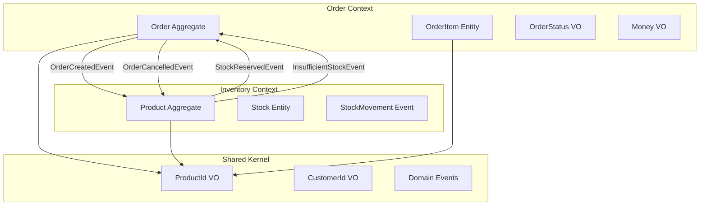

# 🏗️ Domain-Driven Design 모델링

## 📋 Domain Model 상세 정의

### Order Domain Model

#### 📋 속성 (Attributes)
**Order Aggregate Root**
- `OrderId orderId` - UUID 기반 전역 고유 식별자
- `CustomerId customerId` - 고객 참조 (Value Object)
- `List<OrderItem> orderItems` - 주문 아이템 컬렉션 (Entity)
- `OrderStatus status` - 주문 상태 (Value Object, 12가지 상태)
- `Money totalAmount` - 총 주문 금액 (BigDecimal 기반 Value Object)
- `LocalDateTime createdAt` - 주문 생성 시각
- `LocalDateTime lastModifiedAt` - 최종 수정 시각
- `String reason` - 취소/반품 사유 (선택적)

**OrderItem Entity**
- `ProductId productId` - 상품 식별자 (Value Object)
- `String productName` - 상품명 스냅샷
- `Integer quantity` - 주문 수량 (양수)
- `Money unitPrice` - 단가 (주문 시점 스냅샷)
- `Money totalPrice` - 아이템 총액 (수량 × 단가)

**Value Objects**
- `OrderId`: UUID 기반, 불변, 유효성 검증
- `CustomerId`: UUID 기반, 불변, 유효성 검증
- `ProductId`: UUID 기반, 불변, 유효성 검증
- `OrderStatus`: 12가지 상태 enum, 전이 규칙 내장
- `Money`: BigDecimal 기반, 통화 단위, 연산 지원

#### ⚡ 행위 (Behaviors)
**Order Aggregate 행위**
```java
// 주문 아이템 관리
+ addItem(ProductId productId, String productName, Integer quantity, Money unitPrice)
+ removeItem(ProductId productId)
+ updateItemQuantity(ProductId productId, Integer newQuantity)
+ hasItem(ProductId productId): boolean
+ getItemCount(): int

// 상태 관리
+ confirm(): void                    // PENDING → CONFIRMED
+ cancel(String reason): void        // CONFIRMED 이전만 가능
+ markAsPaid(): void                // CONFIRMED → PAID
+ ship(): void                      // PAID → SHIPPED
+ complete(): void                  // SHIPPED → COMPLETED
+ returnOrder(String reason): void   // COMPLETED → RETURNED
+ refund(): void                    // RETURNED → REFUNDED

// 조회 메서드
+ isConfirmed(): boolean
+ isCancellable(): boolean
+ isReturnable(): boolean
+ calculateTotalAmount(): Money
+ getItemsByProductId(ProductId): Optional<OrderItem>
```

**OrderStatus 행위**
```java
+ canTransitionTo(OrderStatus target): boolean
+ getValidTransitions(): Set<OrderStatus>
+ isTerminalState(): boolean
+ getDescription(): String
```

**Money 행위**
```java
+ add(Money other): Money
+ subtract(Money other): Money
+ multiply(BigDecimal factor): Money
+ divide(BigDecimal divisor): Money
+ isGreaterThan(Money other): boolean
+ isZero(): boolean
```

#### 🔒 규칙 (Business Rules)
**Order 불변성 규칙**
1. **주문 생성 규칙**: 최소 1개 이상의 아이템, 모든 수량은 양수
2. **상태 전이 규칙**: 정의된 전이 경로만 허용 (PENDING → CONFIRMED → PAID → SHIPPED → COMPLETED)
3. **취소 가능 조건**: CONFIRMED 이전 상태에서만 취소 가능
4. **반품 가능 조건**: COMPLETED 상태에서만 반품 가능
5. **아이템 중복 방지**: 동일한 ProductId를 가진 아이템 중복 추가 불가
6. **아이템 개수 제한**: 최대 50개 아이템까지 허용
7. **가격 스냅샷**: 주문 시점의 가격을 보존하여 불변성 보장
8. **총액 일관성**: orderItems의 totalPrice 합계와 totalAmount 일치

**Domain Events**
- `OrderCreatedEvent`: 주문 생성 시 발행 → 재고 예약 요청
- `OrderConfirmedEvent`: 주문 확정 시 발행 → 결제 프로세스 시작
- `OrderCancelledEvent`: 주문 취소 시 발행 → 예약 재고 해제
- `OrderCompletedEvent`: 주문 완료 시 발행 → 배송 완료 처리

### Inventory Domain Model

#### 📋 속성 (Attributes)
**Product Aggregate Root** (미구현)
- `ProductId productId` - 상품 고유 식별자
- `String productName` - 상품명
- `Stock stock` - 재고 정보 (Entity)
- `List<StockMovement> stockMovements` - 재고 변동 이력
- `LocalDateTime createdAt` - 상품 등록 시각
- `LocalDateTime lastModifiedAt` - 최종 수정 시각

**Stock Entity** (미구현)
- `Integer availableQuantity` - 구매 가능 수량
- `Integer reservedQuantity` - 예약된 수량
- `Integer totalQuantity` - 총 재고 수량
- `Long version` - 낙관적 락을 위한 버전

#### ⚡ 행위 (Behaviors)
**Product Aggregate 행위** (미구현)
```java
// 재고 관리
+ reserveStock(Integer quantity, OrderId orderId): boolean
+ releaseReservation(OrderId orderId): void
+ deductStock(Integer quantity): void
+ restoreStock(Integer quantity): void
+ adjustStock(Integer newQuantity, String reason): void

// 조회 메서드
+ isStockAvailable(Integer quantity): boolean
+ getAvailableQuantity(): Integer
+ getTotalQuantity(): Integer
+ getReservationByOrderId(OrderId): Optional<StockReservation>
```

#### 🔒 규칙 (Business Rules)
**Inventory 불변성 규칙** (미구현)
1. **재고 음수 방지**: availableQuantity >= 0 항상 유지
2. **예약 타임아웃**: 30분 후 자동 해제 (설정 가능)
3. **동시성 제어**: 분산 락 + 낙관적 락 조합
4. **재고 일관성**: availableQuantity + reservedQuantity = totalQuantity
5. **감사 추적**: 모든 재고 변동 이력 보관
6. **예약 중복 방지**: 동일한 OrderId로 중복 예약 불가

**Domain Events** (미구현)
- `StockReservedEvent`: 재고 예약 성공 → Order 확정 가능
- `StockDeductedEvent`: 재고 차감 완료 → 배송 준비
- `StockRestoredEvent`: 재고 복원 → 취소 처리 완료
- `InsufficientStockEvent`: 재고 부족 → 주문 취소 필요
- `LowStockAlertEvent`: 재고 부족 임계값 도달 → 재입고 알림

## 🔗 Bounded Context 분리 전략

### Order Context (주문 컨텍스트)
**분리 이유**: 주문은 고객의 구매 의사를 표현하는 독립적인 개념으로, 재고 상태와 무관하게 먼저 생성되어야 함

**핵심 특징:**
- 고객 중심의 비즈니스 로직
- 주문 상태의 생명주기 관리
- 가격 스냅샷을 통한 데이터 일관성
- 이벤트 기반 다른 컨텍스트와의 통신

### Inventory Context (재고 컨텍스트)  
**분리 이유**: 재고는 물리적 자원을 표현하며, 동시성 제어가 핵심인 별도의 비즈니스 영역

**핵심 특징:**
- 물리적 재고의 정확한 추적
- 높은 동시성 처리 (분산 락 + 낙관적 락)
- 재고 변동의 완전한 감사 추적
- 실시간 재고 상태 모니터링

## 🔄 Context Mapping



## 📐 설계 원칙

### 1. Aggregate 설계 원칙
- **불변성 보장**: 비즈니스 규칙을 Aggregate 내부에서 강제
- **트랜잭션 경계**: 하나의 Aggregate = 하나의 트랜잭션
- **참조 방식**: 다른 Aggregate은 ID로만 참조
- **크기 제한**: Aggregate는 가능한 작게 유지

### 2. Value Object 설계 원칙
- **불변성**: 생성 후 변경 불가
- **자기 검증**: 생성 시점에 유효성 검증
- **동등성**: 값이 같으면 동일한 객체
- **무부작용**: 메서드 호출이 상태를 변경하지 않음

### 3. Domain Event 설계 원칙
- **과거형 명명**: 이미 일어난 사실을 표현
- **불변성**: 발행 후 내용 변경 불가
- **완전성**: 이벤트만으로 상황 파악 가능
- **순서 보장**: 동일한 Aggregate의 이벤트는 순서 보장

## 🧪 테스트 전략

### Domain Model 테스트
```java
// Order Aggregate 테스트 예시
@Test
void 주문_아이템_추가_시_총액이_올바르게_계산된다() {
    // Given
    Order order = Order.create(customerId);
    Money unitPrice = Money.of(BigDecimal.valueOf(1000));
    
    // When
    order.addItem(productId, "테스트 상품", 2, unitPrice);
    
    // Then
    assertThat(order.getTotalAmount())
        .isEqualTo(Money.of(BigDecimal.valueOf(2000)));
}

@Test
void CONFIRMED_이전_상태에서만_주문_취소가_가능하다() {
    // Given
    Order order = Order.create(customerId);
    order.addItem(productId, "테스트 상품", 1, unitPrice);
    order.confirm();
    
    // When & Then
    assertThatThrownBy(() -> order.cancel("고객 요청"))
        .isInstanceOf(InvalidOrderStateException.class);
}
```

### Value Object 테스트
```java
@Test
void Money_덧셈_연산이_올바르게_동작한다() {
    // Given
    Money money1 = Money.of(BigDecimal.valueOf(1000));
    Money money2 = Money.of(BigDecimal.valueOf(500));
    
    // When
    Money result = money1.add(money2);
    
    // Then
    assertThat(result).isEqualTo(Money.of(BigDecimal.valueOf(1500)));
    assertThat(money1).isEqualTo(Money.of(BigDecimal.valueOf(1000))); // 불변성 확인
}
```

## 📚 구현 상태

## 🏢 Domain Services 및 비즈니스 규칙

### Order Domain Services

#### OrderDomainService
고객 친화적인 주문 관리 로직을 담당

**구현된 주요 기능:**
- 주문 병합 로직 (제한 없이 자유롭게)
- 주문 우선순위 계산
- 고객 주문 통계 계산
- 고가 주문 식별 (VIP 서비스 제공용)

#### OrderValidationService
최소한의 필수 검증만 수행

**구현된 주요 기능:**
- 중복 주문 방지 (5분 내)
- 주문 취소 가능 여부 확인 (24시간 내)
- 기본적인 주문 항목 검증 (수량 > 0)

#### OrderPricingService
고객 혜택 중심의 가격 계산

**구현된 주요 기능:**
- 할인 정책 적용 (대량구매, VIP, 충성고객)
- 배송비 계산 (무료배송 적극 적용)
- 쿠폰/포인트 적용 (50%까지 사용 가능)
- 주말 할증 제거 (기본값 비활성화)

### 📋 고객 친화적 비즈니스 정책

#### ✅ 유지되는 최소한의 규칙들
| 규칙 | 현재 값 | 비즈니스 근거 |
|------|---------|---------------|
| 중복 주문 방지 시간 | 5분 | • 실수 주문 방지<br>• 고객 보호 |
| 주문 취소 가능 시간 | 24시간 | • 법적 쿨링오프<br>• 고객 만족도 |
| 기본 수량 검증 | 1개 이상 | • 논리적 최소값 |

#### 🎁 고객 혜택 중심 가격 정책
| 정책 | 설정값 | 고객 혜택 |
|------|---------|-----------|
| VIP 기준 | 30만원 (완화) | • 더 많은 고객이 VIP 혜택<br>• 10% 할인 제공 |
| 충성고객 기준 | 3회 주문 (완화) | • 빠른 혜택 제공<br>• 3% 할인 제공 |
| 대량구매 할인 | 10개 이상 5% | • B2B 고객 지원<br>• 대량 구매 장려 |
| 무료배송 기준 | 3만원 | • 합리적인 기준<br>• 높은 접근성 |
| 주말 할증 | 비활성화 | • 언제나 동일한 가격<br>• 고객 불편 제거 |
| 포인트 사용 | 50%까지 | • 적극적인 포인트 활용<br>• 고객 만족도 증대 |

### 🔧 설정 기반 관리 전략

#### 🎯 설계 결정: 왜 Configuration Properties를 선택했나?

**문제 상황**
- 비즈니스 규칙이 코드에 하드코딩되어 있어 변경 시마다 재배포 필요
- 환경별(개발/스테이징/운영) 다른 정책 적용 어려움
- 프로모션 기간 등 임시 정책 변경의 복잡성

**고려한 대안들**

| 방식 | 장점 | 단점 | 적합성 |
|------|------|------|--------|
| **하드코딩** | 단순함, 빠름 | 변경시 재배포, 환경별 설정 불가 | ❌ 부적합 |
| **DB 설정 테이블** | 런타임 변경 가능 | DB 의존성, 복잡도 증가, 성능 저하 | ❌ 과도함 |
| **외부 Config Server** | 중앙 관리, 런타임 변경 | 인프라 복잡도, 네트워크 의존성 | ❌ 과도함 |
| **Configuration Properties** ✅ | 환경별 설정, 타입 안전성, 성능 최적 | 재시작 필요 | ✅ 최적 |

**선택 이유: Configuration Properties + 시작시 캐시**

#### 📊 성능 최적화 결정

**캐시 vs 실시간 읽기 분석**

```java
// ❌ 실시간 파일 읽기 (매번 I/O 발생)
public boolean isHighValueOrder(Order order) {
    Properties props = loadFromFile("config.properties"); // 매번 디스크 I/O
    BigDecimal threshold = new BigDecimal(props.getProperty("vip.threshold"));
    return order.getTotalAmount().getAmount().compareTo(threshold) >= 0;
}

// ✅ 시작시 캐시 (메모리에서 바로 읽기)
public boolean isHighValueOrder(Order order) {
    return order.getTotalAmount().getAmount()
        .compareTo(config.getPricing().getVipThreshold()) >= 0; // 메모리 액세스
}
```

**성능 벤치마크 (가상 시나리오)**
```
실시간 파일 읽기: ~1-5ms (디스크 I/O)
메모리 캐시 읽기: ~0.001ms (메모리 액세스)
성능 향상: 1000-5000배
```

#### 🏗️ 아키텍처 일관성

**Spring Boot 생태계와의 정합성**
- Spring Boot의 표준 설정 방식 활용
- `@ConfigurationProperties`로 타입 안전성 보장
- IDE 자동완성 지원 (spring-boot-configuration-processor)
- Validation 어노테이션 지원

```java
@ConfigurationProperties("ecommerce.order")
@Validated
public class OrderBusinessRulesConfig {
    
    @NotNull
    @DecimalMin("0.0")
    private BigDecimal vipDiscountRate = new BigDecimal("0.10");
    
    @Min(1)
    private int loyaltyOrderThreshold = 3;
}
```

#### 🎯 비즈니스 요구사항 분석

**설정 변경 빈도 분석**
- **VIP 기준 금액**: 분기별 1-2회 (마케팅 전략 변경)
- **할인율**: 월 1-2회 (프로모션 계획)
- **배송비 정책**: 년 1-2회 (물류비 변동)
- **시간 제한**: 거의 변경 없음 (법적 요구사항)

**결론**: 빈번하지 않은 변경 → 재시작 기반 설정이 적합

#### 🛡️ 운영 안정성 고려사항

**장애 시나리오 분석**

1. **파일 시스템 장애**
   ```
   실시간 읽기: 매 요청마다 장애 발생 가능
   캐시 방식: 시작 후에는 영향 없음 ✅
   ```

2. **설정 파일 손상**
   ```
   실시간 읽기: 런타임 에러, 서비스 중단
   캐시 방식: 시작 시점에 검증, 안전한 실패 ✅
   ```

3. **동시성 이슈**
   ```
   실시간 읽기: 파일 락, 동시 접근 문제
   캐시 방식: 불변 객체, 동시성 문제 없음 ✅
   ```

#### 🔄 배포 전략과의 호환성

**무중단 배포 시나리오**
```yaml
# Blue-Green 배포
# 1. Green 환경에 새 설정으로 시작
# 2. 헬스체크 통과 확인
# 3. 트래픽 전환
# 4. Blue 환경 종료

# 설정 검증
ecommerce:
  order:
    pricing:
      vip-threshold: 300000  # 새 정책
    time:
      duplicate-order-prevention-minutes: 3  # 완화된 정책
```

**롤백 전략**
- 이전 버전 설정 파일로 즉시 롤백 가능
- Git을 통한 설정 이력 관리
- 환경별 설정 파일 분리로 실수 방지

#### 🧪 테스트 용이성

**단위 테스트**
```java
@Test
void 설정값에_따른_VIP_판정_테스트() {
    // Given
    OrderBusinessRulesConfig config = new OrderBusinessRulesConfig();
    config.getPricing().setVipThreshold(new BigDecimal("100000"));
    
    OrderDomainService service = new OrderDomainService(repository, config);
    Order order = createOrderWithAmount(150000);
    
    // When & Then
    assertThat(service.isHighValueOrder(order)).isTrue();
}
```

**통합 테스트**
```yaml
# application-test.yml
ecommerce:
  order:
    pricing:
      vip-threshold: 10000  # 테스트용 낮은 임계값
      enable-weekend-surcharge: false  # 테스트 안정성
```

#### 📈 모니터링 및 관찰 가능성

**설정 값 추적**
```java
@EventListener(ApplicationReadyEvent.class)
public void logConfigurationOnStartup() {
    log.info("Order Configuration Loaded: VIP Threshold={}, Loyalty Threshold={}", 
        config.getPricing().getVipThreshold(),
        config.getPricing().getLoyaltyOrderThreshold());
}
```

**운영 메트릭**
- VIP 고객 전환율 모니터링
- 할인 적용률 추적
- 설정 변경 후 비즈니스 지표 변화 관찰

#### 🔮 미래 확장성 고려

**단계적 발전 경로**
```
1단계 (현재): Static Configuration Properties
   ↓ (필요시)
2단계: @RefreshScope + Spring Cloud Config
   ↓ (필요시)  
3단계: Database-driven Configuration
   ↓ (필요시)
4단계: AI-driven Dynamic Pricing
```

**확장 지점 준비**
```java
// 인터페이스로 추상화하여 미래 확장 준비
public interface PricingPolicyProvider {
    BigDecimal getVipThreshold();
    BigDecimal getVipDiscountRate();
}

// 현재 구현
@Component
public class ConfigurationBasedPricingPolicy implements PricingPolicyProvider {
    // Configuration Properties 기반
}

// 미래 구현 (필요시)
public class DatabaseDrivenPricingPolicy implements PricingPolicyProvider {
    // DB 기반 실시간 설정
}
```

#### 단순화된 Configuration Properties
```java
@ConfigurationProperties("ecommerce.order")
public class OrderBusinessRulesConfig {
    
    // 가격 정책 설정 (고객 혜택 중심)
    private PricingPolicy pricing = new PricingPolicy();
    
    // 시간 정책 설정 (최소한의 제한)
    private TimePolicy time = new TimePolicy();
    
    public static class PricingPolicy {
        private BigDecimal vipDiscountRate = new BigDecimal("0.10");
        private int bulkDiscountThreshold = 10;
        private BigDecimal bulkDiscountRate = new BigDecimal("0.05");
        private BigDecimal loyaltyDiscountRate = new BigDecimal("0.03");
        private int loyaltyOrderThreshold = 3; // 완화
        private BigDecimal freeShippingThreshold = new BigDecimal("30000");
        private BigDecimal standardShippingFee = new BigDecimal("3000");
        private BigDecimal expressShippingFee = new BigDecimal("5000");
        private BigDecimal weekendSurchargeRate = new BigDecimal("0.02");
        private boolean enableWeekendSurcharge = false; // 비활성화
        private BigDecimal vipThreshold = new BigDecimal("300000"); // 완화
    }
    
    public static class TimePolicy {
        private int duplicateOrderPreventionMinutes = 5;
        private int orderCancellationHours = 24;
    }
}
```

#### 환경별 설정 예시
```yaml
# application-prod.yml (운영환경 - 고객 친화적)
ecommerce:
  order:
    pricing:
      enable-weekend-surcharge: false      # 할증 없음
      vip-discount-rate: 0.10
      vip-threshold: 300000                # 접근하기 쉬운 VIP 기준
    time:
      duplicate-order-prevention-minutes: 5
      order-cancellation-hours: 24

# application-promotion.yml (프로모션 기간 - 더욱 혜택 강화)
ecommerce:
  order:
    pricing:
      vip-discount-rate: 0.15             # 할인율 증가
      loyalty-order-threshold: 2          # 더 빠른 충성고객 혜택
      free-shipping-threshold: 20000      # 무료배송 기준 완화
      vip-threshold: 200000               # VIP 기준 완화
    time:
      duplicate-order-prevention-minutes: 1  # 빠른 재주문 허용
      order-cancellation-hours: 48           # 취소 기간 연장

# application-dev.yml (개발환경 - 제한 최소화)
ecommerce:
  order:
    pricing:
      enable-weekend-surcharge: false
      vip-threshold: 10000                # 테스트 용이성
    time:
      duplicate-order-prevention-minutes: 0  # 중복 방지 해제
      order-cancellation-hours: 168          # 7일까지 취소 가능
```

#### A/B 테스트 및 Feature Flag 지원
```java
@Component
public class BusinessRuleFeatureFlags {
    
    @Value("${feature.dynamic-pricing:false}")
    private boolean enableDynamicPricing;
    
    @Value("${feature.ai-fraud-detection:false}")
    private boolean enableAiFraudDetection;
    
    @Value("${feature.real-time-inventory:true}")
    private boolean enableRealTimeInventory;
    
    public boolean shouldApplyDynamicPricing(CustomerId customerId) {
        return enableDynamicPricing && isInTestGroup(customerId);
    }
}
```

## 🔧 Value Object ID 생성 패턴 설계 원칙

### 🎯 문제 인식
초기 구현에서 모든 ID Value Object에 `generate()` 메서드를 추가했으나, DDD 관점에서 도메인 책임 경계를 위반하는 문제가 발견됨.

### 📋 도메인별 ID 생성 책임 분석

#### ✅ ID 생성이 적절한 경우
| Value Object | 도메인 | 이유 |
|--------------|-------|------|
| **OrderId** | Order | 주문 생성은 Order 도메인의 핵심 책임 |
| **ReservationId** | Inventory | 재고 예약 생성은 Inventory 도메인의 핵심 책임 |

```java
// ✅ 적절한 사용 예시
public class Order {
    public static Order create(CustomerId customerId) {
        OrderId orderId = OrderId.generate();  // 새로운 주문 생성
        return new Order(orderId, customerId);
    }
}

public class StockReservation {
    public static StockReservation create(ProductId productId, StockQuantity quantity) {
        ReservationId reservationId = ReservationId.generate();  // 새로운 예약 생성
        return new StockReservation(reservationId, productId, quantity);
    }
}
```

#### ❌ ID 생성이 부적절한 경우
| Value Object | 도메인 | 문제점 |
|--------------|-------|--------|
| **CustomerId** | Order | 고객 등록은 User/Customer 도메인의 책임 |
| **ProductId** | Inventory | 상품 생성은 Product 도메인의 책임 |

```java
// ❌ 부적절한 사용 (수정 전)
CustomerId.generate();  // Order 도메인에서 고객 생성?
ProductId.generate();   // Inventory 도메인에서 상품 생성?

// ✅ 올바른 사용 (수정 후)
CustomerId.of(existingCustomerId);  // 기존 고객 ID 참조
ProductId.of(existingProductId);    // 기존 상품 ID 참조
```

### 🎯 설계 결정 원칙

#### 1. 도메인 책임 경계 준수
- **ID 생성 = 새로운 엔티티 생성의 시작점**
- 해당 도메인에서 새로운 개념을 생성할 때만 `generate()` 메서드 제공
- 다른 도메인의 엔티티 참조 시에는 `of()` 메서드만 제공

#### 2. 컨텍스트 매핑 고려
```mermaid
graph TB
    subgraph "Order Context"
        O[Order] --> CI[CustomerId.of()]
        O --> PI[ProductId.of()]
        O --> OI[OrderId.generate()]
    end
    
    subgraph "Inventory Context"
        INV[Inventory] --> PI2[ProductId.of()]
        INV --> RI[ReservationId.generate()]
    end
    
    subgraph "Customer Context"
        C[Customer] --> CI2[CustomerId.generate()]
    end
    
    subgraph "Product Context"
        P[Product] --> PI3[ProductId.generate()]
    end
```

#### 3. 책임 이전 방법
```java
// 잘못된 방법: Value Object가 직접 생성
ProductId newProductId = ProductId.generate();

// 올바른 방법: 해당 도메인의 Factory나 Service에서 생성
public class ProductFactory {
    public Product createProduct(String name) {
        ProductId productId = ProductId.of(UUID.randomUUID());
        return new Product(productId, name);
    }
}
```

### 🔧 수정 내역

#### Before (문제가 있던 코드)
```java
// 모든 ID Value Object에 generate() 메서드 존재
OrderId.generate()      // ✅ 적절
CustomerId.generate()   // ❌ 부적절
ProductId.generate()    // ❌ 부적절
ReservationId.generate() // ✅ 적절
```

#### After (수정된 코드)
```java
// 도메인 책임에 따라 선택적으로 generate() 메서드 제공
OrderId.generate()      // ✅ 유지 (Order 도메인의 책임)
CustomerId.of()         // ✅ 수정 (Customer 도메인에서 관리)
ProductId.of()          // ✅ 수정 (Product 도메인에서 관리)
ReservationId.generate() // ✅ 유지 (Inventory 도메인의 책임)
```

### 📚 학습 포인트

1. **Value Object의 주목적은 값 표현이지 생성이 아님**
2. **ID 생성 권한 = 해당 엔티티의 생성 권한**
3. **Bounded Context 경계를 명확히 하여 책임 분리**
4. **코드 편의성보다 도메인 무결성 우선**

### ✅ 완료된 구현
- [x] Order Domain Events (OrderCreatedEvent, OrderConfirmedEvent, OrderCancelledEvent, OrderCompletedEvent)
- [x] Order Value Objects (OrderId, CustomerId, OrderStatus, Money, ProductId)
- [x] Order Aggregate (Order, OrderItem)
- [x] Order Repository Interface (확장 완료)
- [x] Order Domain Exceptions
- [x] Order Domain Services (OrderDomainService, OrderValidationService, OrderPricingService)

### 🔄 진행 중인 구현
- [ ] Configuration Properties 적용
- [ ] Application Layer (Use Cases, Command/Query Handlers)
- [ ] Infrastructure Layer (JPA Adapters, Kafka Adapters)

### ⏳ 예정된 구현
- [ ] Inventory Domain Model (Product Aggregate, Stock Entity)
- [ ] Inventory Domain Events
- [ ] Inventory Repository Implementation
- [ ] Distributed Lock Implementation
- [ ] Saga Pattern Implementation