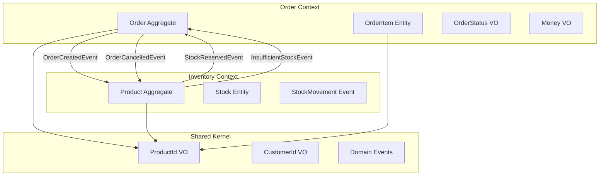

# 🏗️ Domain-Driven Design 모델링

## 📋 Domain Model 상세 정의

### Order Domain Model

#### 📋 속성 (Attributes)
**Order Aggregate Root**
- `OrderId orderId` - UUID 기반 전역 고유 식별자
- `CustomerId customerId` - 고객 참조 (Value Object)
- `List<OrderItem> orderItems` - 주문 아이템 컬렉션 (Entity)
- `OrderStatus status` - 주문 상태 (Value Object, 12가지 상태)
- `Money totalAmount` - 총 주문 금액 (BigDecimal 기반 Value Object)
- `LocalDateTime createdAt` - 주문 생성 시각
- `LocalDateTime lastModifiedAt` - 최종 수정 시각
- `String reason` - 취소/반품 사유 (선택적)

**OrderItem Entity**
- `ProductId productId` - 상품 식별자 (Value Object)
- `String productName` - 상품명 스냅샷
- `Integer quantity` - 주문 수량 (양수)
- `Money unitPrice` - 단가 (주문 시점 스냅샷)
- `Money totalPrice` - 아이템 총액 (수량 × 단가)

**Value Objects**
- `OrderId`: UUID 기반, 불변, 유효성 검증
- `CustomerId`: UUID 기반, 불변, 유효성 검증
- `ProductId`: UUID 기반, 불변, 유효성 검증
- `OrderStatus`: 12가지 상태 enum, 전이 규칙 내장
- `Money`: BigDecimal 기반, 통화 단위, 연산 지원

#### ⚡ 행위 (Behaviors)
**Order Aggregate 행위**
```java
// 주문 아이템 관리
+ addItem(ProductId productId, String productName, Integer quantity, Money unitPrice)
+ removeItem(ProductId productId)
+ updateItemQuantity(ProductId productId, Integer newQuantity)
+ hasItem(ProductId productId): boolean
+ getItemCount(): int

// 상태 관리
+ confirm(): void                    // PENDING → CONFIRMED
+ cancel(String reason): void        // CONFIRMED 이전만 가능
+ markAsPaid(): void                // CONFIRMED → PAID
+ ship(): void                      // PAID → SHIPPED
+ complete(): void                  // SHIPPED → COMPLETED
+ returnOrder(String reason): void   // COMPLETED → RETURNED
+ refund(): void                    // RETURNED → REFUNDED

// 조회 메서드
+ isConfirmed(): boolean
+ isCancellable(): boolean
+ isReturnable(): boolean
+ calculateTotalAmount(): Money
+ getItemsByProductId(ProductId): Optional<OrderItem>
```

**OrderStatus 행위**
```java
+ canTransitionTo(OrderStatus target): boolean
+ getValidTransitions(): Set<OrderStatus>
+ isTerminalState(): boolean
+ getDescription(): String
```

**Money 행위**
```java
+ add(Money other): Money
+ subtract(Money other): Money
+ multiply(BigDecimal factor): Money
+ divide(BigDecimal divisor): Money
+ isGreaterThan(Money other): boolean
+ isZero(): boolean
```

#### 🔒 규칙 (Business Rules)
**Order 불변성 규칙**
1. **주문 생성 규칙**: 최소 1개 이상의 아이템, 모든 수량은 양수
2. **상태 전이 규칙**: 정의된 전이 경로만 허용 (PENDING → CONFIRMED → PAID → SHIPPED → COMPLETED)
3. **취소 가능 조건**: CONFIRMED 이전 상태에서만 취소 가능
4. **반품 가능 조건**: COMPLETED 상태에서만 반품 가능
5. **아이템 중복 방지**: 동일한 ProductId를 가진 아이템 중복 추가 불가
6. **아이템 개수 제한**: 최대 50개 아이템까지 허용
7. **가격 스냅샷**: 주문 시점의 가격을 보존하여 불변성 보장
8. **총액 일관성**: orderItems의 totalPrice 합계와 totalAmount 일치

**Domain Events**
- `OrderCreatedEvent`: 주문 생성 시 발행 → 재고 예약 요청
- `OrderConfirmedEvent`: 주문 확정 시 발행 → 결제 프로세스 시작
- `OrderCancelledEvent`: 주문 취소 시 발행 → 예약 재고 해제
- `OrderCompletedEvent`: 주문 완료 시 발행 → 배송 완료 처리

### Inventory Domain Model

#### 📋 속성 (Attributes)
**Product Aggregate Root** (미구현)
- `ProductId productId` - 상품 고유 식별자
- `String productName` - 상품명
- `Stock stock` - 재고 정보 (Entity)
- `List<StockMovement> stockMovements` - 재고 변동 이력
- `LocalDateTime createdAt` - 상품 등록 시각
- `LocalDateTime lastModifiedAt` - 최종 수정 시각

**Stock Entity** (미구현)
- `Integer availableQuantity` - 구매 가능 수량
- `Integer reservedQuantity` - 예약된 수량
- `Integer totalQuantity` - 총 재고 수량
- `Long version` - 낙관적 락을 위한 버전

#### ⚡ 행위 (Behaviors)
**Product Aggregate 행위** (미구현)
```java
// 재고 관리
+ reserveStock(Integer quantity, OrderId orderId): boolean
+ releaseReservation(OrderId orderId): void
+ deductStock(Integer quantity): void
+ restoreStock(Integer quantity): void
+ adjustStock(Integer newQuantity, String reason): void

// 조회 메서드
+ isStockAvailable(Integer quantity): boolean
+ getAvailableQuantity(): Integer
+ getTotalQuantity(): Integer
+ getReservationByOrderId(OrderId): Optional<StockReservation>
```

#### 🔒 규칙 (Business Rules)
**Inventory 불변성 규칙** (미구현)
1. **재고 음수 방지**: availableQuantity >= 0 항상 유지
2. **예약 타임아웃**: 30분 후 자동 해제 (설정 가능)
3. **동시성 제어**: 분산 락 + 낙관적 락 조합
4. **재고 일관성**: availableQuantity + reservedQuantity = totalQuantity
5. **감사 추적**: 모든 재고 변동 이력 보관
6. **예약 중복 방지**: 동일한 OrderId로 중복 예약 불가

**Domain Events** (미구현)
- `StockReservedEvent`: 재고 예약 성공 → Order 확정 가능
- `StockDeductedEvent`: 재고 차감 완료 → 배송 준비
- `StockRestoredEvent`: 재고 복원 → 취소 처리 완료
- `InsufficientStockEvent`: 재고 부족 → 주문 취소 필요
- `LowStockAlertEvent`: 재고 부족 임계값 도달 → 재입고 알림

## 🔗 Bounded Context 분리 전략

### Order Context (주문 컨텍스트)
**분리 이유**: 주문은 고객의 구매 의사를 표현하는 독립적인 개념으로, 재고 상태와 무관하게 먼저 생성되어야 함

**핵심 특징:**
- 고객 중심의 비즈니스 로직
- 주문 상태의 생명주기 관리
- 가격 스냅샷을 통한 데이터 일관성
- 이벤트 기반 다른 컨텍스트와의 통신

### Inventory Context (재고 컨텍스트)  
**분리 이유**: 재고는 물리적 자원을 표현하며, 동시성 제어가 핵심인 별도의 비즈니스 영역

**핵심 특징:**
- 물리적 재고의 정확한 추적
- 높은 동시성 처리 (분산 락 + 낙관적 락)
- 재고 변동의 완전한 감사 추적
- 실시간 재고 상태 모니터링

## 🔄 Context Mapping



## 📐 설계 원칙

### 1. Aggregate 설계 원칙
- **불변성 보장**: 비즈니스 규칙을 Aggregate 내부에서 강제
- **트랜잭션 경계**: 하나의 Aggregate = 하나의 트랜잭션
- **참조 방식**: 다른 Aggregate은 ID로만 참조
- **크기 제한**: Aggregate는 가능한 작게 유지

### 2. Value Object 설계 원칙
- **불변성**: 생성 후 변경 불가
- **자기 검증**: 생성 시점에 유효성 검증
- **동등성**: 값이 같으면 동일한 객체
- **무부작용**: 메서드 호출이 상태를 변경하지 않음

### 3. Domain Event 설계 원칙
- **과거형 명명**: 이미 일어난 사실을 표현
- **불변성**: 발행 후 내용 변경 불가
- **완전성**: 이벤트만으로 상황 파악 가능
- **순서 보장**: 동일한 Aggregate의 이벤트는 순서 보장

## 🧪 테스트 전략

### Domain Model 테스트
```java
// Order Aggregate 테스트 예시
@Test
void 주문_아이템_추가_시_총액이_올바르게_계산된다() {
    // Given
    Order order = Order.create(customerId);
    Money unitPrice = Money.of(BigDecimal.valueOf(1000));
    
    // When
    order.addItem(productId, "테스트 상품", 2, unitPrice);
    
    // Then
    assertThat(order.getTotalAmount())
        .isEqualTo(Money.of(BigDecimal.valueOf(2000)));
}

@Test
void CONFIRMED_이전_상태에서만_주문_취소가_가능하다() {
    // Given
    Order order = Order.create(customerId);
    order.addItem(productId, "테스트 상품", 1, unitPrice);
    order.confirm();
    
    // When & Then
    assertThatThrownBy(() -> order.cancel("고객 요청"))
        .isInstanceOf(InvalidOrderStateException.class);
}
```

### Value Object 테스트
```java
@Test
void Money_덧셈_연산이_올바르게_동작한다() {
    // Given
    Money money1 = Money.of(BigDecimal.valueOf(1000));
    Money money2 = Money.of(BigDecimal.valueOf(500));
    
    // When
    Money result = money1.add(money2);
    
    // Then
    assertThat(result).isEqualTo(Money.of(BigDecimal.valueOf(1500)));
    assertThat(money1).isEqualTo(Money.of(BigDecimal.valueOf(1000))); // 불변성 확인
}
```

## 📚 구현 상태

### ✅ 완료된 구현
- [x] Order Domain Events (OrderCreatedEvent, OrderConfirmedEvent, OrderCancelledEvent, OrderCompletedEvent)
- [x] Order Value Objects (OrderId, CustomerId, OrderStatus, Money, ProductId)
- [x] Order Aggregate (Order, OrderItem)
- [x] Order Repository Interface
- [x] Order Domain Exceptions

### 🔄 진행 중인 구현
- [ ] Application Layer (Use Cases, Command/Query Handlers)
- [ ] Infrastructure Layer (JPA Adapters, Kafka Adapters)

### ⏳ 예정된 구현
- [ ] Inventory Domain Model (Product Aggregate, Stock Entity)
- [ ] Inventory Domain Events
- [ ] Inventory Repository Implementation
- [ ] Distributed Lock Implementation
- [ ] Saga Pattern Implementation