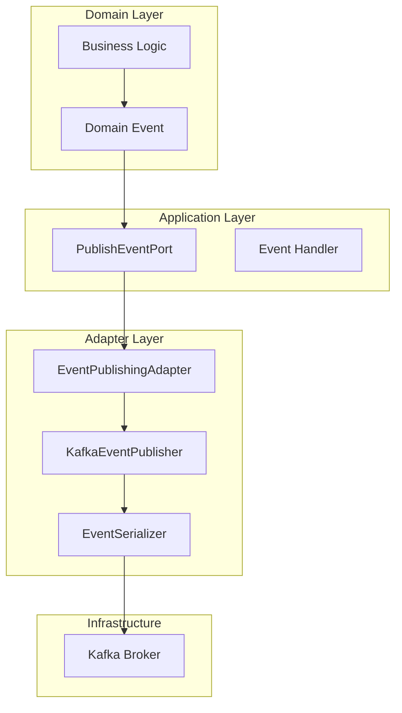
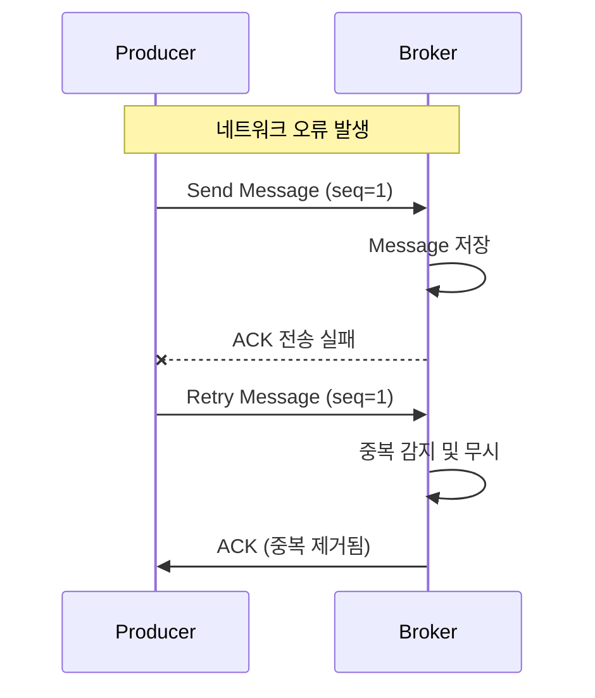
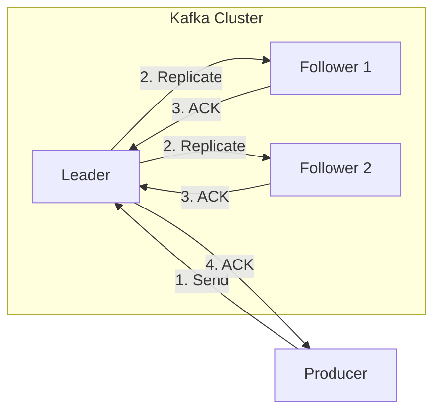
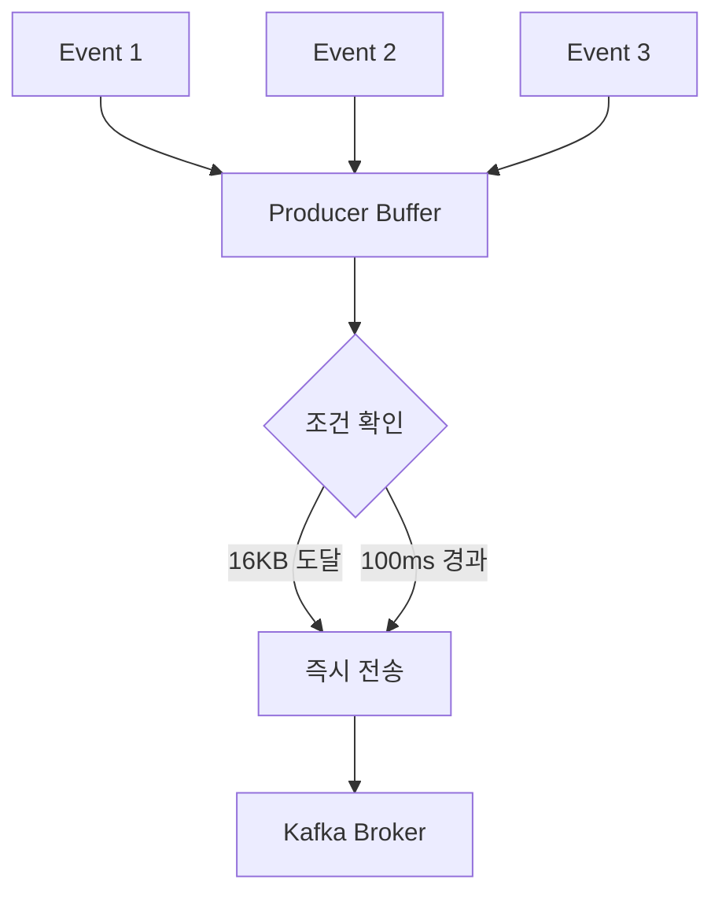
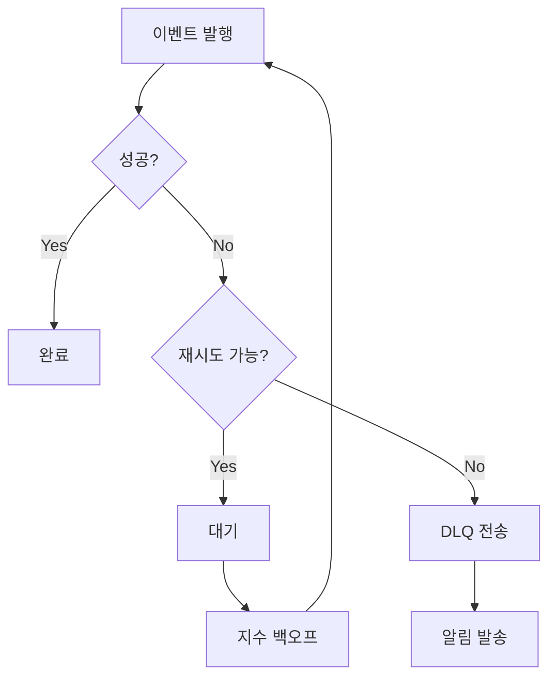
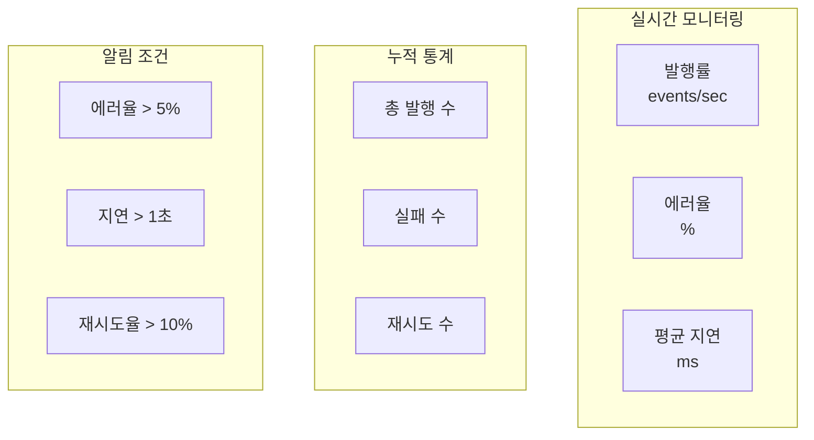

# Event Publishing Architecture - 이벤트 발행 아키텍처 설계

## 📋 목차
1. [개요](#개요)
2. [아키텍처 구조](#아키텍처-구조)
3. [신뢰성 보장 메커니즘](#신뢰성-보장-메커니즘)
4. [성능 최적화](#성능-최적화)
5. [에러 처리 전략](#에러-처리-전략)
6. [모니터링과 관찰성](#모니터링과-관찰성)
7. [설정 가이드](#설정-가이드)

## 개요

Event Publishing 계층은 마이크로서비스 간 비동기 통신의 핵심이며, 이벤트 소싱과 CQRS 패턴 구현의 기반입니다. 높은 처리량과 신뢰성을 동시에 달성하기 위해 세심하게 설계되었습니다.

## 아키텍처 구조

### 계층별 책임 분리



### 왜 이런 구조인가?

1. **헥사고날 아키텍처 준수**
   - Port/Adapter 패턴으로 인프라 의존성 격리
   - 도메인 로직이 Kafka를 직접 알지 못함
   - 테스트 용이성과 유연성 확보

2. **단일 책임 원칙**
   - `KafkaEventPublisher`: 순수 발행 로직
   - `EventPublishingAdapter`: 도메인 이벤트 변환
   - `EventSerializer`: 직렬화 전담

## 신뢰성 보장 메커니즘

### 1. Idempotent Producer

```java
configProps.put(ProducerConfig.ENABLE_IDEMPOTENCE_CONFIG, true);
```

#### 왜 필요한가?



**효과:**
- 네트워크 오류로 인한 재시도 시 중복 방지
- Exactly-once 시맨틱 보장
- 순서 보장 (sequence number 사용)

### 2. Transaction Support (향후 확장)

```java
// 트랜잭션 지원 준비
@Transactional("kafkaTransactionManager")
public void publishWithTransaction(List<DomainEvent> events) {
    // 여러 이벤트를 원자적으로 발행
}
```

### 3. Acknowledgment 전략

```java
// acks=all 설정
configProps.put(ProducerConfig.ACKS_CONFIG, "all");
```

#### 복제본 동기화 과정



**트레이드오프:**
- 성능 vs 신뢰성
- `acks=1`: 빠르지만 데이터 손실 가능
- `acks=all`: 느리지만 데이터 손실 방지

## 성능 최적화

### 1. 배치 처리

```java
configProps.put(ProducerConfig.BATCH_SIZE_CONFIG, 16384);     // 16KB
configProps.put(ProducerConfig.LINGER_MS_CONFIG, 100);        // 100ms
```

#### 배치 처리 메커니즘



**최적화 효과:**
- 네트워크 왕복 횟수 감소
- 압축 효율성 증가
- 처리량 대폭 향상

### 2. 압축

```java
configProps.put(ProducerConfig.COMPRESSION_TYPE_CONFIG, "snappy");
```

#### 압축 알고리즘 비교

| 알고리즘 | 압축률 | CPU 사용량 | 속도 | 사용 시나리오 |
|---------|--------|-----------|------|--------------|
| none | 0% | 없음 | 가장 빠름 | 네트워크 대역폭 충분 |
| snappy | 20-30% | 낮음 | 빠름 | 일반적인 선택 |
| lz4 | 30-40% | 중간 | 빠름 | 균형잡힌 선택 |
| gzip | 40-50% | 높음 | 느림 | 대역폭 제한 환경 |
| zstd | 45-55% | 중간 | 중간 | 최신 옵션 |

### 3. 비동기 발행

```java
public CompletableFuture<EventPublishResult> publish(DomainEvent event, String topic) {
    return kafkaTemplate.send(record)
        .orTimeout(DEFAULT_SEND_TIMEOUT_SECONDS, TimeUnit.SECONDS)
        .handle((result, throwable) -> {
            // 비동기 결과 처리
        });
}
```

#### 동기 vs 비동기 성능 비교

```mermaid
gantt
    title 발행 방식별 처리 시간
    dateFormat X
    axisFormat %s
    
    section 동기 발행
    Event 1 :0, 3
    Event 2 :3, 3
    Event 3 :6, 3
    
    section 비동기 발행
    Event 1 :0, 3
    Event 2 :1, 3
    Event 3 :2, 3
```



## 에러 처리 전략

### 1. 재시도 메커니즘

```java
private void publishWithRetry(DomainEvent event, String topic) {
    int attempt = 0;
    while (attempt < maxRetryAttempts) {
        try {
            // 발행 시도
            return;
        } catch (Exception e) {
            attempt++;
            Thread.sleep(retryDelayMs * attempt); // 지수 백오프
        }
    }
}
```

#### 재시도 전략 플로우



### 2. Circuit Breaker 패턴 (향후 구현)

```java
@CircuitBreaker(name = "eventPublisher", fallbackMethod = "fallbackPublish")
public void publish(DomainEvent event) {
    // 정상 발행
}

public void fallbackPublish(DomainEvent event, Exception ex) {
    // 로컬 큐에 저장 후 나중에 재시도
}
```

### 3. 이벤트 우선순위

```java
// 중요 이벤트: 동기 + 재시도
publishWithRetry(criticalEvent, topic);

// 일반 이벤트: 비동기
publishAsync(normalEvent, topic);

// 낮은 우선순위: Fire-and-forget
publishAsync(lowPriorityEvent, topic)
    .exceptionally(throwable -> {
        log.warn("이벤트 발행 실패 (무시됨)", throwable);
        return null;
    });
```

## 모니터링과 관찰성

### 1. 메트릭 수집

```java
public class EventPublishingMetrics {
    // 성공/실패 카운터
    Counter.builder(PUBLISH_SUCCESS_COUNTER)
        .tag("topic", topic)
        .tag("event_type", eventType)
        .register(meterRegistry);
    
    // 처리 시간
    Timer.builder(PUBLISH_TIMER)
        .tag("topic", topic)
        .register(meterRegistry);
}
```

### 2. 대시보드 구성



### 3. 분산 추적

```java
// 이벤트 헤더에 추적 정보 추가
headers.add("trace-id", MDC.get("traceId"));
headers.add("span-id", MDC.get("spanId"));
headers.add("correlation-id", event.getCorrelationId());
```

## 설정 가이드

### 환경별 최적화 설정

#### 개발 환경
```yaml
app:
  kafka:
    producer:
      acks: 1                    # 빠른 응답
      batch-size: 8192          # 작은 배치
      linger-ms: 10             # 짧은 대기
      compression-type: none    # 압축 없음
```

#### 운영 환경
```yaml
app:
  kafka:
    producer:
      acks: all                 # 완전한 신뢰성
      batch-size: 32768         # 큰 배치
      linger-ms: 100            # 적절한 대기
      compression-type: snappy  # 효율적인 압축
      enable-idempotence: true  # 중복 방지
```

### 토픽 설정 권장사항

```yaml
# 토픽 생성 스크립트
kafka-topics.sh --create \
  --topic order-events \
  --partitions 12 \           # CPU 코어 수 기준
  --replication-factor 3 \    # 내결함성
  --config retention.ms=604800000 \  # 7일
  --config compression.type=producer \ # Producer 압축 사용
  --config min.insync.replicas=2     # 최소 동기화 복제본
```

### 파티셔닝 전략

```java
// 주문 ID 기반 파티셔닝
public CompletableFuture<EventPublishResult> publish(
    DomainEvent event, 
    String topic) {
    // orderId를 파티션 키로 사용
    return publish(event, topic, event.getAggregateId());
}
```

**파티션 키 선택 기준:**
1. **균등 분산**: 해시 분포가 고른 키
2. **순서 보장**: 같은 엔티티의 이벤트는 같은 파티션
3. **핫 파티션 방지**: 특정 키에 편중되지 않도록

## 결론

Event Publishing 계층은 다음을 달성합니다:

1. **신뢰성**: Idempotent producer, acks=all, 재시도
2. **성능**: 배치 처리, 압축, 비동기 발행
3. **관찰성**: 상세한 메트릭과 추적
4. **유연성**: 환경별 설정, 우선순위별 처리

이러한 설계를 통해 대규모 분산 시스템에서 안정적이고 확장 가능한 이벤트 기반 아키텍처를 구현할 수 있습니다.