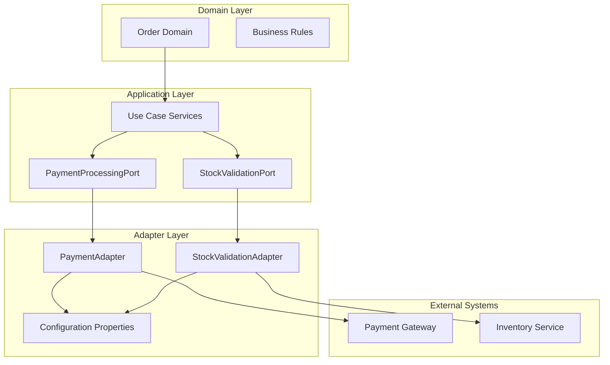
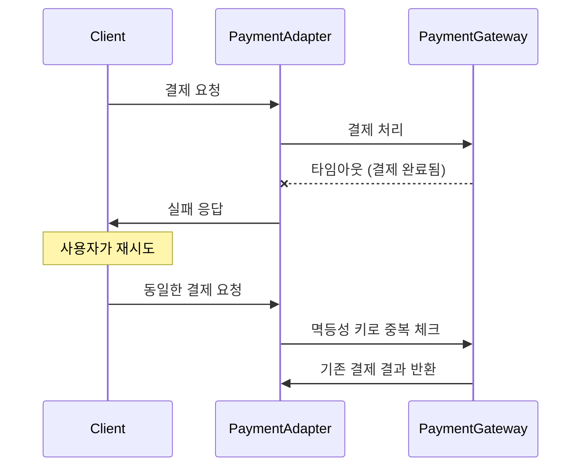
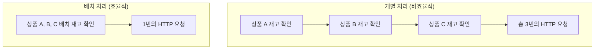
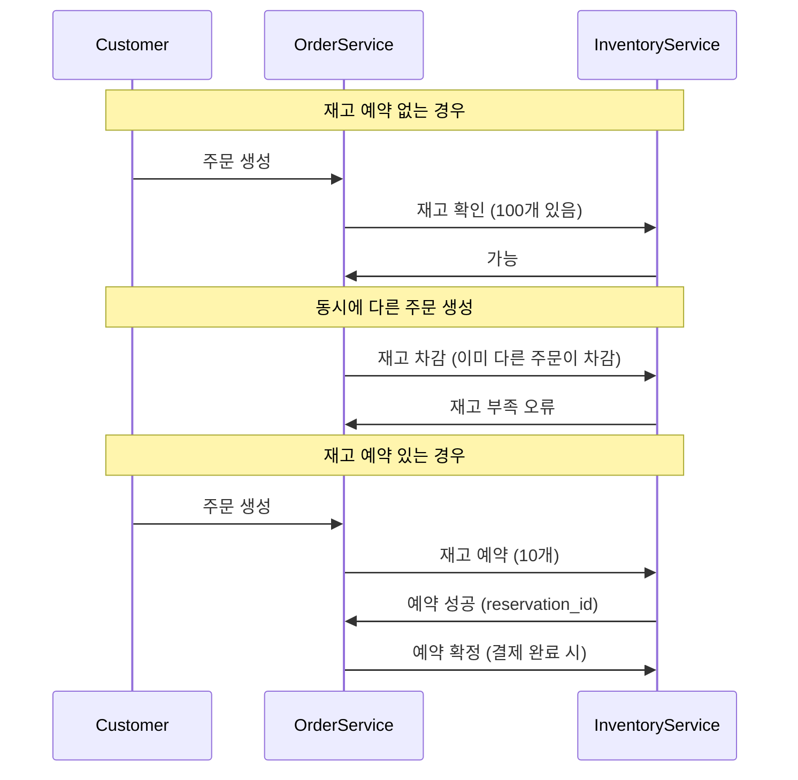
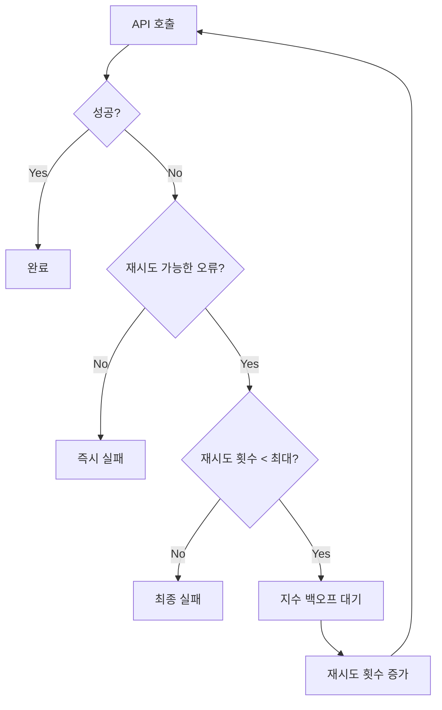
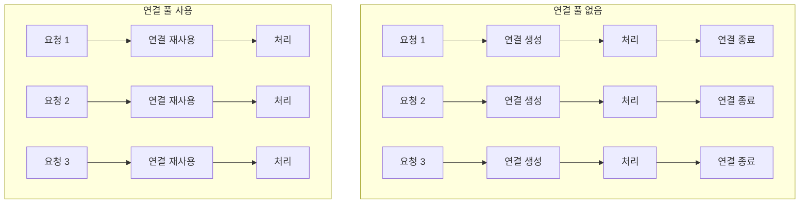

# External API Adapters - 외부 API 어댑터 아키텍처 설계

## 📋 목차
1. [개요](#개요)
2. [아키텍처 구조](#아키텍처-구조)
3. [PaymentAdapter 구현](#paymentadapter-구현)
4. [StockValidationAdapter 구현](#stockvalidationadapter-구현)
5. [신뢰성 보장 메커니즘](#신뢰성-보장-메커니즘)
6. [성능 최적화](#성능-최적화)
7. [에러 처리 전략](#에러-처리-전략)
8. [보안 및 인증](#보안-및-인증)
9. [모니터링과 관찰성](#모니터링과-관찰성)
10. [설정 가이드](#설정-가이드)

## 개요

External API Adapters는 Order Service가 외부 시스템과 통신하는 핵심 컴포넌트입니다. 헥사고날 아키텍처의 Outbound Adapter로서 도메인 로직을 외부 의존성으로부터 격리시키고, 외부 API와의 안정적인 통신을 보장합니다.

## 아키텍처 구조

### 계층별 책임 분리



### 왜 이런 구조인가?

1. **의존성 역전 원칙 (DIP)**
   - 도메인이 인프라를 의존하지 않음
   - Port 인터페이스를 통한 추상화
   - 테스트 가능성 확보

2. **단일 책임 원칙 (SRP)**
   - PaymentAdapter: 결제 처리만 담당
   - StockValidationAdapter: 재고 검증만 담당
   - 각 어댑터는 단일 외부 시스템 연동

3. **개방-폐쇄 원칙 (OCP)**
   - 새로운 결제 수단 추가 시 기존 코드 변경 없음
   - 다른 재고 서비스 연동 시 Port 구현만 변경

## PaymentAdapter 구현

### 설계 결정과 구현 이유

#### 1. 비동기 처리 지원

```java
@Override
public CompletableFuture<PaymentResult> processPaymentAsync(PaymentRequest request) {
    return CompletableFuture.supplyAsync(() -> processPayment(request), asyncExecutor)
        .whenComplete((result, throwable) -> {
            // 결과 처리 및 로깅
        });
}
```

**왜 비동기 처리를 했나?**
- **응답성**: 결제 처리는 시간이 오래 걸림 (평균 3-5초)
- **처리량**: 동시에 여러 결제 요청 처리
- **사용자 경험**: 빠른 응답으로 UI 반응성 개선

#### 2. 멱등성 보장

```java
// 결제 요청 ID 생성
private String generateIdempotentKey(PaymentRequest request) {
    return request.getOrderId() + "_" + request.getAmount() + "_" + System.currentTimeMillis();
}
```

**멱등성이 중요한 이유:**


#### 3. 결제 한도 및 검증

```java
@Override
public boolean canProcessPayment(CustomerId customerId, Money amount) {
    // 결제 금액 한도 확인
    if (amount.getAmount().compareTo(config.getMaxPaymentAmount()) > 0) {
        return false;
    }
    
    // 일일 결제 한도 확인 (향후 구현)
    // 블랙리스트 확인 (향후 구현)
    return true;
}
```

**검증 단계별 이유:**
1. **위험 관리**: 고액 결제 사기 방지
2. **규정 준수**: 금융 규제 요구사항
3. **시스템 보호**: 과도한 결제 요청 방지

#### 4. 다양한 결제 수단 지원

```java
private ExternalPaymentDetails mapPaymentDetails(PaymentDetails paymentDetails) {
    // 카드 결제, 계좌 이체, 모바일 결제 등 지원
    if (paymentDetails instanceof CardPaymentDetails) {
        return mapCardDetails((CardPaymentDetails) paymentDetails);
    } else if (paymentDetails instanceof BankTransferDetails) {
        return mapBankTransferDetails((BankTransferDetails) paymentDetails);
    }
    // 확장 가능한 구조
}
```

## StockValidationAdapter 구현

### 설계 결정과 구현 이유

#### 1. 배치 처리 최적화

```java
@Override
public Map<ProductId, Boolean> checkBatchStockAvailability(Map<ProductId, Integer> stockRequests) {
    // 단일 HTTP 요청으로 여러 상품 재고 확인
    List<BatchStockCheckRequest.StockCheckItem> items = stockRequests.entrySet().stream()
        .map(entry -> new BatchStockCheckRequest.StockCheckItem(
            entry.getKey().getValue(), 
            entry.getValue()
        ))
        .collect(Collectors.toList());
    
    // 배치 요청 전송
    BatchStockCheckRequest request = new BatchStockCheckRequest(items);
    // ... 처리 로직
}
```

**배치 처리의 이점:**


**성능 개선 효과:**
- 네트워크 지연 시간 감소: 3 × 100ms → 100ms
- 연결 비용 절약: 3개 연결 → 1개 연결
- 처리량 증가: 3배 향상

#### 2. 재고 예약 시스템

```java
@Override
public String reserveStock(ProductId productId, Integer quantity, String orderId) {
    // 재고 예약 로직
    StockReservationRequest request = new StockReservationRequest(
        productId.getValue(), 
        quantity, 
        orderId
    );
    
    // 예약 성공 시 reservationId 반환
    // 실패 시 null 반환
}
```

**재고 예약의 필요성:**


#### 3. 재고 정보 캐싱 전략

```java
@Override
public StockInfo getStockInfo(ProductId productId) {
    // 재고 정보는 자주 변경되므로 짧은 TTL 캐싱
    // 또는 캐시 무효화 전략 적용
}
```

**캐싱 전략 결정:**
- **캐시 적용**: 재고 조회는 빈번하지만 변경은 상대적으로 적음
- **TTL 설정**: 30초 (재고 변경 민감도와 성능 균형)
- **무효화**: 재고 변경 이벤트 수신 시 캐시 무효화

## 신뢰성 보장 메커니즘

### 1. 재시도 메커니즘

```java
private <T> T executeWithRetry(Supplier<T> operation, String operationName) {
    int attempt = 0;
    Exception lastException = null;
    
    while (attempt < maxRetryAttempts) {
        try {
            return operation.get();
        } catch (Exception e) {
            lastException = e;
            attempt++;
            
            if (attempt < maxRetryAttempts) {
                // 지수 백오프 적용
                long delay = retryDelayMs * (1L << (attempt - 1));
                Thread.sleep(Math.min(delay, maxRetryDelayMs));
            }
        }
    }
    
    throw new ExternalServiceException("재시도 실패: " + operationName, lastException);
}
```

#### 재시도 전략 플로우



**재시도 조건:**
- 네트워크 오류: 재시도 ✓
- 타임아웃: 재시도 ✓  
- 4xx 클라이언트 오류: 재시도 ✗
- 5xx 서버 오류: 재시도 ✓

### 2. 회로 차단기 패턴 (향후 구현)

```java
@CircuitBreaker(
    name = "paymentService",
    fallbackMethod = "fallbackPayment"
)
public PaymentResult processPayment(PaymentRequest request) {
    // 정상 결제 처리
}

public PaymentResult fallbackPayment(PaymentRequest request, Exception ex) {
    // 폴백 처리: 나중에 재시도하도록 큐에 저장
    log.warn("결제 서비스 회로 차단, 폴백 처리: {}", request.getOrderId());
    return new PaymentResult(request.getOrderId(), PaymentStatus.PENDING, "서비스 일시 중단");
}
```

### 3. 타임아웃 관리

```java
@Bean
public RestTemplate restTemplate() {
    RequestConfig config = RequestConfig.custom()
        .setConnectTimeout(connectionTimeout)
        .setSocketTimeout(readTimeout)
        .build();
    
    HttpClient httpClient = HttpClientBuilder.create()
        .setDefaultRequestConfig(config)
        .build();
    
    return new RestTemplate(new HttpComponentsClientHttpRequestFactory(httpClient));
}
```

**타임아웃 계층:**
1. **연결 타임아웃**: 5초 (외부 서비스 연결 시간)
2. **읽기 타임아웃**: 30초 (응답 대기 시간)
3. **애플리케이션 타임아웃**: 45초 (전체 작업 시간)

## 성능 최적화

### 1. 연결 풀 관리

```java
@Configuration
public class HttpClientConfig {
    
    @Bean
    public PoolingHttpClientConnectionManager connectionManager() {
        PoolingHttpClientConnectionManager cm = new PoolingHttpClientConnectionManager();
        cm.setMaxTotal(200);           // 전체 최대 연결 수
        cm.setDefaultMaxPerRoute(20);  // 호스트당 최대 연결 수
        cm.setValidateAfterInactivity(30000); // 30초 후 연결 검증
        
        return cm;
    }
}
```

**연결 풀 최적화 이유:**


### 2. 응답 압축

```java
private HttpHeaders createHeaders() {
    HttpHeaders headers = new HttpHeaders();
    headers.set("Accept-Encoding", "gzip, deflate");
    headers.set("Content-Type", "application/json");
    return headers;
}
```

### 3. 비동기 처리 최적화

```java
@Bean
public Executor asyncExecutor() {
    ThreadPoolTaskExecutor executor = new ThreadPoolTaskExecutor();
    executor.setCorePoolSize(10);
    executor.setMaxPoolSize(50);
    executor.setQueueCapacity(100);
    executor.setThreadNamePrefix("external-api-");
    executor.initialize();
    return executor;
}
```

## 에러 처리 전략

### 1. 오류 분류 및 처리

```java
private void handleHttpError(HttpStatusCode statusCode, String responseBody) {
    if (statusCode.is4xxClientError()) {
        // 클라이언트 오류: 재시도하지 않음
        if (statusCode.value() == 401) {
            throw new AuthenticationException("인증 실패");
        } else if (statusCode.value() == 400) {
            throw new BadRequestException("잘못된 요청: " + responseBody);
        }
    } else if (statusCode.is5xxServerError()) {
        // 서버 오류: 재시도 가능
        throw new ExternalServiceException("외부 서비스 오류", true);
    }
}
```

### 2. 오류 로깅 및 알림

```java
private void logError(String operation, Exception e, PaymentRequest request) {
    // 구조화된 로깅
    log.error("결제 처리 실패: operation={}, orderId={}, amount={}, error={}", 
        operation, request.getOrderId(), request.getAmount(), e.getMessage(), e);
    
    // 중요 오류는 별도 알림 (Slack, 이메일 등)
    if (e instanceof AuthenticationException) {
        alertService.sendAlert("결제 서비스 인증 실패", e.getMessage());
    }
}
```

### 3. 우아한 성능 저하 (Graceful Degradation)

```java
public PaymentResult processPaymentWithFallback(PaymentRequest request) {
    try {
        return processPayment(request);
    } catch (ExternalServiceException e) {
        // 외부 서비스 장애 시 대체 처리
        log.warn("주 결제 서비스 장애, 보조 서비스 사용: {}", request.getOrderId());
        return processPaymentWithBackupService(request);
    }
}
```

## 보안 및 인증

### 1. API 키 관리

```java
private HttpEntity<T> createSecureHttpEntity(T body) {
    HttpHeaders headers = new HttpHeaders();
    headers.set("Authorization", "Bearer " + config.getApiKey());
    headers.set("X-API-Version", "1.0");
    headers.set("User-Agent", "OrderService/1.0");
    
    return new HttpEntity<>(body, headers);
}
```

### 2. 민감 정보 마스킹

```java
public class PaymentRequest {
    private String cardNumber;
    
    @Override
    public String toString() {
        return "PaymentRequest{" +
            "cardNumber='" + maskCardNumber(cardNumber) + '\'' +
            // 기타 필드들
            '}';
    }
    
    private String maskCardNumber(String cardNumber) {
        if (cardNumber == null || cardNumber.length() < 4) {
            return "****";
        }
        return "****-****-****-" + cardNumber.substring(cardNumber.length() - 4);
    }
}
```

### 3. 요청 검증

```java
private void validatePaymentRequest(PaymentRequest request) {
    if (request.getAmount().getAmount().compareTo(BigDecimal.ZERO) <= 0) {
        throw new InvalidRequestException("결제 금액은 0보다 커야 합니다");
    }
    
    if (request.getPaymentMethod() == null || request.getPaymentMethod().trim().isEmpty()) {
        throw new InvalidRequestException("결제 방법은 필수입니다");
    }
    
    // 추가 검증 로직
}
```

## 모니터링과 관찰성

### 1. 메트릭 수집

```java
@Component
public class ExternalApiMetrics {
    
    private final Counter paymentSuccessCounter;
    private final Counter paymentFailureCounter;
    private final Timer paymentTimer;
    
    public ExternalApiMetrics(MeterRegistry meterRegistry) {
        this.paymentSuccessCounter = Counter.builder("payment.success")
            .description("성공한 결제 요청 수")
            .register(meterRegistry);
            
        this.paymentFailureCounter = Counter.builder("payment.failure")
            .description("실패한 결제 요청 수")
            .register(meterRegistry);
            
        this.paymentTimer = Timer.builder("payment.duration")
            .description("결제 처리 시간")
            .register(meterRegistry);
    }
    
    public void recordPaymentSuccess(String paymentMethod) {
        paymentSuccessCounter.increment(Tags.of("method", paymentMethod));
    }
    
    public void recordPaymentFailure(String paymentMethod, String errorType) {
        paymentFailureCounter.increment(Tags.of("method", paymentMethod, "error", errorType));
    }
}
```

### 2. 헬스 체크

```java
@Component
public class PaymentServiceHealthIndicator implements HealthIndicator {
    
    private final PaymentAdapter paymentAdapter;
    
    @Override
    public Health health() {
        try {
            // 간단한 ping 요청으로 서비스 상태 확인
            boolean isHealthy = paymentAdapter.ping();
            
            if (isHealthy) {
                return Health.up()
                    .withDetail("service", "payment-gateway")
                    .withDetail("status", "UP")
                    .build();
            } else {
                return Health.down()
                    .withDetail("service", "payment-gateway")
                    .withDetail("status", "DOWN")
                    .build();
            }
        } catch (Exception e) {
            return Health.down()
                .withDetail("service", "payment-gateway")
                .withDetail("error", e.getMessage())
                .build();
        }
    }
}
```

### 3. 분산 추적

```java
@RestController
public class PaymentController {
    
    @Autowired
    private PaymentAdapter paymentAdapter;
    
    @PostMapping("/process")
    public ResponseEntity<PaymentResult> processPayment(@RequestBody PaymentRequest request) {
        // 추적 컨텍스트 설정
        try (MDCCloseable mdcCloseable = MDC.putCloseable("orderId", request.getOrderId())) {
            // 결제 처리
            PaymentResult result = paymentAdapter.processPayment(request);
            
            // 추적 정보 로깅
            log.info("결제 처리 완료: orderId={}, paymentId={}, traceId={}", 
                request.getOrderId(), result.getPaymentId(), MDC.get("traceId"));
            
            return ResponseEntity.ok(result);
        }
    }
}
```

## 설정 가이드

### 1. 환경별 설정

#### 개발 환경
```yaml
app:
  payment:
    base-url: https://sandbox.payment-service.com
    timeout: PT10S
    max-retry-attempts: 1
    retry-delay: PT1S
    max-payment-amount: 100000
    connection-timeout: 3000
    read-timeout: 10000
    circuit-breaker-failure-threshold: 10
    
  inventory:
    base-url: http://localhost:8081
    timeout: PT5S
    max-retry-attempts: 2
    batch-size: 50
    enable-caching: false
```

#### 운영 환경
```yaml
app:
  payment:
    base-url: https://api.payment-service.com
    timeout: PT30S
    max-retry-attempts: 3
    retry-delay: PT1S
    max-payment-amount: 10000000
    connection-timeout: 5000
    read-timeout: 30000
    circuit-breaker-failure-threshold: 5
    
  inventory:
    base-url: http://inventory-service:8080
    timeout: PT30S
    max-retry-attempts: 3
    batch-size: 100
    enable-caching: true
    cache-timeout: PT30S
```

### 2. 모니터링 설정

```yaml
management:
  endpoints:
    web:
      exposure:
        include: health,info,metrics,prometheus
  endpoint:
    health:
      show-details: always
  metrics:
    export:
      prometheus:
        enabled: true
    tags:
      application: order-service
      environment: production
```

### 3. 로깅 설정

```yaml
logging:
  level:
    com.hightraffic.ecommerce.order.adapter.out.external: INFO
    org.springframework.web.client.RestTemplate: DEBUG
  pattern:
    console: "%d{yyyy-MM-dd HH:mm:ss} - %msg%n"
    file: "%d{yyyy-MM-dd HH:mm:ss} [%thread] %-5level [%X{traceId:-},%X{spanId:-}] %logger{36} - %msg%n"
```

## 성능 벤치마크

### 1. 응답 시간 목표

| 작업 | 평균 응답 시간 | 95th 백분위수 | 99th 백분위수 |
|------|---------------|---------------|---------------|
| 결제 처리 | < 3초 | < 5초 | < 10초 |
| 재고 확인 | < 500ms | < 1초 | < 2초 |
| 배치 재고 확인 | < 1초 | < 2초 | < 5초 |

### 2. 처리량 목표

| 작업 | 목표 TPS | 최대 TPS |
|------|----------|----------|
| 결제 처리 | 100 | 500 |
| 재고 확인 | 1000 | 5000 |
| 배치 재고 확인 | 200 | 1000 |

### 3. 가용성 목표

- **결제 서비스**: 99.9% (월 43분 다운타임)
- **재고 서비스**: 99.95% (월 22분 다운타임)

## 결론

External API Adapters는 다음을 달성합니다:

1. **신뢰성**: 재시도, 회로 차단기, 타임아웃 관리
2. **성능**: 연결 풀, 배치 처리, 비동기 처리
3. **관찰성**: 상세한 메트릭, 로깅, 헬스 체크
4. **보안**: 인증, 민감 정보 보호, 요청 검증
5. **확장성**: 환경별 설정, 모니터링, 우아한 성능 저하

이러한 설계를 통해 외부 시스템과의 안정적이고 확장 가능한 통신을 보장하며, 마이크로서비스 아키텍처의 복잡성을 효과적으로 관리할 수 있습니다.