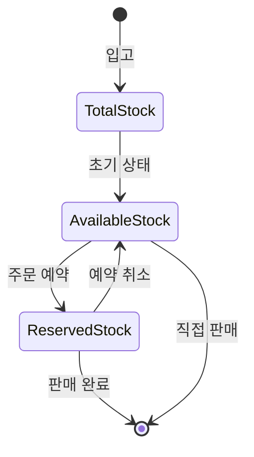
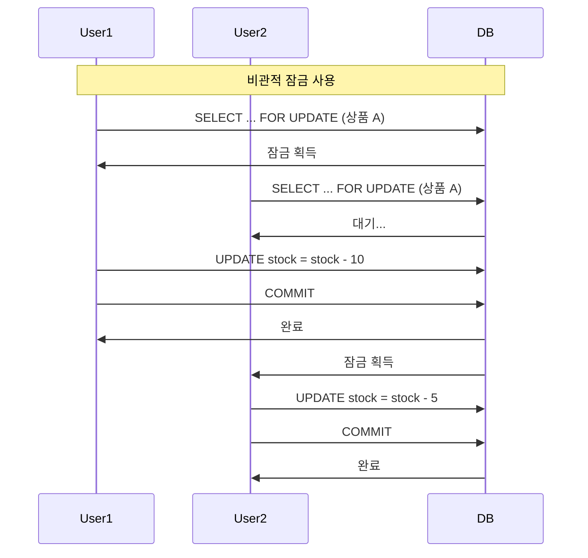
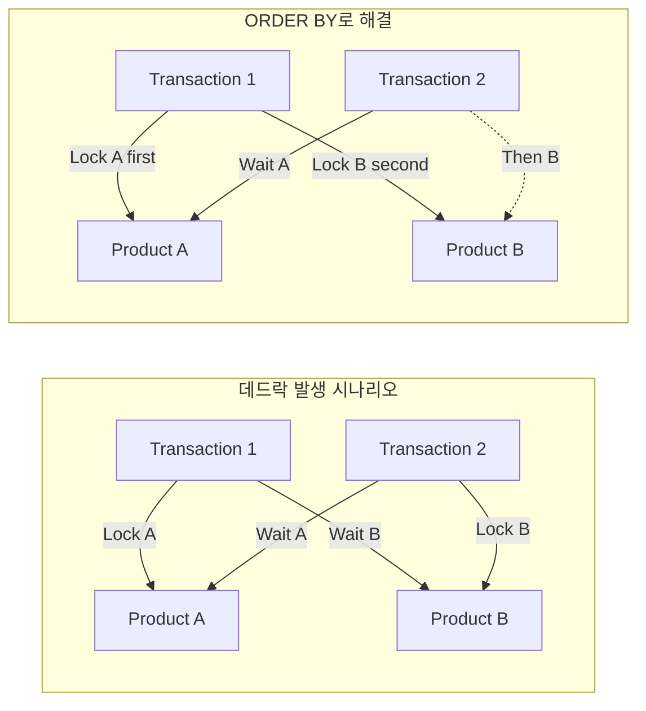
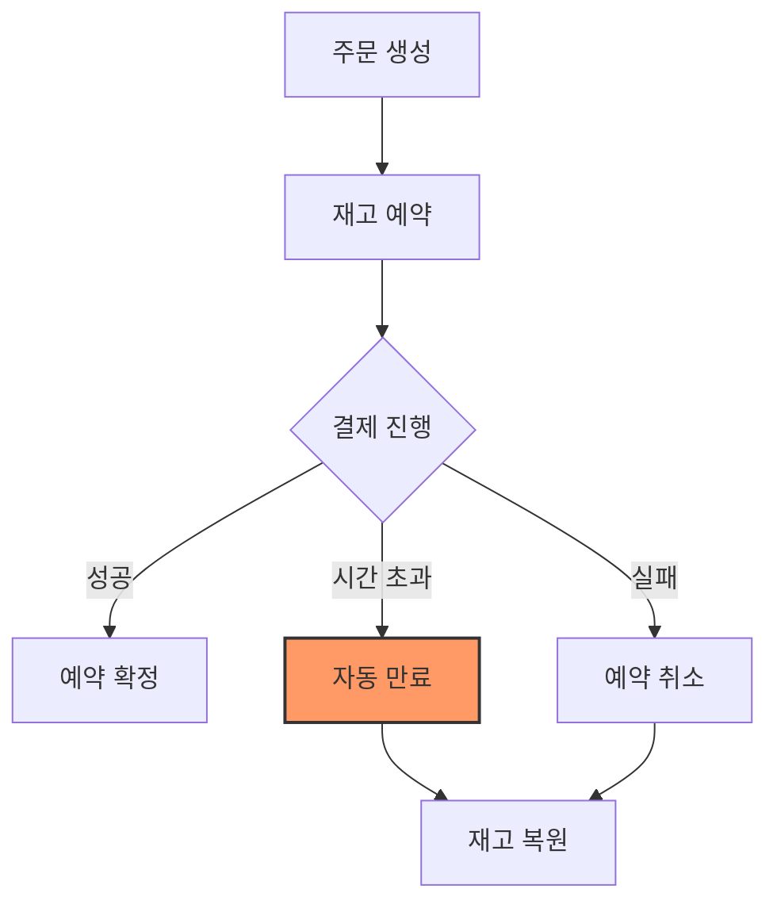
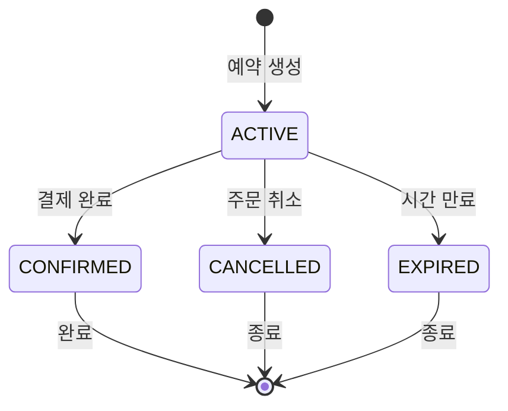
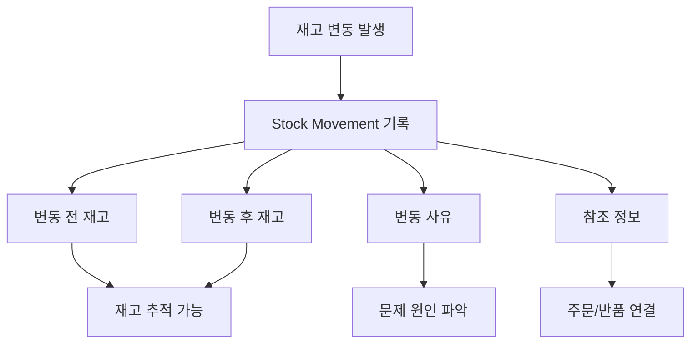
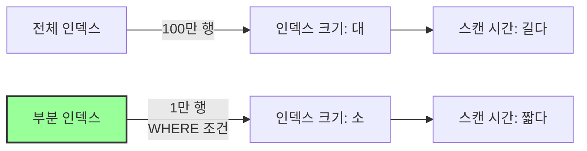
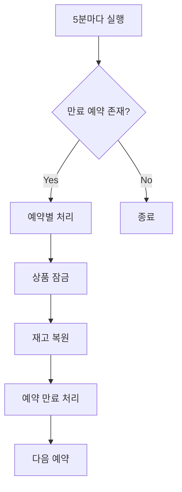

# Inventory Service Persistence Layer 설계 분석

## 📋 목차
1. [개요](#개요)
2. [핵심 설계 원칙](#핵심-설계-원칙)
3. [재고 관리 동시성 제어](#재고-관리-동시성-제어)
4. [예약 시스템 설계](#예약-시스템-설계)
5. [감사 추적 시스템](#감사-추적-시스템)
6. [성능 최적화 전략](#성능-최적화-전략)
7. [데이터 일관성 보장](#데이터-일관성-보장)

## 개요

Inventory Service의 Persistence Layer는 높은 동시성 환경에서 정확한 재고 관리를 위해 설계되었습니다. 재고 예약, 차감, 복원 과정에서 데이터 무결성을 보장하면서도 높은 성능을 유지합니다.

## 핵심 설계 원칙

### 1. 3단계 재고 관리 모델



#### 왜 3단계 모델인가?

**문제 상황:**
```java
// 단순 2단계 모델의 문제
if (stock >= orderQuantity) {
    stock -= orderQuantity;  // 동시에 여러 요청이 오면?
}
```

**해결책: 3단계 모델**
```java
// Total = Available + Reserved
totalQuantity = 100
availableQuantity = 70  // 판매 가능
reservedQuantity = 30   // 예약됨
```

**이점:**
1. **동시성 처리**: 예약 단계로 재고 경쟁 상태 방지
2. **롤백 용이**: 예약 취소로 간단히 복원
3. **정확한 추적**: 각 단계별 재고 현황 파악

### 2. 재고 일관성 보장

```sql
CONSTRAINT chk_quantities CHECK (
    total_quantity >= 0 AND 
    available_quantity >= 0 AND 
    reserved_quantity >= 0 AND
    total_quantity = available_quantity + reserved_quantity
)
```

데이터베이스 레벨에서 재고 일관성을 강제합니다.

## 재고 관리 동시성 제어

### 1. 비관적 잠금 전략

```java
@Lock(LockModeType.PESSIMISTIC_WRITE)
@Query("SELECT p FROM ProductJpaEntity p WHERE p.id = :id")
Optional<ProductJpaEntity> findByIdWithLock(@Param("id") String id);
```

#### 왜 비관적 잠금을 사용하는가?



**재고 관리에서 비관적 잠금이 적합한 이유:**
1. **높은 충돌 가능성**: 인기 상품은 동시 주문이 빈번
2. **데이터 정확성 중요**: 재고 오류는 비즈니스 손실
3. **짧은 트랜잭션**: 재고 업데이트는 빠르게 처리

### 2. 배치 잠금 최적화

```java
@Lock(LockModeType.PESSIMISTIC_WRITE)
@Query("SELECT p FROM ProductJpaEntity p WHERE p.id IN :ids ORDER BY p.id")
List<ProductJpaEntity> findByIdsWithLock(@Param("ids") List<String> ids);
```

#### 왜 ORDER BY를 사용하는가?

**데드락 방지:**


모든 트랜잭션이 동일한 순서로 잠금을 획득하여 데드락을 방지합니다.

## 예약 시스템 설계

### 1. 시간 기반 예약 만료

```java
public static StockReservationJpaEntity createNew(
    ProductJpaEntity product,
    String orderId,
    String orderItemId,
    Integer quantity,
    Integer reservationMinutes  // 기본 30분
) {
    return new Builder()
        .status(ReservationStatus.ACTIVE)
        .expiresAt(Instant.now().plusSeconds(reservationMinutes * 60L))
        .build();
}
```

#### 왜 예약 만료가 필요한가?



**이점:**
1. **재고 점유 방지**: 미완료 주문이 재고를 무한정 점유하지 않음
2. **자동 정리**: 별도의 관리 없이 시스템이 자동 처리
3. **공정한 기회**: 다른 고객에게 구매 기회 제공

### 2. 예약 상태 관리

```java
public enum ReservationStatus {
    ACTIVE,     // 활성 (예약중)
    CONFIRMED,  // 확정됨 (재고 차감됨)
    CANCELLED,  // 취소됨
    EXPIRED     // 만료됨
}
```

각 상태 전환은 명확한 비즈니스 규칙을 따릅니다:



## 감사 추적 시스템

### 1. 모든 재고 변동 기록

```java
public enum MovementType {
    STOCK_IN("입고"),
    STOCK_OUT("출고"),
    RESERVATION("예약"),
    RETURN("반품"),
    ADJUSTMENT_INCREASE("재고증가조정"),
    ADJUSTMENT_DECREASE("재고감소조정")
}
```

#### 왜 모든 변동을 기록하는가?



**활용 사례:**
1. **재고 불일치 조사**: 특정 시점의 재고 계산 가능
2. **패턴 분석**: 재고 소진 속도, 반품률 등
3. **감사 요구사항**: 규제 준수 및 내부 감사

### 2. 재고 복원 기능

```sql
-- 특정 시점의 재고 계산
SELECT SUM(CASE 
    WHEN m.movement_type IN ('STOCK_IN', 'RETURN', 'ADJUSTMENT_INCREASE') 
    THEN m.quantity 
    ELSE -m.quantity 
END) as calculated_stock
FROM stock_movements m 
WHERE m.product_id = :productId 
AND m.created_at <= :targetDate;
```

## 성능 최적화 전략

### 1. 인덱스 전략

```sql
-- 복합 인덱스: 쿼리 패턴 기반
CREATE INDEX idx_products_category_status ON products(category, status);

-- 부분 인덱스: 특정 조건만 인덱싱
CREATE INDEX idx_products_low_stock ON products(available_quantity, minimum_stock_level) 
    WHERE status = 'ACTIVE';

-- 만료 예약 처리용
CREATE INDEX idx_reservations_expires_at ON stock_reservations(expires_at) 
    WHERE status = 'ACTIVE';
```

#### 왜 이런 인덱스를 만들었나?

**부분 인덱스의 장점:**


### 2. 쿼리 최적화

```java
// 재고 회전율 계산 - Native Query 사용
@Query(value = "SELECT p.id, p.sku, p.name, p.total_quantity, " +
               "COALESCE(SUM(sm.quantity), 0) as total_sold " +
               "FROM products p " +
               "LEFT JOIN stock_movements sm ON p.id = sm.product_id " +
               "AND sm.movement_type = 'STOCK_OUT' " +
               "AND sm.created_at >= :startDate " +
               "WHERE p.status = 'ACTIVE' " +
               "GROUP BY p.id, p.sku, p.name, p.total_quantity",
       nativeQuery = true)
```

Native Query를 사용한 이유:
1. **복잡한 집계**: JPA로 표현하기 어려운 쿼리
2. **성능**: 데이터베이스 최적화 기능 활용
3. **가독성**: SQL이 더 명확한 경우

### 3. 배치 처리

```java
@Modifying
@Query("UPDATE ProductJpaEntity p " +
       "SET p.totalQuantity = p.totalQuantity + :quantity, " +
       "p.availableQuantity = p.availableQuantity + :quantity, " +
       "p.lastRestockAt = :restockTime " +
       "WHERE p.id IN :productIds")
int bulkUpdateStock(/*...*/);
```

개별 업데이트 대신 배치 처리로 성능 향상:
- 네트워크 왕복 감소
- 트랜잭션 오버헤드 감소
- 데이터베이스 최적화 가능

## 데이터 일관성 보장

### 1. 트리거를 통한 무결성

```sql
CREATE OR REPLACE FUNCTION check_stock_consistency()
RETURNS TRIGGER AS $$
BEGIN
    IF NEW.total_quantity != NEW.available_quantity + NEW.reserved_quantity THEN
        RAISE EXCEPTION 'Stock consistency violation';
    END IF;
    RETURN NEW;
END;
$$ language 'plpgsql';
```

애플리케이션 버그가 있어도 데이터베이스가 최후의 방어선 역할을 합니다.

### 2. 자동 정리 프로세스

```java
@Transactional
public void processExpiredReservations() {
    List<StockReservationJpaEntity> expiredReservations = 
        reservationRepository.findExpiredReservations(Instant.now());
    
    for (StockReservationJpaEntity reservation : expiredReservations) {
        // 개별 잠금으로 데드락 방지
        productRepository.findByIdWithLock(product.getId())
            .ifPresent(lockedProduct -> {
                reservation.expire();
                lockedProduct.releaseStock(reservation.getQuantity());
            });
    }
}
```

**스케줄러 전략:**


### 3. 뷰를 통한 실시간 모니터링

```sql
CREATE OR REPLACE VIEW v_inventory_summary AS
SELECT 
    CASE 
        WHEN p.available_quantity = 0 THEN 'OUT_OF_STOCK'
        WHEN p.available_quantity <= p.minimum_stock_level THEN 'LOW_STOCK'
        WHEN p.maximum_stock_level IS NOT NULL 
             AND p.total_quantity > p.maximum_stock_level THEN 'OVER_STOCK'
        ELSE 'NORMAL'
    END as stock_status
```

뷰의 장점:
1. **실시간 상태**: 항상 최신 데이터 반영
2. **복잡성 숨김**: 애플리케이션에서 간단히 조회
3. **성능**: 인덱스 활용 가능

## 결론

Inventory Service의 Persistence Layer는 다음을 달성합니다:

1. **정확성**: 3단계 재고 모델과 강력한 일관성 보장
2. **동시성**: 비관적 잠금과 데드락 방지 전략
3. **추적성**: 완벽한 감사 추적 시스템
4. **성능**: 최적화된 인덱스와 배치 처리
5. **신뢰성**: 자동 정리와 무결성 검증

이러한 설계는 대규모 이커머스 환경에서 안정적이고 확장 가능한 재고 관리를 가능하게 합니다.