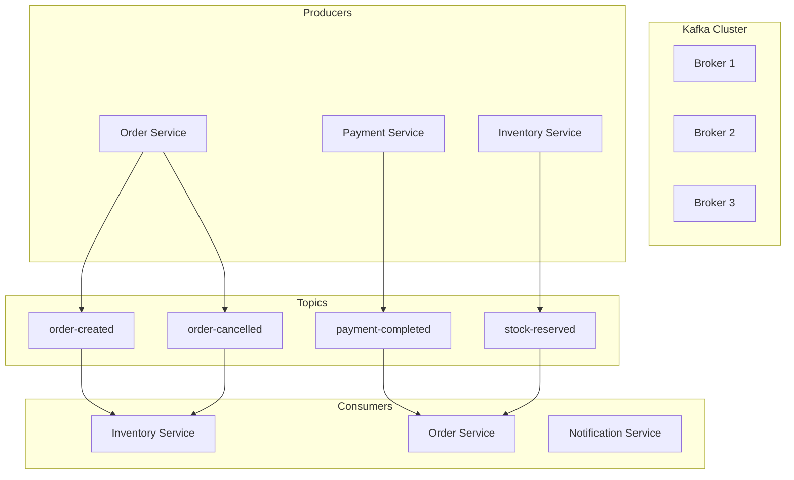
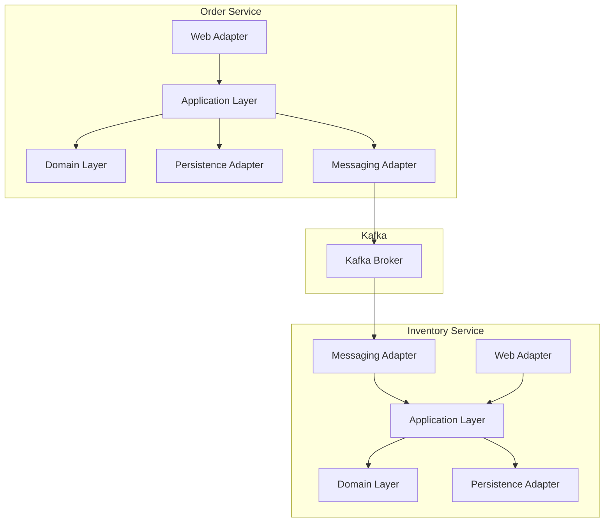
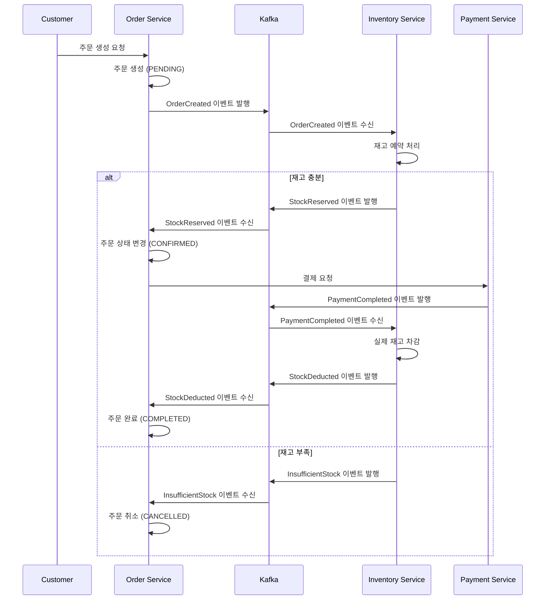
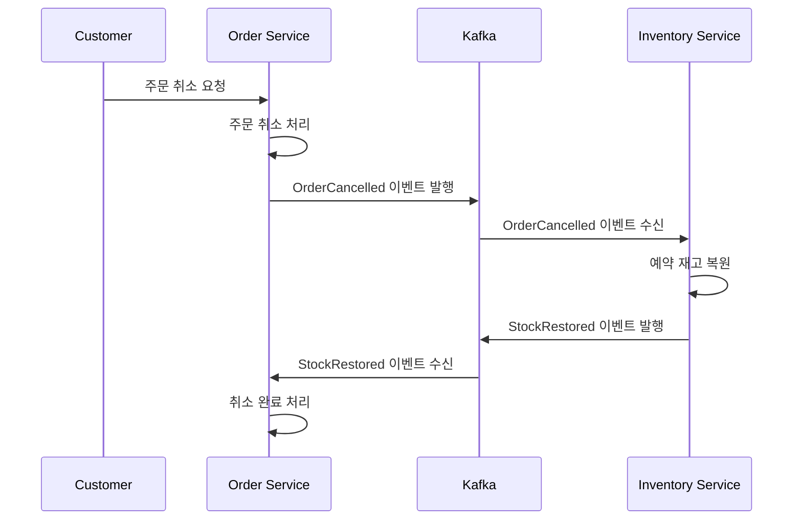
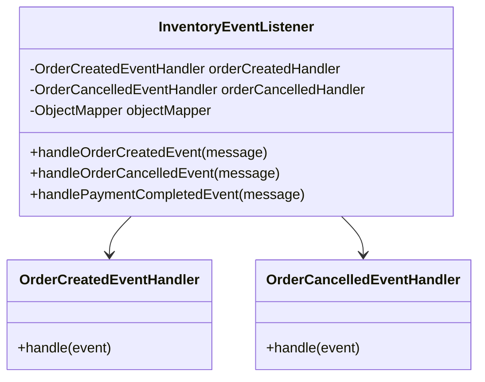
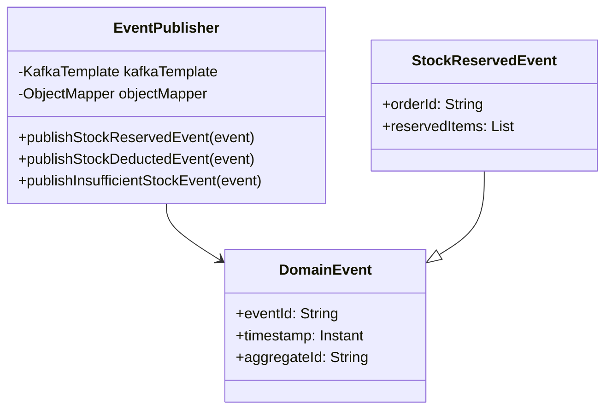
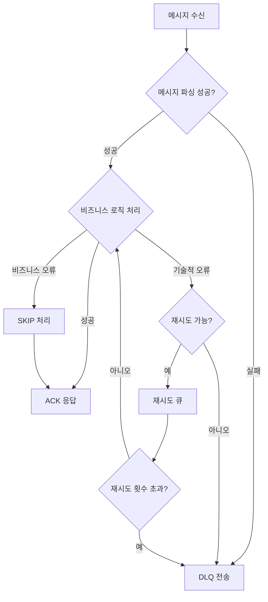
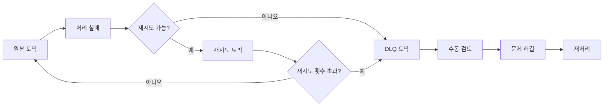
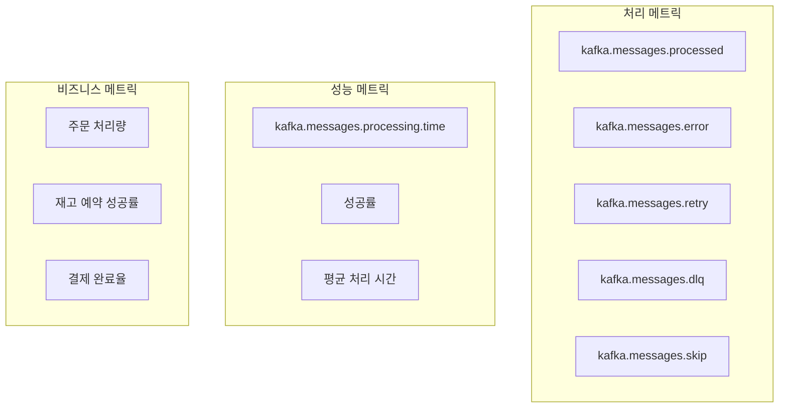
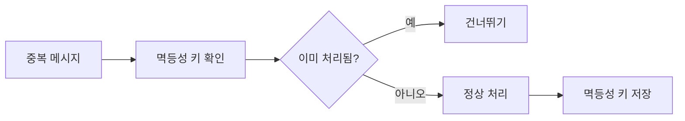

# Kafka 가이드 - 이커머스 마이크로서비스

## 📋 목차
1. [Kafka 개요](#kafka-개요)
2. [시스템 아키텍처](#시스템-아키텍처)
3. [이벤트 플로우](#이벤트-플로우)
4. [메시징 어댑터 구조](#메시징-어댑터-구조)
5. [에러 처리 전략](#에러-처리-전략)
6. [모니터링 및 메트릭](#모니터링-및-메트릭)
7. [설정 가이드](#설정-가이드)
8. [트러블슈팅](#트러블슈팅)

## Kafka 개요

Apache Kafka는 우리 이커머스 시스템에서 **비동기 이벤트 기반 통신**의 핵심 역할을 담당합니다.

### 🎯 주요 역할
- **서비스 간 느슨한 결합** 구현
- **이벤트 소싱** 및 **CQRS** 패턴 지원
- **확장성** 및 **내결함성** 제공
- **실시간 데이터 스트리밍** 처리

### 🔧 핵심 컴포넌트


## 시스템 아키텍처

### 🏗️ 헥사고날 아키텍처와 Kafka 통합



## 이벤트 플로우

### 📦 주문 생성부터 완료까지의 이벤트 흐름



### 🔄 주문 취소 플로우



## 메시징 어댑터 구조

### 📬 Inbound Messaging Adapter

각 서비스는 다른 서비스의 이벤트를 수신하기 위한 **EventListener**를 구현합니다.



### 📤 Outbound Messaging Adapter

도메인 이벤트를 Kafka 메시지로 변환하여 발행합니다.



## 에러 처리 전략

### 🚨 3단계 에러 처리 전략



### 🔄 재시도 전략

#### 재시도 가능한 예외
- `TransientDataAccessException` - 일시적 DB 연결 오류
- `KafkaException` - Kafka 통신 오류  
- `SocketTimeoutException` - 네트워크 타임아웃
- `TimeoutException` - 일반적인 타임아웃

#### 재시도 불가능한 비즈니스 예외
- `ProductNotFoundException` - 존재하지 않는 상품
- `InsufficientStockException` - 재고 부족
- `InvalidStockOperationException` - 잘못된 재고 연산
- `ReservationNotFoundException` - 예약 정보 없음

### 📥 Dead Letter Queue (DLQ)



#### DLQ 헤더 정보
```yaml
dlq.service: "inventory-service"
dlq.original.topic: "order-created"
dlq.original.partition: "0"
dlq.original.offset: "12345"
dlq.error.timestamp: "2024-01-15T10:30:00Z"
dlq.error.class: "ProductNotFoundException"
dlq.error.message: "Product not found: PROD-001"
dlq.error.stacktrace: "..."
```

## 모니터링 및 메트릭

### 📊 핵심 메트릭



#### 메트릭 태그 구조
```yaml
service: "inventory-service"
topic: "order-created"
status: "success|error|retry|dlq|skip"
```

### 📈 대시보드 구성

```mermaid
dashboard
    subgraph "실시간 모니터링"
        메시지처리량[메시지 처리량/분]
        에러율[에러율 %]
        지연시간[평균 처리 시간]
    end
    
    subgraph "비즈니스 메트릭"
        주문성공률[주문 성공률]
        재고정확도[재고 정확도]
        결제완료율[결제 완료율]
    end
    
    subgraph "시스템 건강도"
        DLQ수[DLQ 메시지 수]
        재시도율[재시도율]
        컨슈머지연[컨슈머 지연]
    end
```

## 설정 가이드

### ⚙️ Kafka 설정 예시

#### application.yml
```yaml
spring:
  kafka:
    bootstrap-servers: localhost:9092
    
app:
  kafka:
    # Topics
    topics:
      order-created: "order-created"
      order-cancelled: "order-cancelled"
      payment-completed: "payment-completed"
      stock-reserved: "stock-reserved"
      stock-deducted: "stock-deducted"
      insufficient-stock: "insufficient-stock"
    
    # Consumer 설정
    consumer:
      group-id:
        inventory: "inventory-service-group"
        order: "order-service-group"
      auto-offset-reset: "earliest"
      enable-auto-commit: false
      max-poll-records: 10
      session-timeout-ms: 30000
      heartbeat-interval-ms: 3000
      concurrency: 3
    
    # Producer 설정
    producer:
      retries: 3
      batch-size: 16384
      linger-ms: 100
      buffer-memory: 33554432
```

### 🔧 성능 최적화 설정

#### Consumer 최적화
```yaml
# 배치 크기 조정
max-poll-records: 10-50  # 서비스 처리 능력에 따라

# 네트워크 최적화
fetch-min-bytes: 1024    # 1KB
fetch-max-wait-ms: 500   # 0.5초

# 메모리 최적화
max-partition-fetch-bytes: 1048576  # 1MB
```

#### Producer 최적화
```yaml
# 배치 처리
batch-size: 16384        # 16KB
linger-ms: 100          # 100ms 대기

# 압축
compression-type: "snappy"

# 메모리
buffer-memory: 33554432  # 32MB
```

### 🛡️ 신뢰성 설정

```yaml
# Producer 신뢰성
acks: "all"              # 모든 복제본 확인
retries: 3               # 재시도 횟수
enable-idempotence: true # 중복 방지

# Consumer 신뢰성
isolation-level: "read_committed"
enable-auto-commit: false
max-poll-interval-ms: 300000  # 5분
```

## 트러블슈팅

### 🔍 일반적인 문제와 해결책

#### 1. 메시지 중복 처리
**문제**: 같은 메시지가 여러 번 처리됨


**해결책**:
- 멱등성 키 사용 (eventId 기반)
- 데이터베이스 유니크 제약 조건
- 이벤트 처리 이력 테이블 관리

#### 2. 메시지 순서 보장
**문제**: 순서가 중요한 이벤트의 순서가 뒤바뀜

**해결책**:
```yaml
# Producer 설정
max-in-flight-requests-per-connection: 1

# Consumer 설정  
concurrency: 1  # 순서가 중요한 토픽만
```

#### 3. 컨슈머 지연 (Consumer Lag)
**문제**: 메시지 처리 속도가 생산 속도보다 느림

**모니터링**:
```bash
# 컨슈머 그룹 상태 확인
kafka-consumer-groups --bootstrap-server localhost:9092 \
  --group inventory-service-group --describe
```

**해결책**:
- 컨슈머 인스턴스 늘리기
- 파티션 수 증가
- 처리 로직 최적화

#### 4. 메시지 크기 제한
**문제**: 메시지가 너무 커서 처리 실패

**해결책**:
```yaml
# Producer 설정
max-request-size: 10485760  # 10MB

# Consumer 설정
fetch-max-bytes: 52428800   # 50MB
max-partition-fetch-bytes: 10485760  # 10MB
```

### 🚨 알림 및 경고

#### 임계값 설정
```yaml
alerts:
  error-rate:
    warning: 5%    # 에러율 5% 이상
    critical: 10%  # 에러율 10% 이상
  
  processing-time:
    warning: 5s    # 처리 시간 5초 이상
    critical: 10s  # 처리 시간 10초 이상
  
  consumer-lag:
    warning: 1000  # 지연 메시지 1000개 이상
    critical: 5000 # 지연 메시지 5000개 이상
```

### 📝 로그 분석

#### 중요 로그 패턴
```bash
# 성공적인 메시지 처리
"메시지 처리 완료: orderId=ORDER-001, itemCount=3"

# 재시도 가능한 오류
"재시도 가능한 예외로 메시지 재처리: topic=order-created"

# DLQ 전송
"DLQ 전송 성공: originalTopic=order-created, dlqTopic=order-created-dlq"

# 비즈니스 규칙 위반
"비즈니스 예외로 메시지 건너뛰기: ProductNotFoundException"
```

