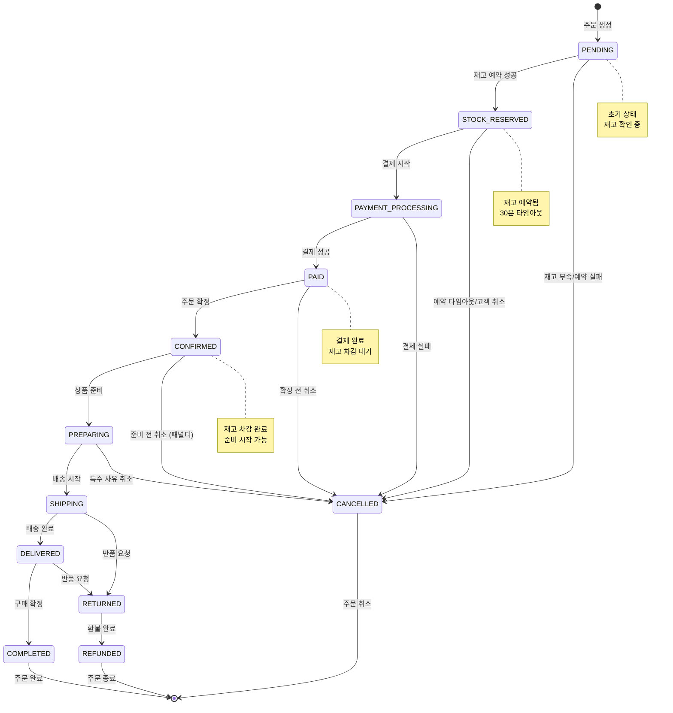
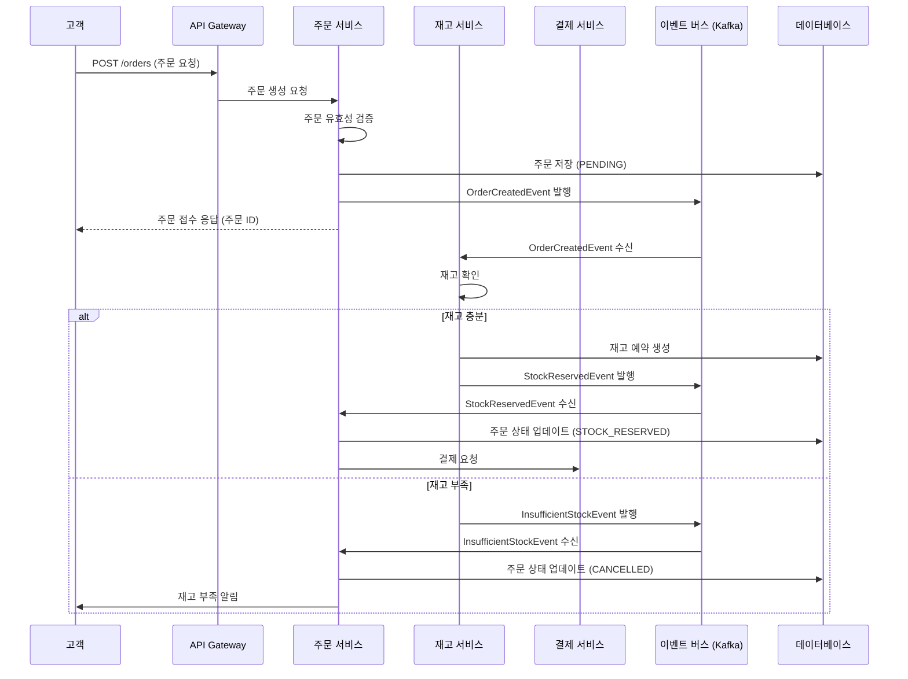
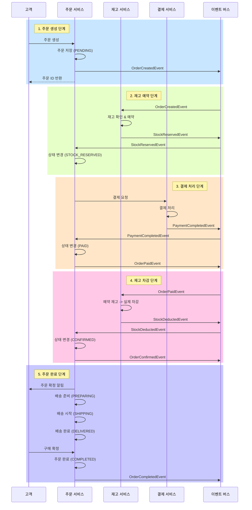
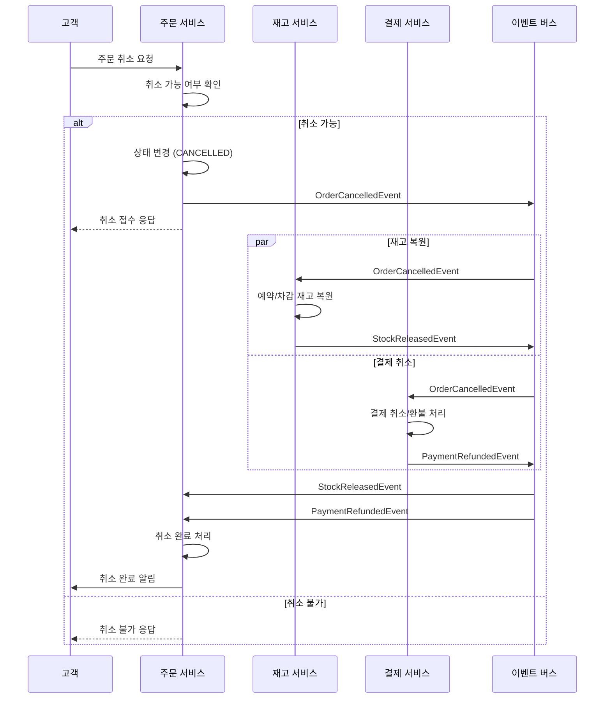
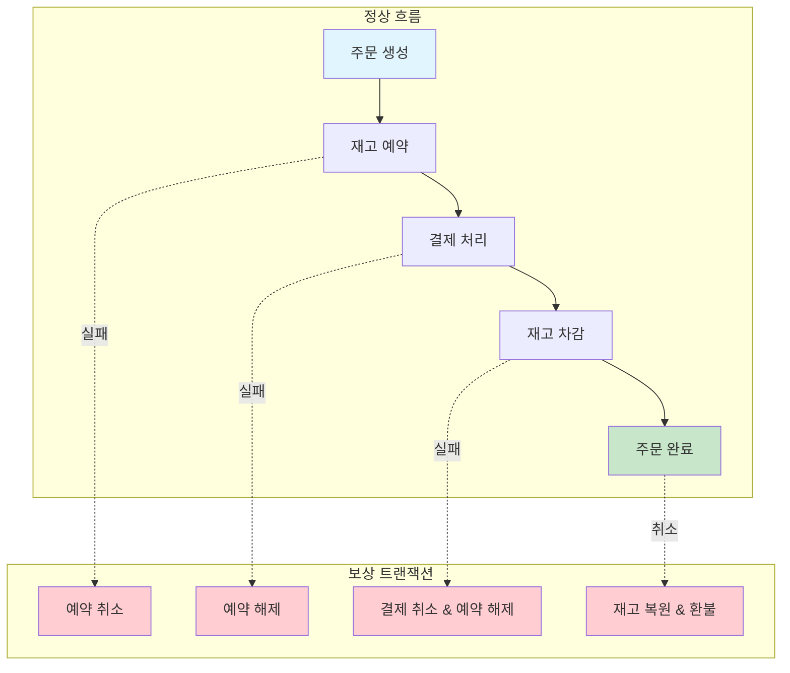

# 주문 생애주기 다이어그램

## 1. 주문 상태 전이 다이어그램

## 2. 주문 생성 및 재고 예약 시퀀스 다이어그램

## 3. 주문 완료까지의 전체 흐름 시퀀스 다이어그램

## 4. 주문 취소 및 보상 트랜잭션 시퀀스 다이어그램

## 5. 이벤트 기반 아키텍처 장점

### 5.1 느슨한 결합 (Loose Coupling)
- 서비스 간 직접적인 의존성 제거
- 각 서비스는 이벤트를 통해서만 통신
- 서비스 독립적 배포 및 확장 가능

### 5.2 확장성 (Scalability)
- 각 서비스 독립적으로 스케일 아웃 가능
- 이벤트 버스를 통한 비동기 처리로 처리량 향상
- 부하가 높은 서비스만 선택적 확장

### 5.3 복원력 (Resilience)
- 일시적 장애에 대한 자동 재시도
- 서비스 장애 시 이벤트는 큐에 보관
- 장애 복구 후 자동으로 처리 재개

### 5.4 감사 추적 (Audit Trail)
- 모든 상태 변경이 이벤트로 기록
- 완벽한 감사 로그 제공
- 이벤트 소싱을 통한 상태 재구성 가능

## 6. 주요 타임아웃 및 정책

| 단계 | 타임아웃 | 정책 |
|------|----------|------|
| 재고 예약 | 30분 | 예약 후 30분 내 미결제 시 자동 해제 |
| 결제 대기 | 10분 | 결제 페이지 진입 후 10분 내 미완료 시 취소 |
| 주문 확정 | 24시간 | 결제 후 24시간 내 확정 필요 |
| 배송 준비 | 48시간 | 확정 후 48시간 내 배송 시작 |
| 구매 확정 | 7일 | 배송 완료 후 7일 내 자동 구매 확정 |

## 7. 보상 트랜잭션 패턴

## 8. 모니터링 포인트

### 8.1 비즈니스 메트릭
- 주문 생성률
- 재고 예약 성공률
- 결제 성공률
- 주문 완료율
- 평균 주문 처리 시간

### 8.2 기술 메트릭
- 이벤트 처리 지연 시간
- 이벤트 처리 실패율
- 서비스 응답 시간
- 데이터베이스 쿼리 성능
- 메시지 큐 크기

### 8.3 알림 설정
- 재고 예약 실패율 > 10%
- 결제 실패율 > 5%
- 이벤트 처리 지연 > 30초
- 서비스 응답 시간 > 1초
- 메시지 큐 크기 > 10,000