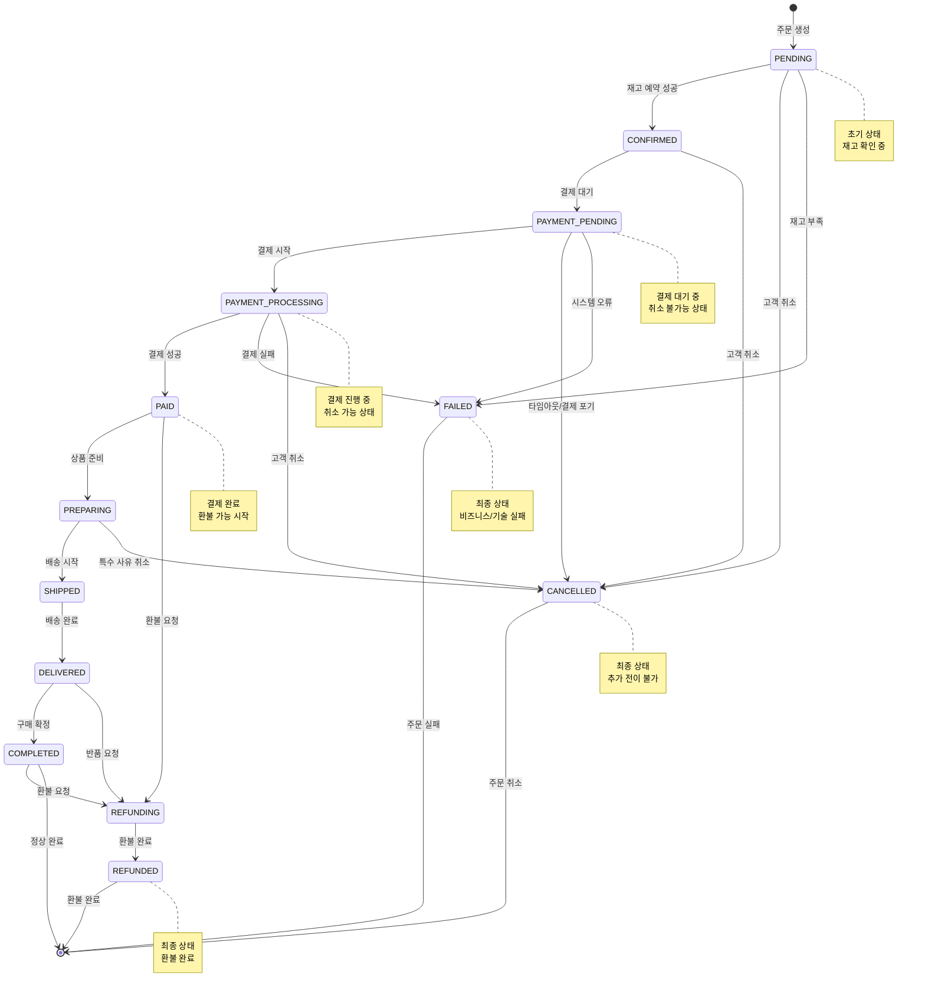
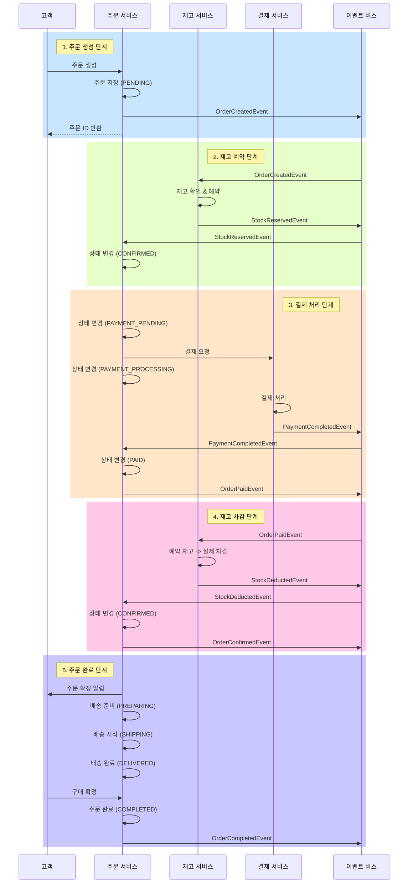

# 주문 생애주기 다이어그램

## 1. 주문 상태 전이 다이어그램



## 2. 주문 생성 및 재고 예약 시퀀스 다이어그램


## 3. 주문 완료까지의 전체 흐름 시퀀스 다이어그램



## 4. 주문 취소 및 보상 트랜잭션 시퀀스 다이어그램


## 5. 이벤트 기반 아키텍처 장점

### 5.1 느슨한 결합 (Loose Coupling)
- 서비스 간 직접적인 의존성 제거
- 각 서비스는 이벤트를 통해서만 통신
- 서비스 독립적 배포 및 확장 가능

### 5.2 확장성 (Scalability)
- 각 서비스 독립적으로 스케일 아웃 가능
- 이벤트 버스를 통한 비동기 처리로 처리량 향상
- 부하가 높은 서비스만 선택적 확장

### 5.3 복원력 (Resilience)
- 일시적 장애에 대한 자동 재시도
- 서비스 장애 시 이벤트는 큐에 보관
- 장애 복구 후 자동으로 처리 재개

### 5.4 감사 추적 (Audit Trail)
- 모든 상태 변경이 이벤트로 기록
- 완벽한 감사 로그 제공
- 이벤트 소싱을 통한 상태 재구성 가능

## 6. 주요 타임아웃 및 정책

### 6.1 타임아웃 정책
| 단계 | 타임아웃 | 정책 |
|------|----------|------|
| 재고 예약 | 30분 | 예약 후 30분 내 미결제 시 자동 해제 |
| 결제 대기 | 10분 | 결제 페이지 진입 후 10분 내 미완료 시 취소 |
| 주문 확정 | 24시간 | 결제 후 24시간 내 확정 필요 |
| 배송 준비 | 48시간 | 확정 후 48시간 내 배송 시작 |
| 구매 확정 | 7일 | 배송 완료 후 7일 내 자동 구매 확정 |

### 6.2 취소 가능 상태
| 상태 | 취소 가능 여부 | 비고 |
|------|----------------|------|
| PENDING | ✅ 가능 | 재고 예약 전 자유 취소 |
| CONFIRMED | ✅ 가능 | 결제 전 자유 취소 |
| PAYMENT_PENDING | ❌ 불가능 | 결제 프로세스 시작 전 |
| PAYMENT_PROCESSING | ✅ 가능 | 결제 진행 중 취소 가능 |
| PAID | ✅ 가능 | 배송 준비 전까지 취소 가능 |
| PREPARING | ✅ 가능 | 특수 사유만 취소 가능 |
| SHIPPED | ❌ 불가능 | 배송 시작 후 취소 불가 |
| DELIVERED | ❌ 불가능 | 반품으로만 처리 |
| COMPLETED | ❌ 불가능 | 환불로만 처리 |

### 6.3 환불 가능 상태
| 상태 | 환불 가능 여부 | 비고 |
|------|----------------|------|
| PAID | ✅ 가능 | 결제 완료 후 환불 가능 |
| PREPARING | ✅ 가능 | 상품 준비 중 환불 가능 |
| SHIPPED | ✅ 가능 | 배송 중 반품 후 환불 |
| DELIVERED | ✅ 가능 | 배송 완료 후 반품 환불 |
| COMPLETED | ✅ 가능 | 구매 확정 후도 특정 기간 내 환불 |

## 7. 보상 트랜잭션 패턴


## 8. 예외 처리 및 재시도 정책

### 8.1 비즈니스 규칙 위반 (재시도 불가)
- **OrderNotFoundException**: 주문이 존재하지 않음
- **InvalidOrderStateException**: 잘못된 상태 전이 시도
- **InsufficientStockException**: 재고 부족
- **DuplicateOrderException**: 중복 주문
- **PaymentLimitExceededException**: 결제 한도 초과

이러한 예외들은 재시도해도 동일한 결과가 나오므로 재시도하지 않고 즉시 실패 처리합니다.

### 8.2 기술적 실패 (재시도 가능)
- **DatabaseConnectionException**: DB 연결 실패
- **NetworkTimeoutException**: 네트워크 타임아웃
- **ServiceUnavailableException**: 서비스 일시 중단
- **OptimisticLockException**: 동시성 충돌

이러한 예외들은 일시적인 문제일 가능성이 높으므로 지수 백오프를 사용하여 재시도합니다.

### 8.3 재시도 정책
```yaml
retry:
  maxAttempts: 3
  backoff:
    initialInterval: 1000ms
    multiplier: 2.0
    maxInterval: 10000ms
  retryableExceptions:
    - DatabaseConnectionException
    - NetworkTimeoutException
    - ServiceUnavailableException
    - OptimisticLockException
```

## 9. 모니터링 포인트

### 9.1 비즈니스 메트릭
- 주문 생성률
- 재고 예약 성공률
- 결제 성공률
- 주문 완료율
- 평균 주문 처리 시간

### 9.2 기술 메트릭
- 이벤트 처리 지연 시간
- 이벤트 처리 실패율
- 서비스 응답 시간
- 데이터베이스 쿼리 성능
- 메시지 큐 크기

### 9.3 알림 설정
- 재고 예약 실패율 > 10%
- 결제 실패율 > 5%
- 이벤트 처리 지연 > 30초
- 서비스 응답 시간 > 1초
- 메시지 큐 크기 > 10,000