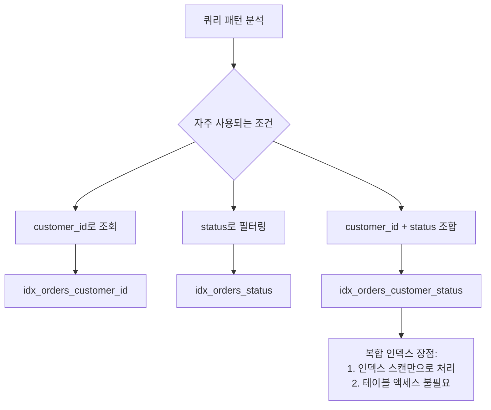
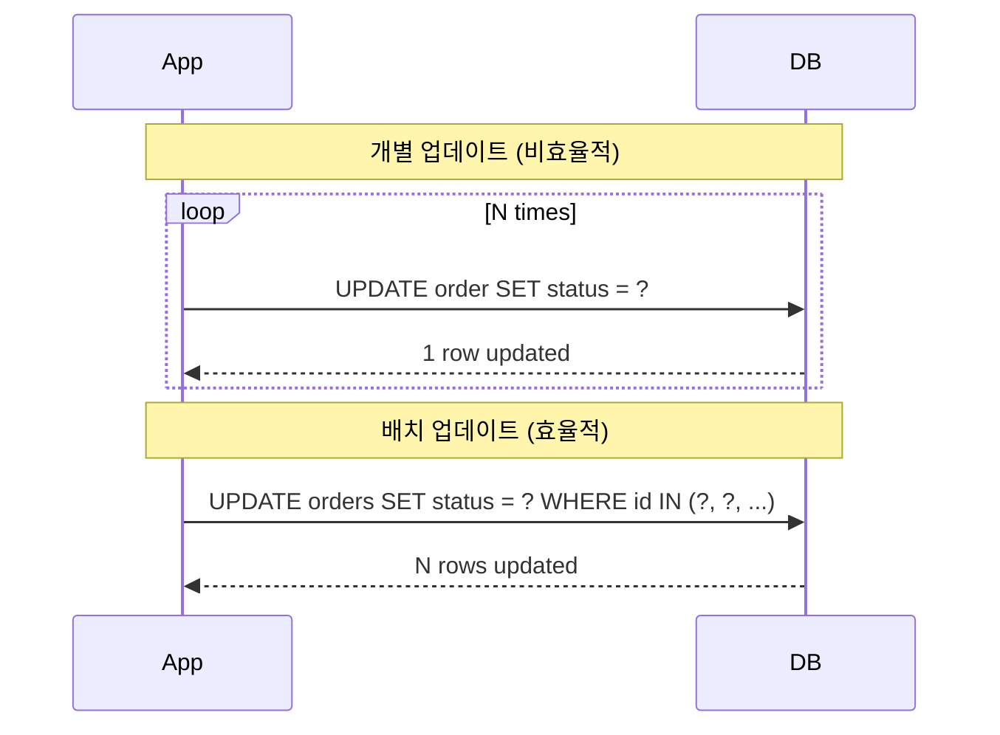
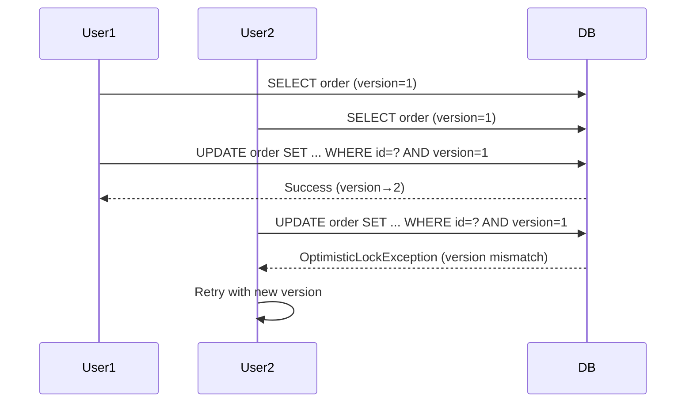
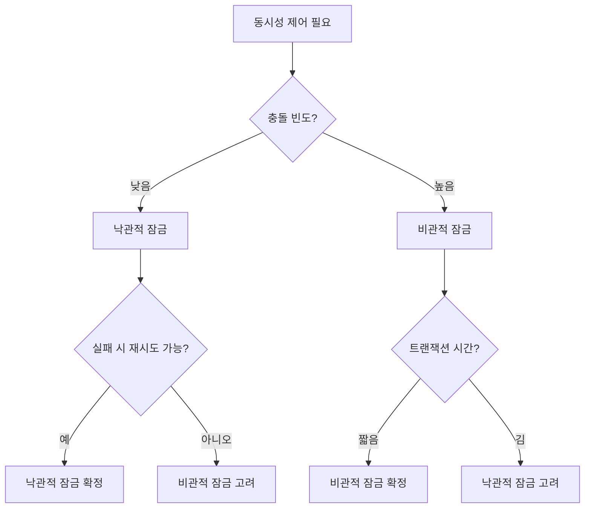
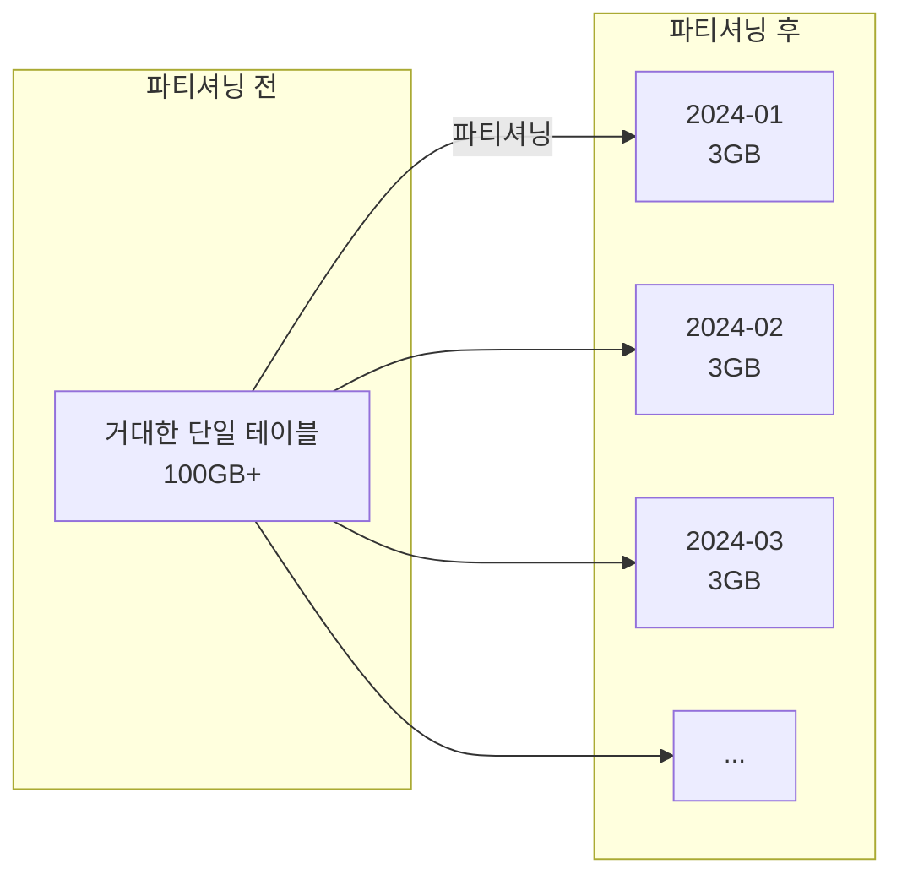
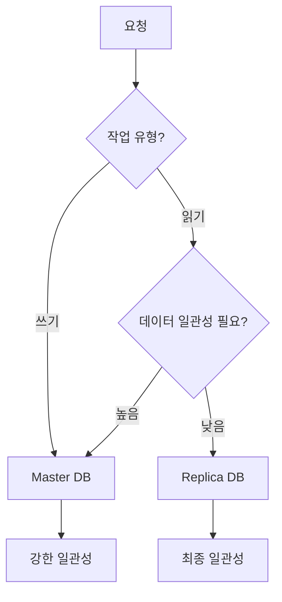
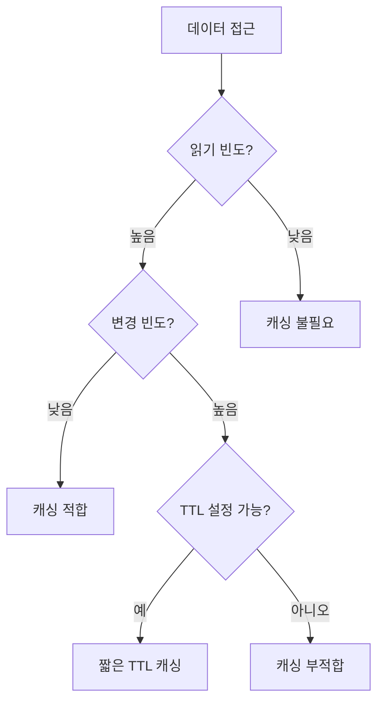
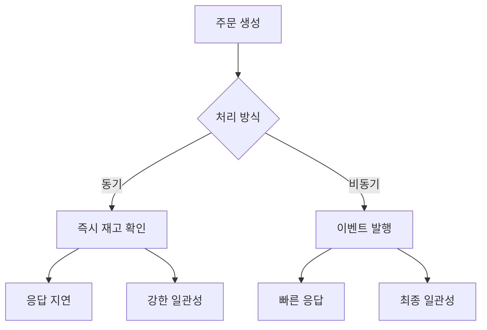
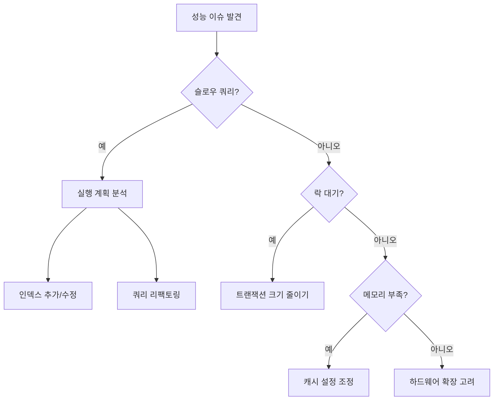

# Order Service Persistence Layer 심층 분석

## 📋 목차
1. [개요](#개요)
2. [성능 최적화 전략](#성능-최적화-전략)
3. [동시성 제어 메커니즘](#동시성-제어-메커니즘)
4. [확장성 설계](#확장성-설계)
5. [설계 결정의 이유](#설계-결정의-이유)
6. [트레이드오프 분석](#트레이드오프-분석)
7. [모니터링 및 튜닝 가이드](#모니터링-및-튜닝-가이드)

## 개요

Order Service의 Persistence Layer는 높은 트래픽 환경에서 안정적이고 확장 가능한 데이터 처리를 위해 설계되었습니다. 이 문서는 각 설계 결정의 **왜(Why)**와 **어떻게(How)**를 상세히 설명합니다.

## 성능 최적화 전략

### 1. N+1 문제 해결

#### 문제점
```java
// N+1 문제 발생 코드
List<Order> orders = orderRepository.findAll();
for (Order order : orders) {
    // 각 주문마다 추가 쿼리 발생
    List<OrderItem> items = order.getItems();
}
```

#### 해결 방법: Fetch Join
```java
@Query("SELECT DISTINCT o FROM OrderJpaEntity o " +
       "LEFT JOIN FETCH o.items " +
       "WHERE o.id = :id")
Optional<OrderJpaEntity> findByIdWithItems(@Param("id") String id);
```

#### 왜 Fetch Join을 사용했나?
- **단일 쿼리**로 연관된 엔티티를 함께 조회
- 네트워크 왕복 시간 감소
- 데이터베이스 연결 사용 최소화

#### 주의사항
```java
// Fetch Join과 페이징을 함께 사용할 때의 문제
@Query("SELECT DISTINCT o FROM OrderJpaEntity o " +
       "LEFT JOIN FETCH o.items " +
       "WHERE o.customerId = :customerId")
List<OrderJpaEntity> findByCustomerIdWithItems(@Param("customerId") String customerId);
// 페이징은 애플리케이션 레벨에서 처리
```

### 2. 인덱스 최적화

#### 복합 인덱스 설계
```sql
-- 단일 컬럼 인덱스
CREATE INDEX idx_orders_customer_id ON orders(customer_id);
CREATE INDEX idx_orders_status ON orders(status);

-- 복합 인덱스 (쿼리 패턴 기반)
CREATE INDEX idx_orders_customer_status ON orders(customer_id, status);
```

#### 왜 이런 인덱스를 만들었나?



#### 인덱스 선택 기준
1. **카디널리티**: customer_id는 높은 카디널리티 → 효과적
2. **쿼리 빈도**: 고객별 주문 조회가 가장 빈번
3. **선택도**: status는 5개 값만 존재 → 단독으로는 비효율적

### 3. 쿼리 최적화

#### EXISTS 최적화
```java
// 비효율적: 전체 조회
boolean exists = orderRepository.findById(id).isPresent();

// 최적화: COUNT 쿼리
@Query("SELECT CASE WHEN COUNT(o) > 0 THEN true ELSE false END " +
       "FROM OrderJpaEntity o WHERE o.id = :id")
boolean existsByIdOptimized(@Param("id") String id);
```

#### 왜 이렇게 최적화했나?
- EXISTS는 첫 번째 행만 찾으면 즉시 반환
- 불필요한 데이터 전송 없음
- 메모리 사용량 최소화

### 4. 배치 처리 최적화

```java
@Modifying
@Query("UPDATE OrderJpaEntity o " +
       "SET o.status = :newStatus, o.updatedAt = :updatedAt " +
       "WHERE o.id IN :orderIds")
int updateOrderStatusBatch(
    @Param("orderIds") List<String> orderIds,
    @Param("newStatus") OrderStatusEntity newStatus,
    @Param("updatedAt") Instant updatedAt
);
```

#### 배치 처리의 이점


## 동시성 제어 메커니즘

### 1. 낙관적 잠금 (Optimistic Locking)

#### 구현
```java
@Version
@Column(name = "version", nullable = false)
private Long version;
```

#### 작동 원리


#### 언제 사용하나?
- **읽기가 많고 쓰기가 적은** 경우
- 충돌이 드문 경우
- 긴 트랜잭션이 필요한 경우

### 2. 비관적 잠금 (Pessimistic Locking)

#### 구현
```java
@Lock(LockModeType.PESSIMISTIC_WRITE)
@Query("SELECT o FROM OrderJpaEntity o WHERE o.id = :id")
Optional<OrderJpaEntity> findByIdWithLock(@Param("id") String id);
```

#### SQL 레벨 동작
```sql
-- PostgreSQL
SELECT * FROM orders WHERE id = ? FOR UPDATE;

-- 다른 트랜잭션은 대기
-- NOWAIT 옵션으로 즉시 실패 가능
SELECT * FROM orders WHERE id = ? FOR UPDATE NOWAIT;
```

#### 언제 사용하나?
- **충돌이 빈번한** 경우 (재고 차감, 결제 처리)
- 데이터 일관성이 중요한 경우
- 짧은 트랜잭션

### 3. 동시성 제어 전략 선택



## 확장성 설계

### 1. 파티셔닝 준비

#### 시간 기반 파티셔닝
```sql
-- 파티션 테이블 생성 (PostgreSQL 12+)
CREATE TABLE orders (
    id VARCHAR(36),
    created_at TIMESTAMP NOT NULL,
    -- 기타 컬럼들
    PRIMARY KEY (id, created_at)
) PARTITION BY RANGE (created_at);

-- 월별 파티션 생성
CREATE TABLE orders_2024_01 
PARTITION OF orders 
FOR VALUES FROM ('2024-01-01') TO ('2024-02-01');

CREATE TABLE orders_2024_02 
PARTITION OF orders 
FOR VALUES FROM ('2024-02-01') TO ('2024-03-01');
```

#### 왜 파티셔닝이 필요한가?



**이점:**
1. **쿼리 성능**: 특정 기간 데이터만 스캔
2. **유지보수**: 오래된 파티션 쉽게 삭제
3. **백업**: 파티션별 독립적 백업
4. **통계**: 파티션별 통계 관리

### 2. 읽기 전용 복제본 활용

```java
@Configuration
public class DataSourceConfig {
    
    @Bean
    @Primary
    public DataSource primaryDataSource() {
        // 쓰기 작업용 마스터 DB
        return DataSourceBuilder.create()
            .url("jdbc:postgresql://master:5432/order_service")
            .build();
    }
    
    @Bean
    public DataSource readOnlyDataSource() {
        // 읽기 작업용 복제본 DB
        return DataSourceBuilder.create()
            .url("jdbc:postgresql://replica:5432/order_service")
            .build();
    }
}
```

#### 읽기/쓰기 분리 전략


### 3. 캐싱 전략

```java
@Cacheable(value = "orders", key = "#orderId")
public Optional<Order> loadOrder(OrderId orderId) {
    // DB 조회 (캐시 미스 시에만 실행)
}

@CacheEvict(value = "orders", key = "#order.id")
public void save(Order order) {
    // DB 저장 및 캐시 무효화
}
```

#### 캐싱 결정 트리


## 설계 결정의 이유

### 1. UUID vs Auto-increment ID

#### UUID 선택 이유
```java
@Id
@Column(name = "id", nullable = false, updatable = false)
private String id;  // UUID 사용
```

**장점:**
- **분산 환경**: 중앙 조정 없이 ID 생성
- **보안**: 순차적이지 않아 추측 불가
- **마이그레이션**: ID 충돌 없이 데이터 이동

**단점과 대응:**
- **인덱스 크기**: → 적절한 인덱스 전략
- **가독성**: → 비즈니스 키 별도 관리

### 2. EAGER vs LAZY Loading

```java
@OneToMany(
    mappedBy = "order",
    cascade = CascadeType.ALL,
    orphanRemoval = true,
    fetch = FetchType.EAGER  // 의도적 선택
)
private List<OrderItemJpaEntity> items = new ArrayList<>();
```

#### EAGER 선택 이유
1. **도메인 특성**: 주문은 항상 아이템과 함께 조회
2. **N+1 방지**: 명시적 Fetch Join 불필요
3. **일관성**: 주문 아이템은 주문의 일부

#### 하지만 주의사항
```java
// 대량 조회 시에는 별도 쿼리 사용
@Query("SELECT o FROM OrderJpaEntity o")
List<OrderJpaEntity> findAllWithoutItems();  // LAZY 로딩 필요
```

### 3. 트리거 vs 애플리케이션 로직

```sql
-- updated_at 자동 갱신 트리거
CREATE TRIGGER update_orders_updated_at 
BEFORE UPDATE ON orders
FOR EACH ROW EXECUTE FUNCTION update_updated_at_column();
```

#### 트리거 사용 이유
1. **일관성**: 모든 업데이트에 자동 적용
2. **성능**: DB 레벨에서 처리
3. **신뢰성**: 애플리케이션 버그 방지

## 트레이드오프 분석

### 1. 정규화 vs 비정규화

```java
// 정규화된 설계
@Column(name = "product_id", nullable = false)
private String productId;

// 비정규화 - 스냅샷 저장
@Column(name = "product_name", nullable = false, length = 200)
private String productName;

@Column(name = "unit_price", nullable = false)
private BigDecimal unitPrice;
```

#### 트레이드오프
- **정규화**: 데이터 일관성 ↔ 조인 비용
- **비정규화**: 조회 성능 ↔ 저장 공간

#### 결정: 하이브리드 접근
- **참조 무결성**: product_id로 유지
- **히스토리**: 주문 시점 데이터 스냅샷
- **성능**: 조인 없이 주문 정보 완성

### 2. 동기 vs 비동기 처리



## 모니터링 및 튜닝 가이드

### 1. 슬로우 쿼리 모니터링

```sql
-- PostgreSQL 슬로우 쿼리 설정
ALTER SYSTEM SET log_min_duration_statement = 1000;  -- 1초 이상

-- 쿼리 실행 계획 분석
EXPLAIN (ANALYZE, BUFFERS) 
SELECT * FROM orders 
WHERE customer_id = ? AND status = ?;
```

### 2. 인덱스 사용률 확인

```sql
-- 인덱스 사용 통계
SELECT 
    schemaname,
    tablename,
    indexname,
    idx_scan,
    idx_tup_read,
    idx_tup_fetch
FROM pg_stat_user_indexes
WHERE schemaname = 'public'
ORDER BY idx_scan DESC;
```

### 3. 락 모니터링

```sql
-- 현재 락 상태 확인
SELECT 
    pid,
    usename,
    application_name,
    state,
    query,
    wait_event_type,
    wait_event
FROM pg_stat_activity
WHERE wait_event IS NOT NULL;
```

### 4. 성능 튜닝 체크리스트



### 5. 용량 계획

```sql
-- 테이블 크기 모니터링
SELECT 
    schemaname,
    tablename,
    pg_size_pretty(pg_total_relation_size(schemaname||'.'||tablename)) AS size,
    pg_size_pretty(pg_relation_size(schemaname||'.'||tablename)) AS table_size,
    pg_size_pretty(pg_indexes_size(schemaname||'.'||tablename)) AS indexes_size
FROM pg_tables
WHERE schemaname = 'public'
ORDER BY pg_total_relation_size(schemaname||'.'||tablename) DESC;
```

#### 용량 예측 모델
```
일일 주문 수: 10,000
평균 주문 크기: 2KB (주문 + 아이템)
일일 증가량: 20MB
연간 증가량: 7.3GB

인덱스 오버헤드: 30%
총 연간 증가량: ~10GB
```

## 결론

Order Service의 Persistence Layer는 다음을 달성합니다:

1. **성능**: 인덱스 최적화, 쿼리 튜닝, 캐싱
2. **확장성**: 파티셔닝, 읽기 복제본, 샤딩 준비
3. **신뢰성**: 트랜잭션, 동시성 제어, 데이터 무결성
4. **유지보수성**: 명확한 구조, 모니터링, 문서화

각 설계 결정은 실제 운영 경험과 모범 사례를 기반으로 하며, 트레이드오프를 신중히 고려했습니다.