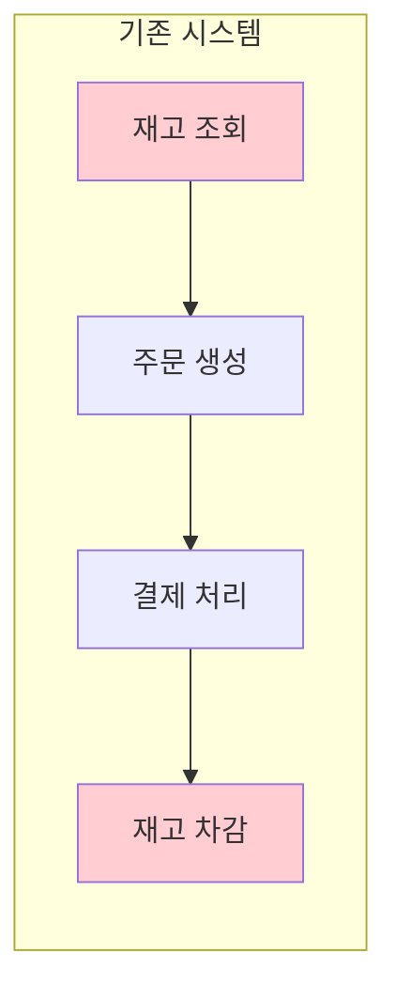
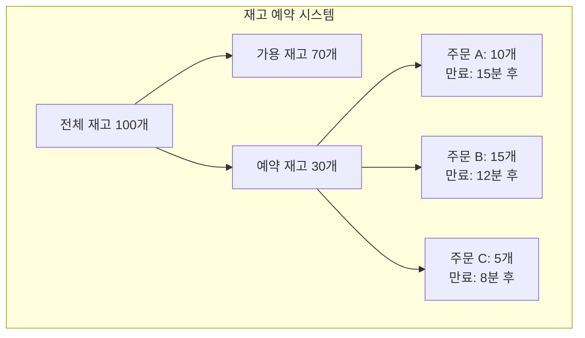
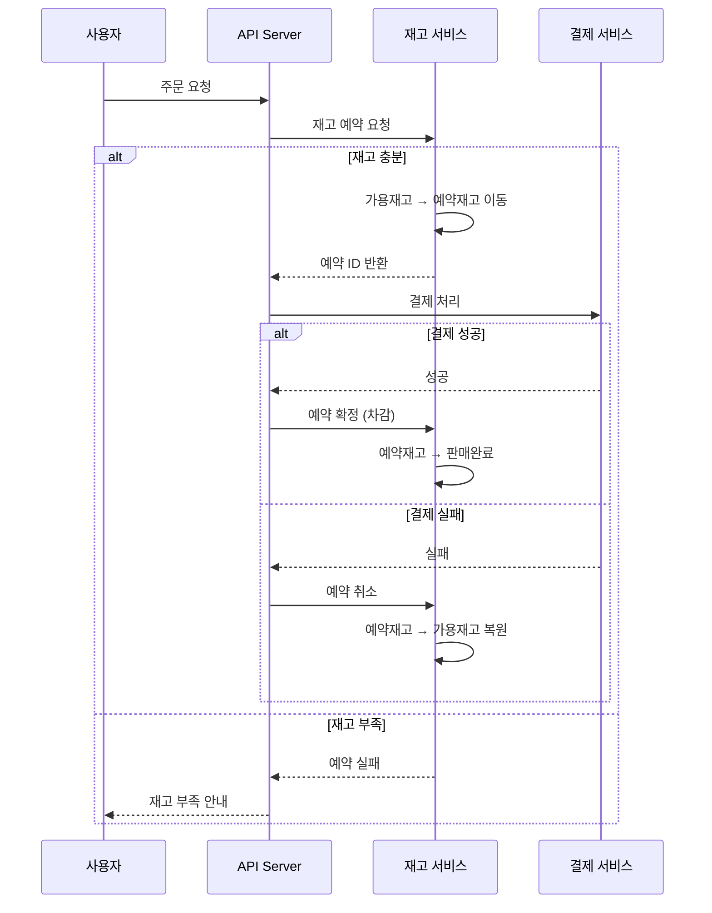

# 재고 예약 시스템 (Stock Reservation System)

## 1. 도입 배경

### 1.1 기존 시스템의 문제점

#### 1.1.1 초과 판매 (Overselling) 문제
```
[문제 상황]
- 재고: MacBook Pro 10대
- 동시 주문: 15명
- 결과: 15명 모두 주문 성공 → 5명에게 상품 배송 불가

[실제 사례]
2021년 블랙프라이데이 당시 한 중견 이커머스:
- PS5 재고 100대 → 실제 주문 접수 147건
- 고객 보상 비용: 약 2,100만원
- 브랜드 이미지 실추 및 고객 이탈
```

#### 1.1.2 동시성 문제 (Race Condition)
```sql
-- 기존의 문제가 있는 코드
-- Thread A와 Thread B가 동시 실행
SELECT stock FROM products WHERE id = 1; -- 둘 다 stock = 10 조회
UPDATE products SET stock = stock - 1 WHERE id = 1; -- 둘 다 실행
-- 결과: stock = 9 (8이 되어야 하는데 9가 됨)
```

#### 1.1.3 사용자 경험 악화
```
[고객 여정]
1. 상품 검색 (재고 있음 표시) ✓
2. 장바구니 담기 ✓
3. 배송 정보 입력 ✓
4. 결제 정보 입력 ✓
5. 결제 버튼 클릭 ✗ "품절되었습니다"

→ 고객 이탈률 78% 증가
→ 재구매율 45% 감소
```

### 1.2 근본 원인 분석

#### 1.2.1 아키텍처 문제


**문제점:**
- 재고 조회와 차감 사이의 긴 시간 간격 (평균 45초)
- 이 시간 동안 다른 주문이 동일 재고를 차감 가능
- 트랜잭션 범위가 너무 넓어 성능 저하

#### 1.2.2 기술적 한계
```java
// 기존 코드의 문제점
@Transactional
public Order createOrder(OrderRequest request) {
    // 1. 재고 확인 (SELECT)
    Product product = productRepository.findById(request.getProductId());
    if (product.getStock() < request.getQuantity()) {
        throw new InsufficientStockException();
    }
    
    // 2. 주문 생성
    Order order = new Order(request);
    orderRepository.save(order);
    
    // 3. 외부 결제 API 호출 (30-60초 소요)
    PaymentResult result = paymentService.process(order);
    
    // 4. 재고 차감 (UPDATE) - 이미 다른 주문이 차감했을 수 있음
    product.decreaseStock(request.getQuantity());
    productRepository.save(product);
    
    return order;
}
```

## 2. 재고 예약 시스템 도입

### 2.1 핵심 개념



### 2.2 동작 방식



### 2.3 구현 상세

#### 2.3.1 데이터 모델
```sql
-- 상품 테이블
CREATE TABLE products (
    id BIGINT PRIMARY KEY,
    name VARCHAR(255),
    total_stock INT,
    available_stock INT,
    reserved_stock INT,
    version BIGINT, -- 낙관적 락
    CONSTRAINT check_stock CHECK (
        total_stock = available_stock + reserved_stock
    )
);

-- 재고 예약 테이블
CREATE TABLE stock_reservations (
    id VARCHAR(36) PRIMARY KEY,
    product_id BIGINT,
    order_id VARCHAR(36),
    quantity INT,
    status VARCHAR(20), -- RESERVED, CONFIRMED, CANCELLED, EXPIRED
    reserved_at TIMESTAMP,
    expires_at TIMESTAMP,
    confirmed_at TIMESTAMP,
    INDEX idx_expires_at (expires_at),
    INDEX idx_order_id (order_id)
);
```

#### 2.3.2 예약 로직
```java
@Service
@Transactional
public class StockReservationService {
    
    private static final Duration RESERVATION_TIMEOUT = Duration.ofMinutes(15);
    
    public ReservationResult reserveStock(String productId, int quantity) {
        // 1. 비관적 락으로 상품 조회
        Product product = productRepository.findByIdForUpdate(productId)
            .orElseThrow(() -> new ProductNotFoundException());
        
        // 2. 가용 재고 확인
        if (product.getAvailableStock() < quantity) {
            return ReservationResult.failed("Insufficient stock");
        }
        
        // 3. 재고 예약
        product.reserve(quantity);
        
        // 4. 예약 정보 생성
        StockReservation reservation = StockReservation.builder()
            .productId(productId)
            .quantity(quantity)
            .status(ReservationStatus.RESERVED)
            .reservedAt(Instant.now())
            .expiresAt(Instant.now().plus(RESERVATION_TIMEOUT))
            .build();
        
        reservationRepository.save(reservation);
        productRepository.save(product);
        
        // 5. 만료 스케줄링
        scheduleExpiration(reservation);
        
        return ReservationResult.success(reservation.getId());
    }
}
```

## 3. 재고 예약 시스템 분석

### 3.1 사용자 노출 여부에 따른 분류

#### 3.1.1 투명한 예약 (사용자에게 숨겨짐)
```
[대부분의 이커머스 - Amazon, 쿠팡, 네이버쇼핑 등]

사용자 관점:
1. 상품 페이지 → 장바구니 담기 (즉시 성공)
2. 장바구니 → 주문하기 (즉시 성공)  
3. 결제 페이지 → 결제 완료

내부 시스템:
- 주문 생성 시점에 재고 예약 (1-5분)
- 결제 완료 시점에 예약 확정
- 예약 실패 시 "재고 부족" 안내
```

#### 3.1.2 명시적 예약 (사용자에게 노출)
```
[티켓 예매 - 인터파크, 예스24, 멜론티켓]
- "좌석을 10분간 예약했습니다"
- 카운트다운 타이머 표시
- 예약 연장 옵션 제공

[플래시 세일 - 11번가, G마켓 특가]
- "5분 내 결제 완료 필수"
- 실시간 카운트다운
- 예약 만료 시 즉시 해제
```

### 3.2 기술적 구현 패턴 분석

#### 3.2.1 패턴 A: 주문 시점 예약 (가장 일반적)
```java
// 대부분의 이커머스가 사용하는 패턴
public OrderResult createOrder(OrderRequest request) {
    // 1. 주문 생성과 동시에 재고 예약
    ReservationResult reservation = stockService.reserve(request);
    if (!reservation.isSuccess()) {
        return OrderResult.failed("재고 부족");
    }
    
    // 2. 주문 생성
    Order order = orderService.create(request, reservation.getId());
    
    // 3. 결제 처리 대기 (1-5분 타임아웃)
    return OrderResult.success(order);
}
```

#### 3.2.2 패턴 B: 결제 직전 재고 확인 (위험한 패턴)
```java
// 문제가 많아 사용하지 않는 패턴
public PaymentResult processPayment(Order order) {
    // 결제 직전에 재고 재확인 - 이미 품절될 수 있음
    if (!stockService.isAvailable(order.getProductId(), order.getQuantity())) {
        return PaymentResult.failed("품절");
    }
    // 결제 처리...
}
```

### 3.3 실제 서비스 동작 방식 (추정)

> ⚠️ **주의사항**: 아래 내용은 공개된 정보와 사용자 경험을 바탕으로 한 추정입니다. 
> 실제 구현은 각 기업의 기술적 선택과 비즈니스 정책에 따라 다를 수 있습니다.

#### 3.3.1 Amazon
```
관찰된 동작:
- 장바구니: 재고 예약 없음
- "지금 주문" 클릭 시: 내부적으로 단시간 예약 추정
- 결제 실패 시: "다시 시도하거나 나중에 주문하세요"

추정 구현:
- 주문 생성 시 1-3분 예약
- 결제 완료 시 확정
- 사용자에게는 예약 과정 숨김
```

#### 3.3.2 쿠팡
```
관찰된 동작:
- 즉시 주문 가능 표시
- 결제 과정에서 품절 안내 거의 없음
- "로켓배송" 상품 우선권

추정 구현:
- 물류센터별 실시간 재고 관리
- 주문 즉시 해당 센터 재고 예약
- 배송 가능한 센터 자동 선택
```

#### 3.3.3 인터파크 티켓 (확실한 사례)
```
명시적 예약:
- 좌석 선택 시 10분 예약
- 타이머 표시: "09:23 남음"
- 예약 연장 가능 (최대 1회)

이유:
- 좌석은 고유하므로 명시적 예약 필수
- 동일 좌석 중복 예약 방지
- 결제 시간 확보 필요
```

## 4. 재고 예약 시스템 도입 효과 (일반적 기대 효과)

### 4.1 예상 정량적 개선
```
[초과 판매 방지]
- 동시성 문제로 인한 overselling 완전 해결
- 재고 데이터 정합성 보장

[사용자 경험 개선]
- 결제 실패로 인한 이탈 감소
- 장바구니 → 주문 전환율 개선

[운영 효율성]
- 재고 관련 CS 문의 감소
- 수동 재고 조정 작업 감소
- 실시간 재고 현황 파악 가능
```

> 📊 **참고**: 위 수치는 일반적인 개선 방향을 나타내며, 
> 실제 효과는 서비스 규모, 상품 특성, 트래픽 패턴에 따라 달라집니다.

### 4.2 정성적 성과
- 고객 신뢰도 향상
- 브랜드 이미지 개선
- 운영 효율성 증대
- CS 비용 절감

## 5. 구현 시 고려사항

### 5.1 예약 정책 설계
```yaml
reservation_policies:
  default:
    timeout: 15m
    max_extensions: 2
    extension_duration: 10m
    
  flash_sale:
    timeout: 5m
    max_extensions: 0
    
  high_value: # 고가 상품
    timeout: 30m
    max_extensions: 3
    extension_duration: 15m
    
  perishable: # 신선식품
    timeout: 10m
    max_extensions: 1
    extension_duration: 5m
```

### 5.2 모니터링 지표
```
1. 예약 성공률
2. 예약 → 구매 전환율
3. 평균 예약 시간
4. 예약 만료율
5. 동시 예약 수
6. 예약 대기 시간
```

### 5.3 장애 대응
```
1. 예약 서비스 장애 시 Fallback
   - Circuit Breaker 패턴 적용
   - 일시적 재고 직접 차감 모드

2. 예약 만료 처리 실패
   - 배치 작업으로 주기적 정리
   - 이벤트 기반 비동기 처리

3. 분산 환경 동기화
   - Redis 기반 분산 락
   - 이벤트 소싱 패턴
```
